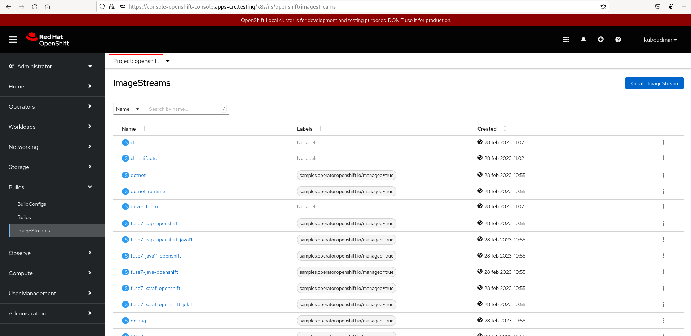
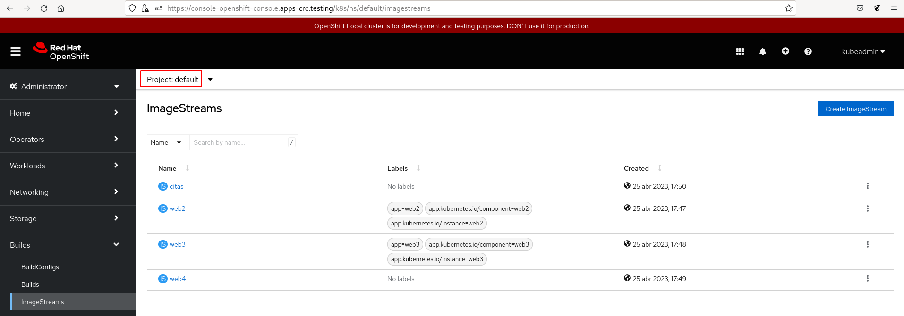
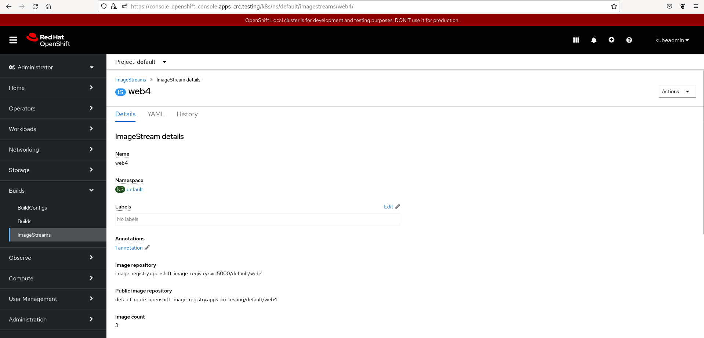
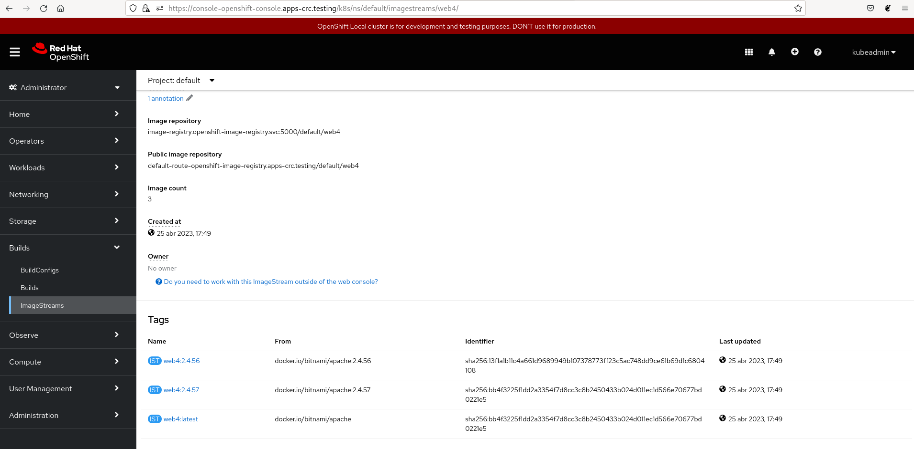
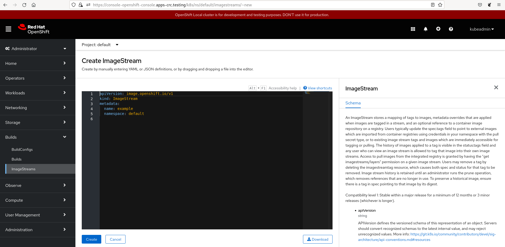

# Gestión de ImageStream desde la consola web

En primer lugar podemos ver desde la consola web los objetos **ImageStream** que apuntan a las imágenes precargadas en OpenShift. Recordemos que se encuentran en el proyecto `openshift`. En la vista **Administrator**, en el apartado **Builds->ImageStream**, escogemos el proyecto **OpenShift** y accedemos:

Si cambiamos el proyecto, y escogemos el `default` donde hemos estado trabajando, accederemos a los **ImageStream** que hemos creado en el apartado anterior:

Por ejemplo si pulsamos en uno de ellos, podemos ver los detalles de este objeto:

Podemos acceder a varias pestañas:

* **Details**: Es la ventana en la que estamos, y donde podemos ver lo detalles del **ImageStream**.
* **YAML**: Accedemos a la definición yaml del objeto.
* **History**: Accedemos a una línea de tiempo donde vemos gráficamente cuando de han creado o borrado las etiquetas del objeto **ImageStream**.

Además en esta misma pantalla, podemos ver las etiquetas que tiene el objeto **ImageStream**:

Finalmente podemos pulsar sobre el botón **Create ImageStream** para crear un nuevo objeto desde su definición YAML:

