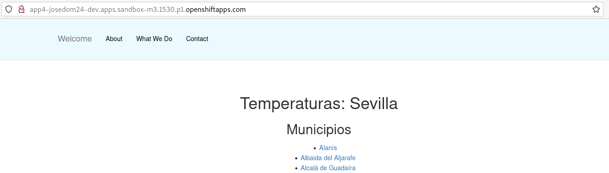
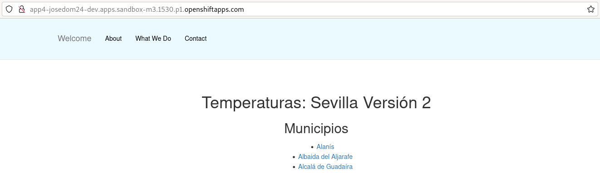
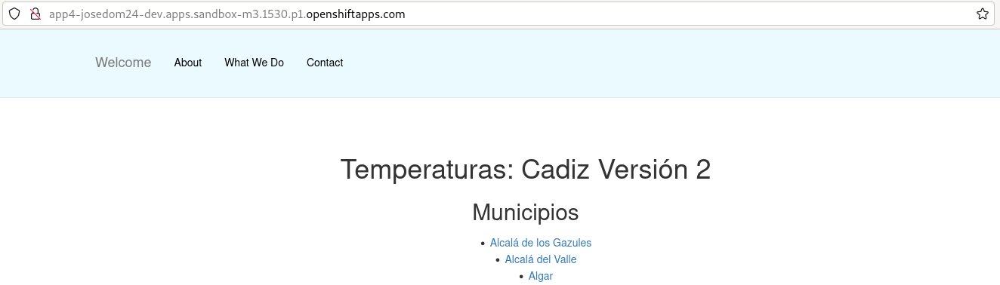

# Actualización manual de un build

En este apartado vamos a aprender los comandos que nos permiten gestionar los procesos de construcción a partir de un objeto **BuildConfig**. Para ello vamos a crear un **BuildConfig** usando la estrategia Docker y los ficheros necesarios se encuentra en el repositorio [https://github.com/josedom24/osv4_python](https://github.com/josedom24/osv4_python).

La aplicación muestra los municipios de una provincia, el nombre de la provincia se indica en la variable de entorno `PROVINCIA`. El fichero `Dockerfile` crea esta variable con una valor determinado.

Por lo tanto lo primero que vamos a hacer es crear el objeto **BuildCondig**, para ello:

    oc new-build https://github.com/josedom24/osv4_python --name=app4

    oc get bc 
    NAME      TYPE     FROM   LATEST
    app4      Docker   Git    1

    oc get build
    NAME        TYPE     FROM          STATUS     STARTED             DURATION
    app4-1      Docker   Git@8ab1cd8   Running    18 seconds ago    

Como vemos en el campo `LATEST`, se ha creado un build, que de forma automática ha llamado `app4-1`.
Cuando termina la construcción, comprobamos que se ha creado un nuevo **ImageStream** apuntando a la nueva imagen:

    oc get is -o name
    imagestream.image.openshift.io/app4

Ahora, podríamos crear una nueva aplicación que utilizará esta nueva imagen que hemos generado (vamos a llamar a la aplicación con el mismo nombre que el build, aunque se podría llamar de forma distinta):

    oc new-app app4 --name=app4
    oc expose service app4

## Primera modificación: Modificación de la aplicación

¿Qué pasa si mi equipo de desarrollo saca una nueva versión de la aplicación y queremos desplegar esta nueva versión?. Para ello vamos a modificar la aplicación y luego vamos a lanzar una nueva construcción. Para ello:

1. Modificamos el fichero `app/templates/base.html` y cambiamos la línea: `<h1>Temperaturas: {{prov}}</h1>` por esta otra `<h1>Temperaturas: {{prov}} Versión 2</h1>`.
2. Guardamos los cambios en el repositorio:

        git commit -am "Versión 2"
        git push
3. Lanzamos manualmente una nueva construcción de la imagen:

        oc start-build app4
        build.build.openshift.io/app4-2 started

        oc get bc
        NAME      TYPE     FROM   LATEST
        app4      Docker   Git    2

        oc get build
        NAME        TYPE     FROM          STATUS     STARTED             DURATION
        app4-1      Docker   Git@8ab1cd8   Complete   8 minutes ago       58s
        app4-2      Docker   Git@a672300   Running    18 seconds ago      

        oc get pod
        NAME                       READY   STATUS      RESTARTS   AGE
        app4-1-build               0/1     Completed   0          9m40s
        app4-2-build               1/1     Running     0          10s
        app4-4fbd68446-trd56       1/1     Running     0          2m45s

    Vemos como tenemos en ejecución otro Pod constructor (**app4-2-build**) donde se está creando la nueva imagen.

4. ¿Qué ha ocurrido al finalizar la construcción de la nueva imagen? El despliegue se ha actualizado, al cambiar la imagen de origen, y por tanto ha creado un nuevo recurso **ReplicaSet** que ha creado un nuevo Pod:

        oc get rs
        NAME                 DESIRED   CURRENT   READY   AGE
        app4-55b7b94b66      0         0         0       8m34s
        app4-578d64d9ff      0         0         0       8m34s
        app4-65b86b5b8f      1         1         1       58s

        oc get pod
        NAME                       READY   STATUS      RESTARTS   AGE
        app4-1-build               0/1     Completed   0          9m40s
        app4-2-build               0/1     Completed   0          101s
        app4-65b86b5b8f-jmh49      1/1     Running     0          45s

5. Si accedemos a la aplicación vemos la modificación:

    

## Segunda modificación: Modificación del valor de la variable de entorno

¿Qué pasa si modificamos el fichero `Dockerfile`, por ejemplo para cambiar el valor de la variable de entorno? De la misma forma, habrá que construir una nueva imagen, y desplegarla de nuevo.

1. Modifica el fichero `Dockerfile` y cambia el valor de la variable de entorno: `ENV PROVINCIA=cadiz`.
2. Guardamos los cambios en el repositorio:

        git commit -am "Modificación Dockerfile"
        git push
3. Lanzamos manualmente una nueva construcción de la imagen:

        oc start-build app4
        build.build.openshift.io/app4-3 started

        oc get bc
        NAME      TYPE     FROM   LATEST
        app4      Docker   Git    3

        oc get build
        NAME        TYPE     FROM          STATUS     STARTED             DURATION
        app4-1      Docker   Git@8ab1cd8   Complete   16 minutes ago      58s
        app4-2      Docker   Git@a672300   Complete   8 minutes ago       1m0s
        app4-3      Docker   Git@a672300   Running    8 seconds ago       

        oc get pod
        NAME                       READY   STATUS      RESTARTS   AGE
        app4-1-build               0/1     Completed   0          16m
        app4-2-build               0/1     Completed   0          8m27s
        app4-3-build               1/1     Running     0          12s
        app4-65b86b5b8f-jmh49      1/1     Running     0          7m31s

4. Al terminar la construcción de la imagen, se ha actualizado el **Deployment**:

        oc get rs
        NAME                 DESIRED   CURRENT   READY   AGE
        app4-55b7b94b66      0         0         0       16m
        app4-578d64d9ff      0         0         0       16m
        app4-65b86b5b8f      0         0         0       8m42s
        app4-67df6db9bf      1         1         1       27s
        
        oc get pod
        NAME                       READY   STATUS      RESTARTS   AGE
        app4-1-build               0/1     Completed   0          17m
        app4-2-build               0/1     Completed   0          9m44s
        app4-3-build               0/1     Completed   0          89s
        app4-67df6db9bf-xq5wg      1/1     Running     0          33s

5. Si accedemos a la aplicación vemos la modificación:

    

## Otras operaciones

Podemos cancelar una construcción ejecutando la instrucción `oc cancel-build`:

    oc start-build app4 
    build.build.openshift.io/app4-5 started
 
    oc cancel-build app4-5
    build.build.openshift.io/app4-5 marked for cancellation, waiting to be cancelled

Por último si borramos el objeto **BuildConfig** se borrarán todas los objetos **Builds** y todos los Pods de construcción:

    oc delete bc app4
    buildconfig.build.openshift.io "app4" deleted
 
    oc get build
    No resources found in josedom24-dev namespace.

    oc get pod
    NAME                       READY   STATUS      RESTARTS   AGE
    app4-5ccc5ddf7f-lp297      1/1     Running     0          2m53s
 