# Gestión de builds desde la consola web

Para ver como podemos gestionar los objetos **BuildConfig** en la consola web, vamos a desplegar una de las aplicaciones que hemos visto en algún apartado anterior, desplegando el código del repositorio [https://github.com/josedom24/osv4_php](https://github.com/josedom24/osv4_php):

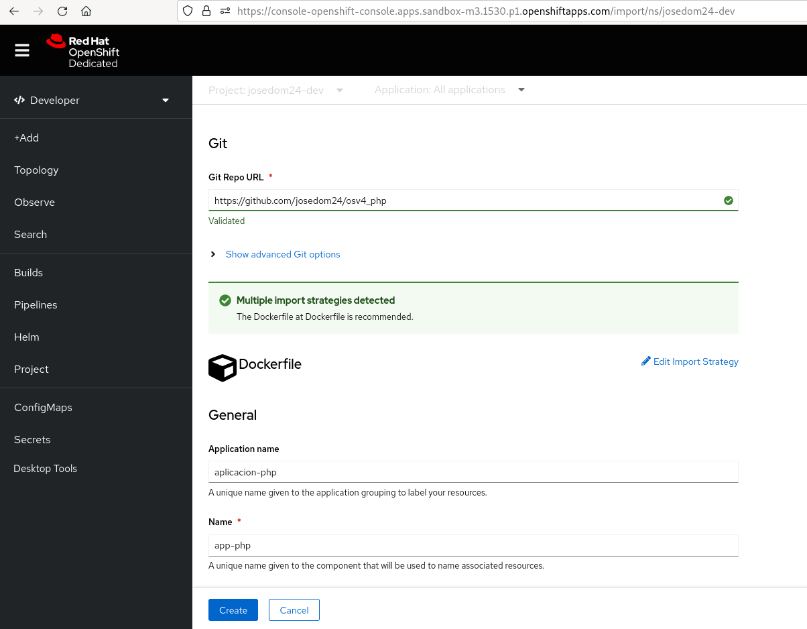

## Objeto BuildConfig

Cuando acabamos de crear el despliegue podemos apreciar en la topología que se ha creado un **BuildConfig** y se está ejecutando el primer **Build**:

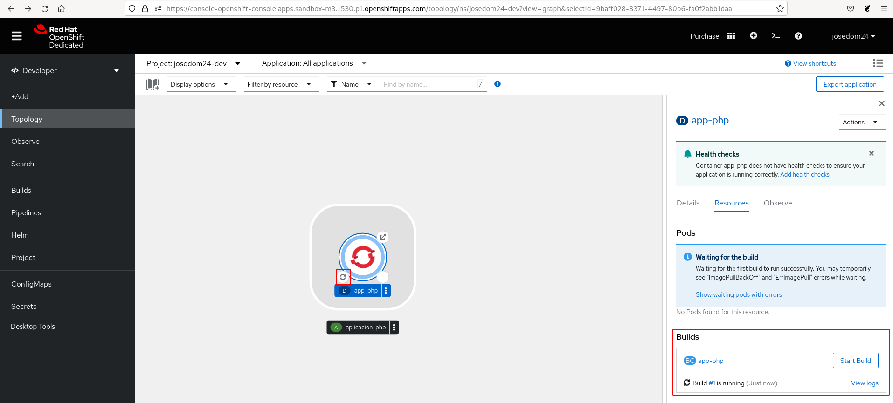

Una vez concluida la primera construcción, se nos muestra en la topología que ha concluido:

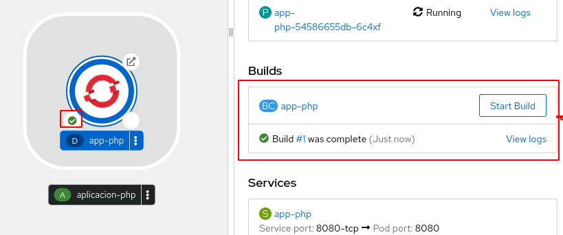

En la vista **Developer**, en la sección **Builds** podemos ver la lista de objetos **BuildConfig** que tenemos en nuestro proyecto:

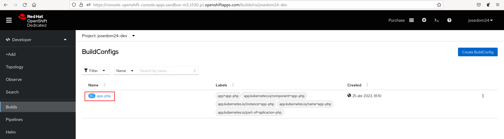

En esta página encontramos el botón **Create BuildConfig** que nos posibilita crear un nuevo objeto **BuildConfig** desde su definición YAML:

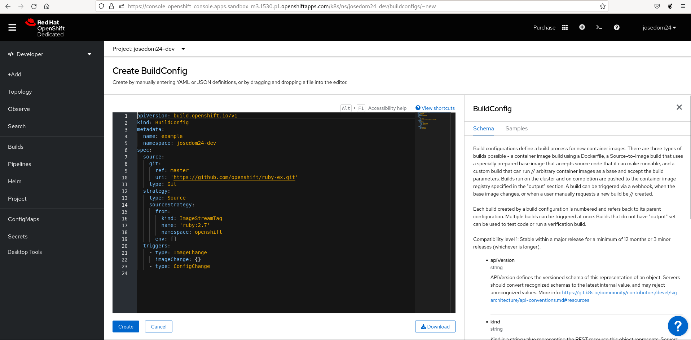

Si pulsamos sobre uno de ellos obtenemos los detalles:

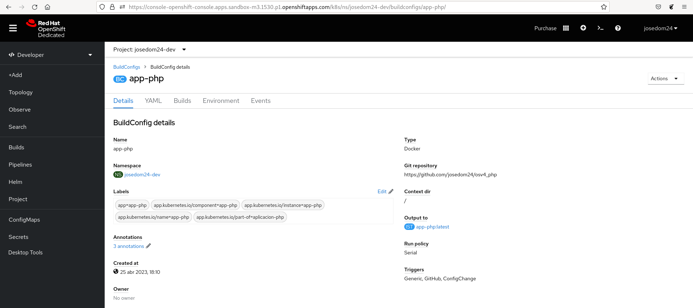

En esta página tenemos varias pestañas: 
* **Details**: La página donde estamos, que nos da información detallada del objeto.
* **YAML**: Donde accedemos a la definición YAML del objeto.
* **Builds**: Donde vemos la lista de **Builds** que se han realzados.
* **Enverionment**: Donde podemos crear variables de entornos de tipo clave=valor que se utilizan en el proceso de construcción.
* **Events**: Donde nos indica los distintos eventos que han modificado el estado del objeto.

En esta misma página podemos ver la configuración de los webhook del **BuildConfig**:

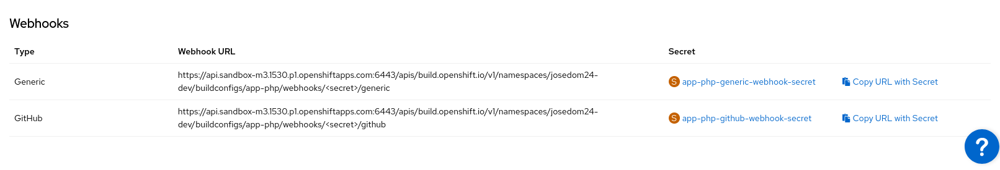

## Objetos builds

Como hemos indicado en la pestaña **Builds** nos encontramos la lista de builds que se han ejecutado para un **BuildConfig** determinado:

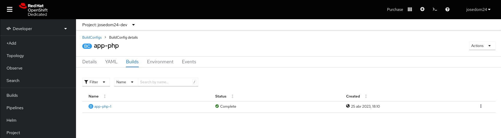

Si pulsamos sobre algún **Build** en concreto, accedemos a los detalles de la construcción:

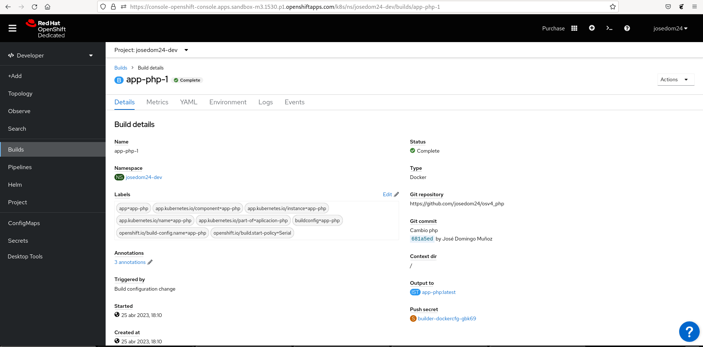

En esta página tenemos varias pestañas: 
* **Details**: La página donde estamos, que nos da información detallada del objeto.
* **Metrics**: Accedemos a los recursos que ha consumido el **build pod** en la construcción de la nueva imagen.
* **YAML**: Donde accedemos a la definición YAML del objeto.
* **Environment**: Donde podemos crear variables de entorno de tipo clave=valor que se utilizan en el proceso de construcción.
* **Logs**: Donde podemos visualizar los logs del proceso de construcción.
* **Events**: Donde nos indica los distintos eventos que han modificado el estado del objeto.

## Creación de un nuevo build

Tanto en el apartado **Topology**, como en la lista o detalles del objeto **BuildConfig** tenemos la opción de realizar otra construcción con la acción **Start Build**:

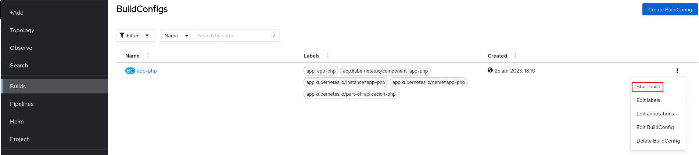

Podemos observar en la lista de **Builds** que se ha creado una nueva construcción:

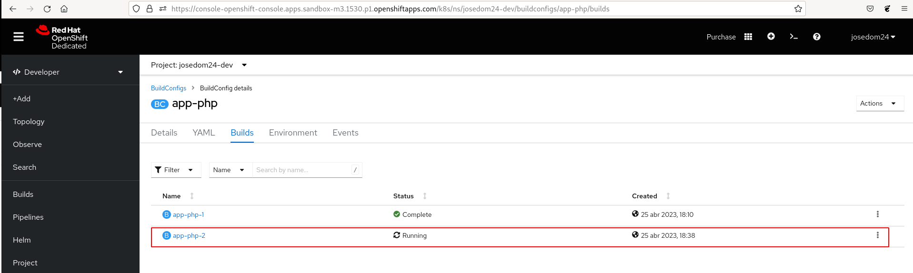

El proceso de construcción se ha creado en un nuevo **build pod**, que podemos ver una vez que se ha completado:

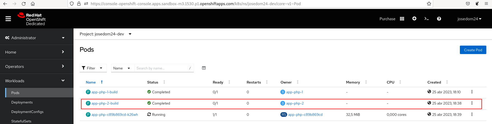

Como sabemos, esta nueva construcción hace que el objeto **Deployment** se actualice creando un nuevo **ReplicaSet** que creará un nuevo conjunto de Pods basados en la nueva imagen construida:

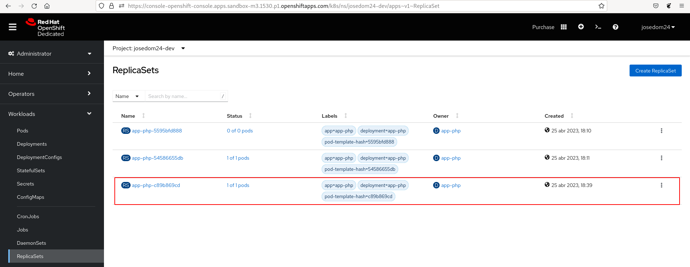