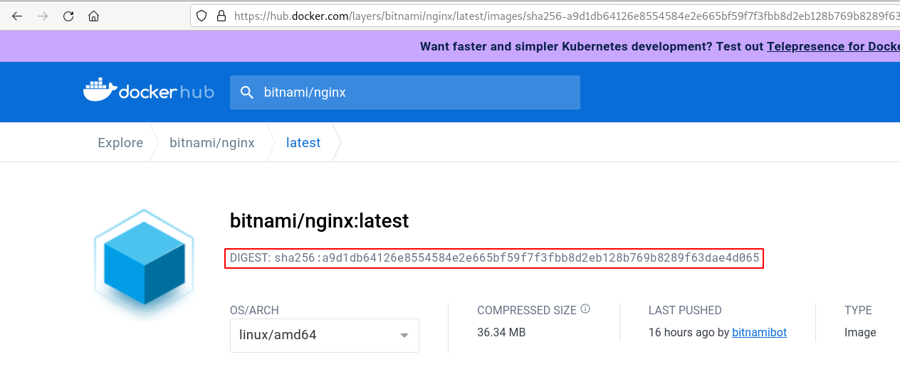
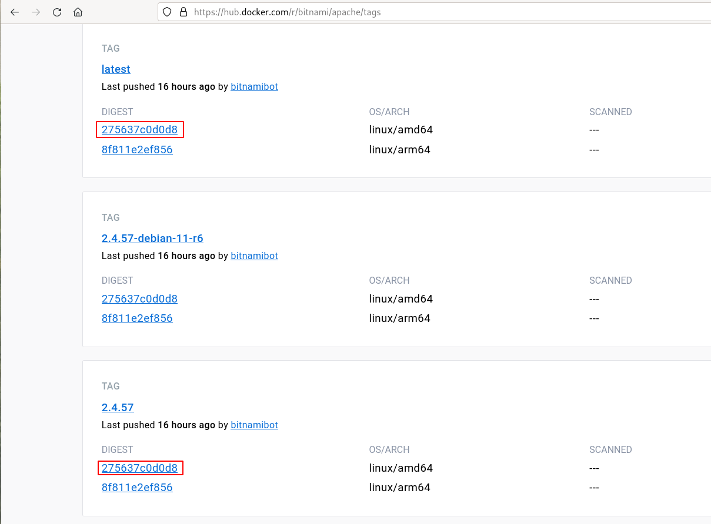

# Creación de ImageStream

Tenemos dos maneras de crear recursos **ImageStream**:

## Creación de ImageStream con new-app

Cada vez que creamos un nuevo despliegue con la instrucción `oc new-app` se crea una objeto **ImageStream** que apunta a la imagen utilizada o construida. Por ejemplo:

    oc new-project nginx
    oc new-app bitnami/nginx --name=web3
    --> Found container image 336e5d1 (16 hours old) from Docker Hub for "bitnami/nginx"
    ...
    --> Creating resources ...
        imagestream.image.openshift.io "web3" created

Si obtenemos los recursos **ImageStream**:

    oc get is
    NAME   IMAGE REPOSITORY                                                     TAGS     UPDATED
    web3   default-route-openshift-image-registry.apps-crc.testing/nginx/web3   latest   About a minute ago

Como vemos el nuevo **ImageStream** ha sido nombrado con el nombre que hemos puesto a la aplicación, y en este caso lo ha etiquetado con el mismo nombre de etiqueta (`latest`) que la imagen original:

Si obtenemos información del recurso:

    oc describe is web3
    ...
    Image Repository:	default-route-openshift-image-registry.apps-crc.testing/nginx/web3
    Image Lookup:		local=false
    Unique Images:		1
    Tags:			1

    latest
      tagged from bitnami/nginx

      * bitnami/nginx@sha256:a9d1db64126e8554584e2e665bf59f7f3fbb8d2eb128b769b8289f63dae4d065
          3 minutes ago

Observamos que tenemos una imagen con una etiqueta y encontramos el nombre de la imagen a la que estamos apuntando, cuyo ID se corresponde con la imagen original:

Finalmente podemos comprobar que tenemos la imagen en nuestro registro interno:

    oc get images|grep nginx
    ...
    sha256:a9d1db64126e8554584e2e665bf59f7f3fbb8d2eb128b769b8289f63dae4d065   bitnami/nginx@sha256:a9d1db64126e8554584e2e665bf59f7f3fbb8d2eb128b769b8289f63dae4d065

## Creación de ImageStream con import-image

Otra manera de crear recursos **ImageStream** es usando el comando `import-image`. En este caso indicamos el nombre de la **ImageStream** y la imagen a la que apunta. En este ejemplo vamos a utilizar el mismo nombre y vamos a apuntar a otra image indicando otra etiqueta:

    oc import-image web4:latest --from=docker.io/bitnami/apache --confirm

Es necesario poner la opción `--confirm` cuando creamos por primera ver una objeto **ImageStream**.

En este caso hemos creado el **ImageStream** `web4:latest`:

    oc describe is web4
    ...
    Unique Images:		1
    Tags:			1

    latest
      tagged from docker.io/bitnami/apache

      * docker.io/bitnami/apache@sha256:275637c0d0d82c0f87b2269d1871d6a7ad1e81e8960f5ec23fe599e456618b1a
          About a minute ago

Si miramos los ID de las imaǵenes `bitanmi/apache` en Docker Hub podemos comprobnar que hemos apuntado la versión `latest`. Además vemos que la versión `2.4.57` es la misma imagen:

Podríamos crear un nuevo tag apuntando a la misma imagen dentro de la **ImageStream** `web4`:

    oc import-image web4:2.4.57 --from=docker.io/bitnami/apache:2.4.57

    oc describe is web4
    ...
    Unique Images:		1
    Tags:			2

    latest
      tagged from docker.io/bitnami/apache

      * docker.io/bitnami/apache@sha256:275637c0d0d82c0f87b2269d1871d6a7ad1e81e8960f5ec23fe599e456618b1a
          4 minutes ago

    2.4.57
      tagged from docker.io/bitnami/apache:2.4.57

      * docker.io/bitnami/apache@sha256:275637c0d0d82c0f87b2269d1871d6a7ad1e81e8960f5ec23fe599e456618b1a
          1 second ago

Y también podríamos crear un tag a apuntando a otra vessión que corresponde a una imagen diferente:

    oc import-image web4:2.4.56 --from=docker.io/bitnami/apache:2.4.56

    oc describe is web4
    ...
    Unique Images:		2
    Tags:			3

    latest
      tagged from docker.io/bitnami/apache

      * docker.io/bitnami/apache@sha256:275637c0d0d82c0f87b2269d1871d6a7ad1e81e8960f5ec23fe599e456618b1a
          7 minutes ago

    2.4.57
      tagged from docker.io/bitnami/apache:2.4.57

      * docker.io/bitnami/apache@sha256:275637c0d0d82c0f87b2269d1871d6a7ad1e81e8960f5ec23fe599e456618b1a
          3 minutes ago

    2.4.56
      tagged from docker.io/bitnami/apache:2.4.56

      * docker.io/bitnami/apache@sha256:13f1a1b11c4a661d9689949b107378773ff23c5ac748dd9ce61b69d1c6804108
          2 seconds ago

Para ver las imágenes que tenemos en registro interno, ejecutamos:

    oc get images|grep apache
    sha256:13f1a1b11c4a661d9689949b107378773ff23c5ac748dd9ce61b69d1c6804108   docker.io/bitnami/apache@sha256:13f1a1b11c4a661d9689949b107378773ff23c5ac748dd9ce61b69d1c6804108
    sha256:275637c0d0d82c0f87b2269d1871d6a7ad1e81e8960f5ec23fe599e456618b1a   docker.io/bitnami/apache@sha256:275637c0d0d82c0f87b2269d1871d6a7ad1e81e8960f5ec23fe599e456618b1a

Para terminar, podríamos usar este **ImageStream** para desplegar una nueva aplicación:

    oc new-app web4:2.4.57 --name apache1

