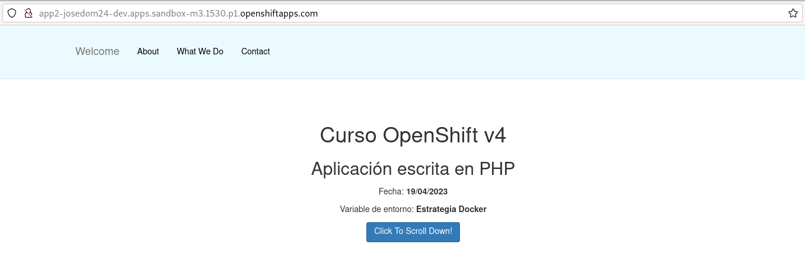
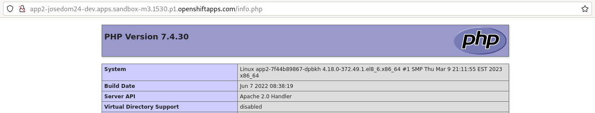

# Construcción de imágenes con estrategia Docker + repositorio Git

En el apartado anterior, vimos que al desplegar una aplicación con `oc new-app` entre otros recursos, se creaba el **BuildConfig** responsable de construir la nueva imagen. Realmente, no es necesario desplegar la aplicación, podemos simplemente crear el objeto **BuildConfig** para construir la imagen y posteriormente crear la aplicación desde la **ImageStream** que se haya creado. Para ello vamos a usar el comando `oc new-build`.

En este primer ejercicio vamos a crear una construcción (build) utilizando la estrategia **Docker** y como fuente de entrada donde esta nuestro fichero `Dockerfile` indicaremos  un **repositorio en GitHub**. 

En este ejercicio no vamos a desplegar la aplicación, vamos a construir la imagen ejecutando el comando `oc new-build`, que creará el **BuildConfig** encargado de construir la imagen que se guardará en el registro interno y se referenciará con un objeto **ImageStream**. Posteriormente desplegaremos la aplicación con `oc new-app` utilizando la imagen construida.

## Creación del BuildConfig con estrategia Docker

Vamos a seguir trabajando con el repositorio `https://github.com/josedom24/osv4_php` al que vamos a añadir un fichero `Dockerfile` con el siguiente contenido:

```
# https://github.com/sclorg/s2i-php-container/
FROM registry.access.redhat.com/ubi8/php-74
ENV INFORMACION="Estrategia Docker"
USER 0
COPY . /tmp/src
RUN chown -R 1001:0 /tmp/src
USER 1001
# Let the assemble script to install the dependencies
RUN /usr/libexec/s2i/assemble
# Run script uses standard ways to run the application
CMD /usr/libexec/s2i/run
``` 

Para ello:

    git add Dockerfile
    git commit -am "Añadimos Dockerfile"
    git push

Ahora, vamos a usar el comando `oc new-build` para construir la imagen. Este comando detectará en el repositorio el fichero `Dockerfile` y realizará una construcción con estrategia Docker. Vamos a verlo:

    oc new-build https://github.com/josedom24/osv4_php --name=app2
    --> Found container image 1df2b8a (6 days old) from registry.access.redhat.com for "registry.access.redhat.com/ubi8/php-74"

    
    --> Creating resources with label build=app2 ...
        imagestream.image.openshift.io "php-74" created
        imagestream.image.openshift.io "app2" created
        buildconfig.build.openshift.io "app2" created

Como vemos se crean dos objetos **ImageStream**: uno que referencia a la imagen indicada en el fichero `Dockerfile` y otro que referencia a la imagen creada, y un objeto **BuildConfig**:

    oc get bc
    NAME      TYPE     FROM   LATEST
    app2      Docker   Git    1

    oc get build
    NAME        TYPE     FROM          STATUS     STARTED          DURATION
    app2-1      Docker   Git@91cf2b5   Running    38 seconds ago   

Si quieres ver las tareas que se están ejecutando en el proceso de construcción, ejecuta:

    oc logs -f bc/app2

Una vez terminada, la construcción podemos ver los objetos **ImageStream** que se han generado:

    oc get is
    NAME      IMAGE REPOSITORY                                                                                         TAGS     UPDATED
    app2      default-route-openshift-image-registry.apps.sandbox-m3.1530.p1.openshiftapps.com/josedom24-dev/app2      latest   About a minute ago
    php-74    default-route-openshift-image-registry.apps.sandbox-m3.1530.p1.openshiftapps.com/josedom24-dev/php-74    latest   2 minutes ago

Sólo hemos creado la nueva imagen, pero no hemos realizado un despliegue, podemos desplegar nuestra nueva imagen utilizando el comando `oc new-app` indicando la imagen que hemos creado (el nombre del objeto **ImageStream** que lo referencia):

    oc new-app app2 --name=app2
    --> Found image c48eb64 (2 minutes old) in image stream "josedom24-dev/app2" under tag "latest" for "app2"
    ...
    --> Creating resources ...
        deployment.apps "app2" created
        service "app2" created

Como vemos ha encontrado una **ImageStream** llamada `app2:latest`, que será el que se utiliza para realizar el despliegue. En este caso, `oc new-app` sólo ha creado un recurso **Deployment** y otro **Service**.

    oc get deploy,rs,pod 
    NAME                      READY   UP-TO-DATE   AVAILABLE   AGE
    deployment.apps/app2      1/1     1            1           3m40s

    NAME                                 DESIRED   CURRENT   READY   AGE
    replicaset.apps/app2-7bdc779db9      0         0         0       3m40s
    replicaset.apps/app2-7f44b89867      1         1         1       3m40s

    NAME                           READY   STATUS      RESTARTS   AGE
    pod/app2-1-build               0/1     Completed   0          35m
    pod/app2-7f44b89867-ppfpd      1/1     Running     0          3m40s

Ya nos había ocurrido en un ejemplo anterior, vemos que se han creado dos recursos **ReplicaSet**. En realidad, en el proceso interno de creación del despliegue se crea un **ReplicaSet** pero no tiene indicada la imagen, por eso falla y a continuación, se vuelve a crear otro, con la imagen que hemos indicado, que ya si funciona y crea el Pod.

Creamos el objeto **Route** y accedemos a la aplicación:





## Otras operaciones

Si queremos crear la imagen y desplegarla, ejecutamos:

    oc new-app https://github.com/josedom24/osv4_php --name=app2-v2

Si queremos, no utilizar el fichero `Dockerfile` para la construcción y volver a usar la estrategia de **Source-2-Image**, hay que indicarlo explícitamente:

    oc new-build https://github.com/josedom24/osv4_php --name=app2-v4 --strategy=source

O si queremos también, desplegar la aplicación:

    oc new-app https://github.com/josedom24/osv4_php --name=app2-v4 --strategy=source
