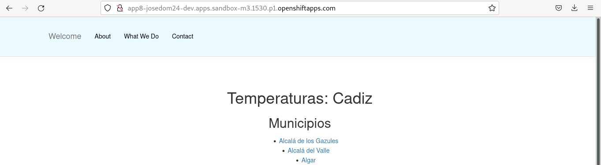

# Construcción de imágenes con Dockerfile en línea

En este tipo de construcción vamos a tener el contenido del fichero `Dockerfile` dentro de la definición del objeto **BuildConfig**.

Vamos a ver dos ejemplos:

## Ejemplo 1: BuildConfig con un Dockerfile inline

Partimos de la definición de un **BuildConfig** que tenemos en el fichero `bc-dockerfile1.yaml`:

```yaml
apiVersion: build.openshift.io/v1
kind: BuildConfig
metadata:
  labels:
    app: app7
  name: app7
spec:
  failedBuildsHistoryLimit: 5
  output:
    to:
      kind: ImageStreamTag
      name: imagen-app7:latest
  runPolicy: Serial
  source:
    dockerfile: |
      FROM centos:centos7
      CMD echo 'Hola, estás probando un dockerfile inline' && exec sleep infinity
    type: dockerfile
  strategy:
    dockerStrategy:
    type: Docker
  successfulBuildsHistoryLimit: 5
  triggers:
  - type: ConfigChange
  - imageChange: {}
    type: ImageChange
```

Creamos el objeto **BuildConfig**, creando en primer lugar la **ImageStream** que hemos indicado como salida:

    oc create is imagen-app7
    oc apply -f bc-dockerfile1.yaml 

    oc get bc
    NAME   TYPE     FROM         LATEST
    app7   Docker   Dockerfile   1

    oc get build
    NAME     TYPE     FROM             STATUS                         STARTED          DURATION
    NAME     TYPE     FROM             STATUS     STARTED          DURATION
    app7-1   Docker   Dockerfile       Running    24 seconds ago   

Una vez creada la nueva imagen, podemos desplegarla y comprobar la salida del Pod que se ha creado:

    oc new-app imagen-app7 --name=app7

    oc logs deploy/app7
    Hola, estás probando un dockerfile inline

## Ejemplo 2: BuildConfig con un Dockerfile sustituido

En este caso partimos de un repositorio Git donde tenemos una aplicación y un `Dockerfile` para la creación de la imagen. Sin embargo, vamos a partir del código de ese repositorio pero vamos a sustituir el `Dockerfile` por uno que tenemos definido en el **BuildConfig**. Para ello partimos de la definición que tenemos en el fichero `bc-dockerfile2.yaml`:

```yaml
apiVersion: build.openshift.io/v1
kind: BuildConfig
metadata:
  labels:
    app: app8
  name: app8
spec:
  failedBuildsHistoryLimit: 5
  output:
    to:
      kind: ImageStreamTag
      name: imagen-app8:latest
  runPolicy: Serial
  source:
    type: Git
    git:
      uri: https://github.com/josedom24/osv4_python                    
    dockerfile: |
      FROM bitnami/python:3.7
      WORKDIR /app
      COPY app /app
      RUN pip install --upgrade pip
      RUN pip3 install --no-cache-dir -r requirements.txt
      ENV PROVINCIA=cadiz
      EXPOSE 8000
      CMD [ "python3", "app.py"]
  strategy:
    dockerStrategy:
    type: Docker
  successfulBuildsHistoryLimit: 5
  triggers:
  - type: ConfigChange
  - imageChange: {}
    type: ImageChange
```

No se va a ejecutar el fichero `Dockerfile` que se encuentra en el repositorio Git, se va a sustituir por el que hemos escrito en la definición anterior. Por la tanto la variable `PROVINCIA` no será `sevilla`, tendrá el valor de `cadiz`, además se ha utilizado otra versión de la imagen base para construir la imagen.

Y ejecutamos:

    oc create is imagen-app8
    oc apply -f bc-dockerfile2.yaml

    oc new-app imagen-app8 --name=app8
    oc expose service app8

Y accedemos a la aplicación:

