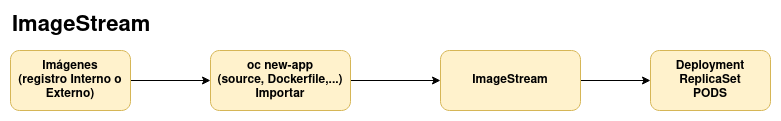
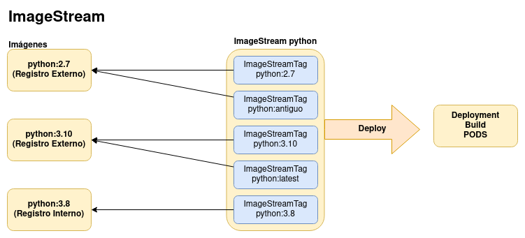

# Introducción al recurso ImageStream

Los flujos de imágenes (**ImageStream**) permiten crear y actualizar imágenes de contenedores de forma continua. 

* Un **ImageStream** y sus etiquetas (**tags**) asociadas proporcionan una abstracción para hacer referencia a imágenes de contenedores desde OpenShift.* Nos permiten ver qué imágenes están disponibles y asegurarse de que está utilizando la imagen específica que necesita, incluso si la imagen del repositorio cambia.
* Las etiquetas de un recurso **ImageStream**, se representa por un recursos **ImageStreamTag** y es un puntero a una versión de una imagen real que puede estar en el registro interno de OpenShift o en un registro externo.
* Realmente tenemos un puntero, no al nombre y versión de una image, sino a su **identificador digest**. Un digest de imagen identifica de forma única una versión específica de la imagen, por lo que garantizamos que se ejecuta el mismo código cada vez que inicia un contenedor con ese nombre de imagen y digest especificado.

Veamos un ejemplo:

A partir, de ejemplo vemos algunas ventajas de usar **ImageStream**:

1. La gestión de etiquetar las imágenes se hace mucho más sencilla.
2. Se pueden desplegar de forma automática las aplicaciones cuando se crea o actualiza una **ImageStream**.
3. Podemos actualizar las imágenes de forma automática.
4. Si la imagen de origen cambia, la etiqueta de flujo de imagen sigue apuntando a una versión buena conocida de la imagen, asegurando que su aplicación no se rompa inesperadamente.
5. Podemos gestionar el acceso a las imágenes de forma sencilla.
6. Podemos crear nuevas aplicaciones o construir imágenes a partir de **ImageStream**. Cuando la imagen cambia, esto puede desencadenar un nuevo despliegue o una nueva construcción.

En este módulo vamos a trabajar en nuestra instalación local crc, con el usuario administrador, para que tengamos acceso a las imágenes del registro interno (`oc get images`) y nos ayuda a entender el funcionamiento de los recursos que vamos a estudiar.
