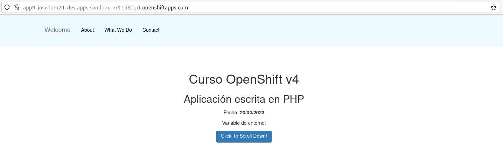
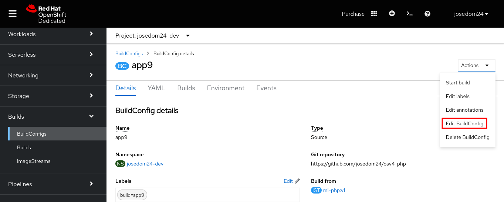
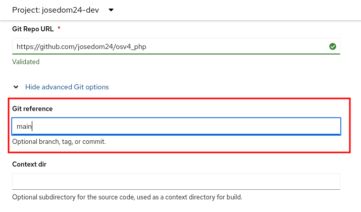
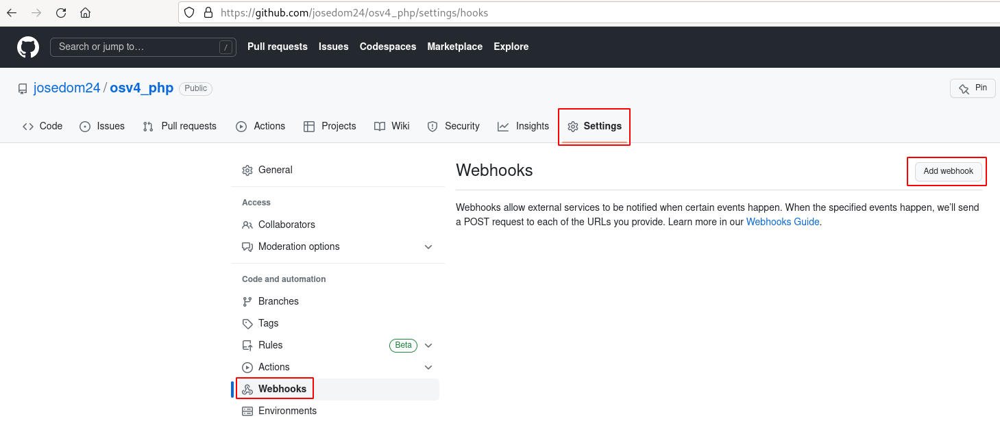
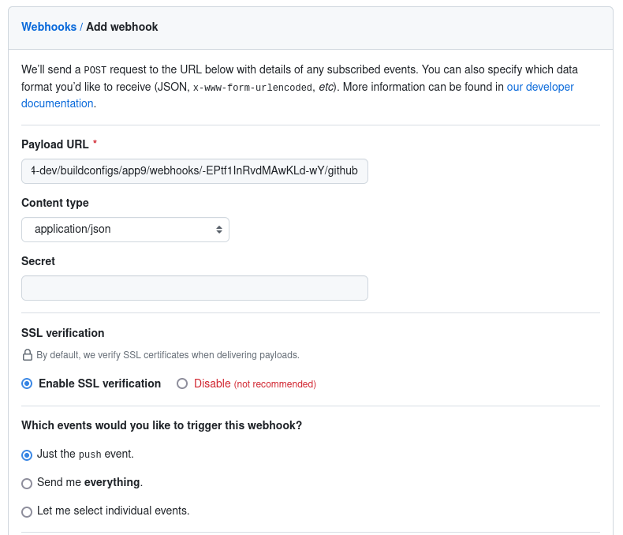
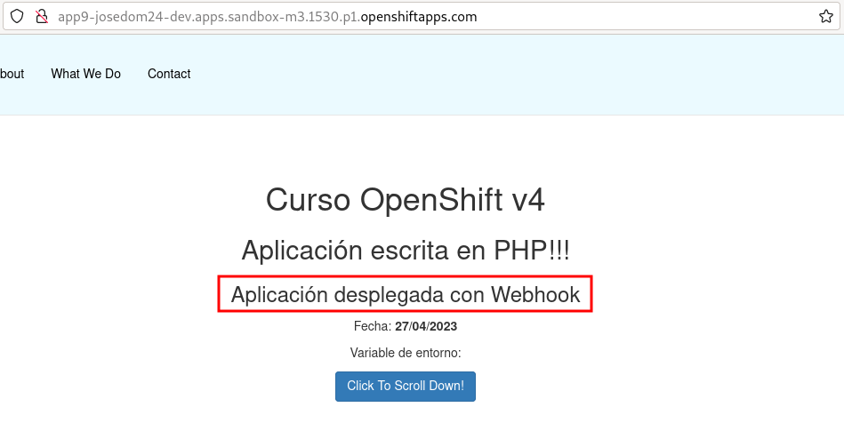

# Actualización automática de un build por trigger webhook

Este tipo de actualización de un **BuildConfig** se realizará por medio de la configuración de un webhook en un servicio externo. El servicio externo hará una llamada a una URL de nuestro clúster de OpenShift cuando ocurra un evento. Esta llamada, provocará el inicio de un nuevo build.

Esta característica nos permite la funcionalidad de **Despliegue Continuo** en OpenShift. Por ejemplo, podemos configurar el repositorio GitHub donde tenemos nuestra aplicación para que cada vez que hagamos un `push` se haga una petición al webhook que hemos configurado y que inicie de forma automática un nuevo build. Si hemos utilizado la imagen generada en un despliegue, finalmente se actualizará el despliegue obteniendo la implantación de la nueva versión de la aplicación.

Veamos una demostración, siguiendo con en el ejemplo del apartado anterior, vamos a desplegar la imagen que habíamos generado:

    oc new-app app9
    oc expose service/app9

Vamos a crear la URL del webhook, para ello ejecutamos:

    oc describe bc app9
    ...
    Triggered by:		Config, ImageChange
    Webhook GitHub:
    	URL:	https://api.sandbox-m3.1530.p1.openshiftapps.com:6443/apis/build.openshift.io/v1/namespaces/josedom24-dev/buildconfigs/app9/webhooks/<secret>/github
    Webhook Generic:
    	URL:		https://api.sandbox-m3.1530.p1.openshiftapps.com:6443/apis/build.openshift.io/v1/namespaces/josedom24-dev/buildconfigs/app9/webhooks/<secret>/generic
    	AllowEnv:	false

En esa sección podemos encontrar la URL del webhook de GitHub, pero necesitamos sustituir la parte `<secret>` por un identificador que identifica este objeto **BuildConfig**. Para obtener este identificador, ejecutamos:

    oc get bc app9 -o yaml
    ...
    triggers:
      - github:
          secret: -EPtf1InRvdMAwKLd-wY
        type: GitHub
      - generic:
          secret: ys1E_7ah4ghQYY_wUbI0
    ...

Por lo tanto la URL que necesitamos es la siguiente:

    https://api.sandbox-m3.1530.p1.openshiftapps.com:6443/apis/build.openshift.io/v1/namespaces/josedom24-dev/buildconfigs/app9/webhooks/-EPtf1InRvdMAwKLd-wY/github

Desde la consola web es más fácil obtener dicha URL. Tenemos que acceder a los detalles del **BuildConfig**, en la parte inferior podemos copiar la URL con el botón **Copy URL with Secret**:

Antes de configurar el webhook en nuestro repositorio GitHub, tenemos que asegurarnos de configurar el objeto **BuildConfig** con el nombre de la rama del repositorio con el que estamos trabajando (si la rama es **master** funciona sin problemas, pero si no es así, hay que realizar este paso):

Editamos la definición del **BuildConfig** y añadimos la rama, que en nuestro caso se llama `main`:

    oc edit bc app9
    ...
    source:
    type: Git
    git:
      uri: 'https://github.com/josedom24/osv4_php'
      ref: main
    ...

Desde la consola web, podemos hacerlo editando el objeto **BuildConfig**:

Y configuramos el nombre de la rama:

A continuación tenemos que configurar el webhook en nuestro repositorio en GitHub, para ello accedemos a **Settings -> Webhooks -> Add webhook**:

Ahora, configuramos el Webhook. En **Payload URL** pegamos la URL y en el parámetro **Content type** elegimos `application/json`:

Vamos a comprobar que funciona. Modificamos un fichero `index.php` y lo guardamos en el repositorio:

    git commit -am "Modifico index.php"
    git push

De forma automática se ha disparado un nuevo build:

    oc get build
    NAME     TYPE     FROM          STATUS     STARTED          DURATION
    app9-1   Source   Git@c8e0272   Complete   16 minutes ago   1m0s
    app9-2   Source   Git@c8e0272   Complete   13 minutes ago   56s
    app9-3   Source   Git@0e4036a   Running    8 seconds ago  

Y comprobamos que la aplicación ha sido modificada:

