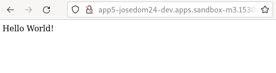
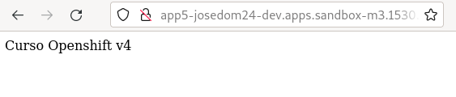
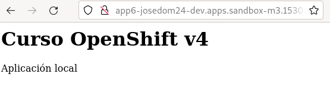

# Construcción de imágenes desde ficheros locales

A este tipo de construcción de imágenes se la llama **binary build**, y nos permite cargar código fuente directamente en un build en lugar de indicar un repositorio Git.

Podemos iniciar una construcción binaria, en cualquier **BuildConfig** que ues estrategia Docker o s2i. Para indicar el código fuente que vamos a usar, tenemos varias formas:

* `from-file`: Se indica un sólo fichero.
* `from-dir`: Se indica un directorio donde están los ficheros.
* `from-archive`: Desde un fichero comprimido.
* `from-repo`: El código fuente forman parte de un repositorio Git en la máquina local del usuario.

Se llama construcción binaria, porque se comprime los ficheros indicados en un binario que se sube a OpenShift para ser utilizado como entrada en la construcción.

Se suelen usar en varios casos: 

* Cuando queremos construir y probar cambios desde código local, por ejemplo clonamos un repositorio Git, y los cambios que realicemos lo podemos probar, antes de volver a guardarlo en el repositorio.
* Cuando queremos construir una imagen usando código privado, que no tenemos en un repositorio.
* En un proceso de IC/DC podemos inyectar un código que se haya generado en un etapa de la integración continúa.

Como limitaciones indicar:

* Que las binary builds no son reproducibles, si queremos repetirlas tenemos que cargar el mismo código fuente.
* No se pueden activar automáticamente, disparadas por triggers. Sólo pueden iniciarse manualmente.

## Ejemplo 1: Construcción de cambios locales del código fuente

Vamos a crear una aplicación a partir de un repositorio de ejemplo de OpenShift que nos despliega una aplicación construida con Python Flask: [https://github.com/devfile-samples/devfile-sample-python-basic.git](https://github.com/devfile-samples/devfile-sample-python-basic.git).

Para ello ejecutamos las siguientes instrucciones:

    oc new-app https://github.com/devfile-samples/devfile-sample-python-basic.git --name=app5
    oc expose service app5

Después de construir la imagen, se despliega y podemos acceder a la aplicación:



A continuación nos clonamos el repositorio y hacemos un cambio en el código:

    git clone https://github.com/devfile-samples/devfile-sample-python-basic.git
    cd devfile-sample-python-basic/

Modificamos el fichero `app.py` y cambiamos el mensaje `Hello World!` por otro mensaje. 

A continuación vamos a crear una nueva construcción, pero le vamos a indicar que coja los ficheros del directorio donde hemos realizado el cambio, para ello:

    oc start-build app5 --from-dir="."
    Uploading directory "." as binary input for the build ...

    Uploading finished
    build.build.openshift.io/app5-2 started

    oc get bc
    NAME   TYPE     FROM   LATEST
    app5   Source   Git    2
    oc get build
    NAME     TYPE     FROM             STATUS     STARTED          DURATION
    app5-1   Source   Git@41017b7      Complete   5 minutes ago    1m5s
    app5-2   Source   Binary@41017b7   Running    16 seconds ago   

Una vez terminada dicha construcción, accedemos de nuevo a la aplicación para asegurarnos que se ha modificado con el nuevo código:



Una vez que probemos que los cambios son adecuados, podríamos guardarlos en el repositorio Git.

## Ejemplo 2: Construcción de imagen usando código privado

En este caso partimos de un código fuente que tenemos en local, no está en ningún repositorio Git.

En un directorio local tenemos un fichero `Dockerfile` con el siguiente contenido:

```
FROM centos:centos7
EXPOSE 8080
COPY index.html /var/run/web/index.html
CMD cd /var/run/web && python -m SimpleHTTPServer 8080
```

Y un dichero `index.html`:

```html
<html lang="es">
  <head>
    <title>Local App</title>
    <meta http-equiv="Content-Type" content="text/html; charset=utf-8"/>
  </head>
  <body>
    <h1>Curso OpenShift v4</h1>
    <p>Aplicación local</p>
  </body>
</html>
```

A continuación vamos a crear un **BuildConfig** de la siguiente manera:

    oc new-build --strategy docker --binary  --name app6
    
Como vemos indicamos la estrategia de construcción, que usará el fichero `Dockerfile` e indicamos con el parámetro `--binary` que el código fuente habrá que inyectarlo en cada una de las construcciones.
Podemos observar que al crear el objeto **BuildConfig** no se disparado ningún build:

    oc get bc
    NAME   TYPE     FROM     LATEST
    app6   Docker   Binary   0

Tenemos que iniciar la construcción de forma manual indicando donde está el código fuente:

    oc start-build app6 --from-dir="."
    Uploading directory "." as binary input for the build ...

    Uploading finished
    build.build.openshift.io/app6-1 started

    oc get build
    NAME     TYPE     FROM             STATUS     STARTED          DURATION
    app6-1   Docker   Binary@820a92f   Running    9 seconds ago    

Una vez concluida la construcción comprobamos que se ha creado la imagen, y lanzamos una nueva aplicación:
    
    $ oc get is -o name
    imagestream.image.openshift.io/app6

    oc new-app app6
    oc expose service app6

Finalmente, accedemos a la aplicación:


