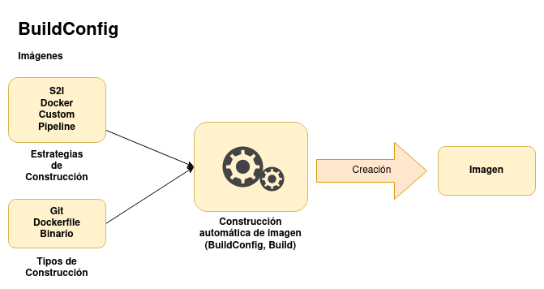

# Introducción a la construcción automática de imágenes (build)

Un **build** el es proceso por el que OpenShift construye una nueva imagen docker a partir de unos parámetros de entrada.

La definición de este proceso de construcción se define en un objeto **BuildConfig**. Cuando se comienza el proceso de construcción definido en un **BuildConfig** se crea un objeto **Build** que representa ese proceso de construcción. La construcción se realizará en un **pod de construcción (pod build)**.

## Estrategias de construcción

* **Docker**: La construcción se realiza a partir de un fichero `Dockerfile`.
* **Source-to-image (S2I)**: La construcción se hace a partir de una imagen constructora (**builder image**) donde se añade el código d la aplicación.
* **Pipeline**: En OpenShift v4 usamos el framework **Tekton** para definir las tareas que queremos ejecutar en el proceso de construcción. También podemos usar pipelines de Jenkins por compatibilidad con la versión 3.
* **Personalizado**: Permite a los desarrolladores definir una imagen de compilación específica responsable de todo el proceso de compilación.

## Fuentes de entrada para la construcción

Tenemos varias fuente como entrada de nuestro proceso de construcción:

* Definiciones de `Dockerfile` en línea 
* Imágenes existentes 
* Repositorios Git 
* Entradas binarias (locales) 
* Inputs secrets
* Artefactos externos 

## Resumen

