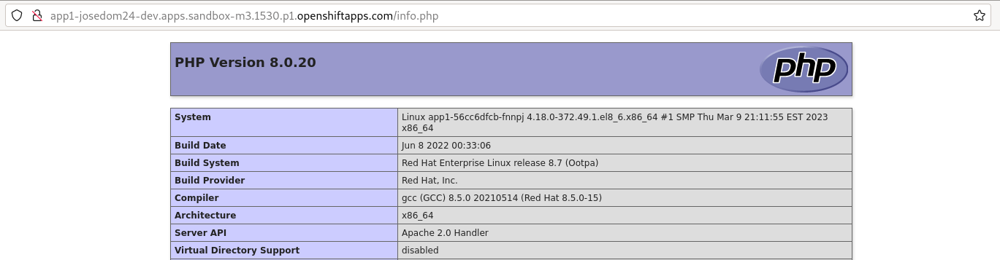

# Creación y definición del recurso BuildConfig

Los ejercicios de este módulo lo vamos a ejecutar en RedHat OpenShift Dedicated Developer Sandbox con nuestro usuario sin privilegios. Se puede realizar en nuestra instalación local con crc, pero el proceso de build requiere más recursos de computación y he tenido algunos problemas de conexión con el clúster.

En este primer ejercicio vamos a crear una construcción (build) utilizando la estrategia **Source-to-image (S2I)** y como fuente de entrada donde esta nuestra código un **repositorio en GitHub**. 

En este ejercicio vamos a desplegar la aplicación con `oc new-app` y como ya hemos visto unos de los recursos que se crearán será el **BuildConfig** encargado de construir la imagen que se guardara en el registro interno y se apuntara con un objeto **ImageStream**. En posteriores capítulos utilizaremos lel comando `oc new-build` para crear el objeto **BuildConfig** sin necesidad de desplegar la aplicación.

## Despliegue de la aplicación con la estrategia Source-to-image

Para ello usamos el comando `oc new-app` indicando la imagen constructora que vamos a usar y el repositorio donde se encuentra el código. Si no indicamos la imagen constructora, OpenShift examinará los ficheros del repositorio y escogerá una imagen constructora dependiendo del lenguaje de programación que haya detectado. Para ello sigue el siguiente criterio:

|Lenguaje|Ficheros|
|--------|-----------|
|dotnet|project.json, *.csproj|
|jee|pom.xml|
|nodejs|app.json, package.json|
|perl|cpanfile, index.pl|
|php|composer.json, index.php|
|python|requirements.txt, setup.py|
|ruby|Gemfile, Rakefile, config.ru|
|scala|build.sbt|
|golang|Godeps, main.go|

Por lo tanto en la primera aplicación no vamos a indicar la imagen constructora y vemos que imagen nos sugiere, con nuestra aplicación PHP:

    oc new-app https://github.com/josedom24/osv4_php --name=app1
    -> Found image b34c3d8 (5 months old) in image stream "openshift/php" under tag "8.0-ubi8" for "php"
    ...
    --> Creating resources ...
        imagestream.image.openshift.io "app1" created
        buildconfig.build.openshift.io "app1" created
        deployment.apps "app1" created
        service "app1" created
    ...

* En este caso se ha escogido la imagen `php:8.0-ubi8` para realizar la construcción.
* Como indicamos se han creado varios recursos:
    * Un **ImageStream**: que apuntará a la imagen que se va a generar.
    * Un **BuildConfig**: donde guardamos la configuración de la construcción que se va a realizar para crear la nueva imagen.
    * Un **Deployment**: Responsable de desplegar la aplicación, una vez que se haya construido la imagen.
    * Un **Service**: Que nos permite el acceso a la aplicación.

Una vez ejecutado el comando, podemos comprobar que efectivamente se ha creado un objeto **BuildConfig**:

    oc get bc
    NAME   TYPE     FROM   LATEST
    app1   Source   Git    1

Además, se ha comenzado el proceso de creación de la imagen, y para ello se ha creado un objeto **Build** (que está en ejecución):

    oc get build
    NAME     TYPE     FROM          STATUS    STARTED         DURATION
    app1-1   Source   Git@3f2efa3   Running   9 seconds ago   

¿Donde se ejecuta la construcción de la nueva imagen? En un pod de construcción:

    oc get pod
    NAME           READY   STATUS    RESTARTS   AGE
    app1-1-build   1/1     Running   0          12s

Una vez terminada la construcción:

    oc get build
    NAME     TYPE     FROM          STATUS     STARTED              DURATION
    app1-1   Source   Git@3f2efa3   Complete   About a minute ago   54s

Podemos comprobar que se ha creado el objeto **ImageStram** apuntando a la nueva imagen que hemos creado:

    oc get is
    NAME   IMAGE REPOSITORY                                                                                      TAGS     UPDATED
    app1   default-route-openshift-image-registry.apps.sandbox-m3.1530.p1.openshiftapps.com/josedom24-dev/app1   latest   51 seconds ago

Y se ha creado el objeto **Deployment** responsable de la creación de los pods de la aplicación, que se construyen a partir de la iamgen construida:

    oc get deploy,rs,pod
    NAME                   READY   UP-TO-DATE   AVAILABLE   AGE
    deployment.apps/app1   1/1     1            1           118s

    NAME                              DESIRED   CURRENT   READY   AGE
    replicaset.apps/app1-56cc6dfcb    1         1         1       67s
    replicaset.apps/app1-5bc9cfc7b9   0         0         0       118s

    NAME                       READY   STATUS      RESTARTS   AGE
    pod/app1-1-build           0/1     Completed   0          118s
    pod/app1-56cc6dfcb-fnnpj   1/1     Running     0          67s

Podemos ver como cuando el pod constructor (**app1-1-build**) termina de construir la imagen, se detiene y está en estado *Completed*.

Por último podemos crear el objeto **Route**:

    oc expose service app1
    route.route.openshift.io/app1 exposed

Y acceder a la aplicación:

