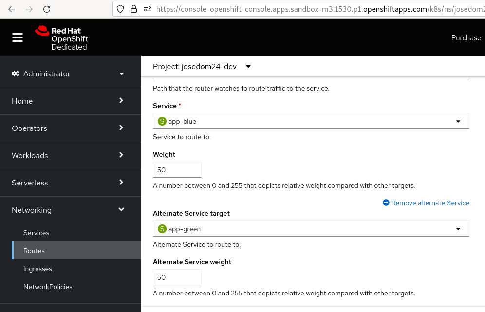

# Estrategias de despliegues basadas en rutas

En este tipo de estrategia de despliegue configuramos el objeto **Route** para que enrute el tráfico a distintos Pods de distintos servicios.

Con esta funcionalidad podemos implementar una estrategia de despliegue **Blue/Green**, podemos ofrecer dos versiones de la aplicación: la nueva (la "verde") se pone a prueba y se evalúa, mientras los usuarios siguen usando la versión actual (la "azul"). El cambio entre versiones se va haciendo gradualmente. Si hay algún problema con la nueva versión, es muy fácil volver a la antigua versión.

Una estrategia alternativa habitual es utilizar versiones A/B que estén activas al mismo tiempo y algunos usuarios utilicen una versión y otros la otra. Esto se puede utilizar para experimentar con cambios en la interfaz de usuario y otras características para obtener comentarios de los usuarios. 

## Modificación del objeto Route para servir otra aplicación

Este tipo de estrategia trabaja con dos objetos **Deployment**, pero se crea un sólo objeto **Route** que en un primer momento está conectado al **Service** del primer despliegue (versión actual de la aplicación). Vamos a crear dos despliegues y vamos a crear la ruta que apunta al primero de ellos:

    oc new-app josedom24/citas-backend:v1 --name=app-blue
    oc new-app josedom24/citas-backend:v2 --name=app-green

    oc expose svc/app-blue --port=10000 --name=app

En otro terminal, podemos comprobar la versión de la aplicación a la que estamos accediendo, ejecutando:

    while true; do curl http://app-josedom24-dev.apps.sandbox-m3.1530.p1.openshiftapps.com/version; done

Si queremos que la ruta nos sirva la nueva aplicación, simplemente tenemos que modificar el **Service** que tiene configurado.

    oc patch route/app -p '{"spec":{"to":{"name":"app-green"}}}'

Vamos a servir la primera versión para continuar con el ejemplo:

    oc patch route/app -p '{"spec":{"to":{"name":"app-blue"}}}'

## Despliegue Blue/Green basado en rutas

Ahora podemos configurar la ruta, para que vaya enrutando a los dos **Services** correspondientes a los dos **Deployment**. A cada servicio se le asigna un peso y la proporción de peticiones a cada servicio es el peso asignado dividido por la suma de los pesos.

Por ejemplo si queremos que el 75% de las peticiones siga sirviendo la versión actual y el 25% la nueva versión:

    oc set route-backends app app-blue=75 app-green=25

Obtenemos información de la ruta y lo comprobamos:

    oc get route app
    NAME   HOST/PORT                                                     PATH   SERVICES                       PORT    TERMINATION   WILDCARD
    app    app-josedom24-dev.apps.sandbox-m3.1530.p1.openshiftapps.com          app-blue(75%),app-green(25%)   10000                 None
   
Para que sirvan las dos versiones al 50%, podemos usar cualquiera de esta dos posibilidades:

    oc set route-backends app app-blue=50 app-green=50
    oc set route-backends app --equal

Y finalmente si sólo queremos servir la nueva versión:

    oc set route-backends app app-blue=0 app-green=100

Los pesos se indican con un número de 0 a 256. Podemos indicar el peso para un servicio y hacer que el otro se ajuste de forma automática:

    oc set route-backends app app-blue=30 --adjust 
    oc get route app
    NAME   HOST/PORT                                                     PATH   SERVICES                       PORT    TERMINATION   WILDCARD
    app    app-josedom24-dev.apps.sandbox-m3.1530.p1.openshiftapps.com          app-blue(23%),app-green(76%)   10000                 None

También podemos indicar los pesos como porcentajes:

    oc set route-backends app app-blue=25% --adjust 

    oc get route app
    NAME   HOST/PORT                                                     PATH   SERVICES                       PORT    TERMINATION   WILDCARD
    app    app-josedom24-dev.apps.sandbox-m3.1530.p1.openshiftapps.com          app-blue(25%),app-green(75%)   10000                 None

Los pesos también se pueden modificar de manera muy sencilla desde la consola web editando la definición del objeto **Route**:

