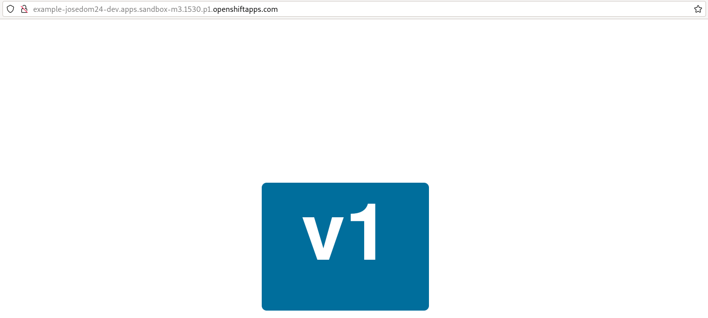
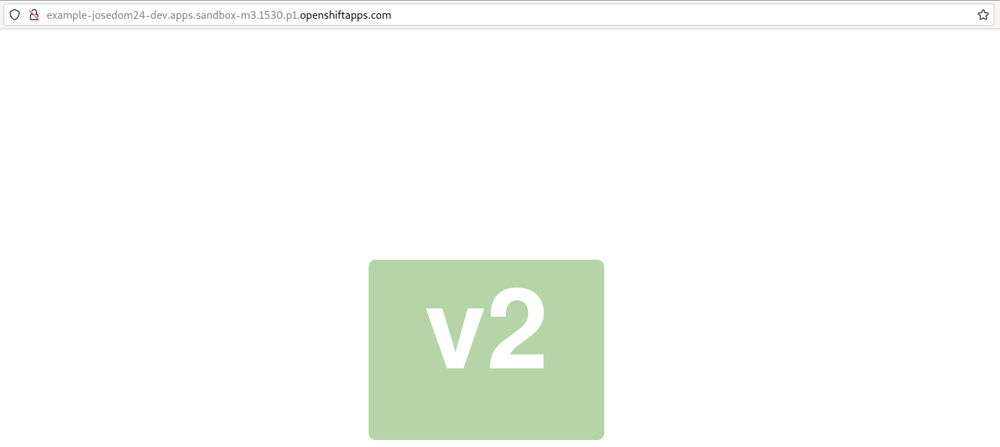
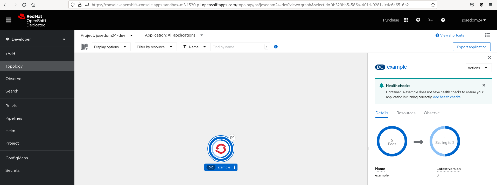

# Estrategias de despliegues

Cuando se actualiza un despliegue, la manera en cómo se van eliminando los Pods antiguos y se crean los nuevos, es lo que llamamos **estrategias de despliegue**. El objetivo, es que el tiempo de inactividad sea lo más bajo posible. Lo que vamos a explicar sobre las estrategias de despliegues en este apartado, nos sirve tanto para los objetos **Deployment** como para los objetos **DeploymentConfig**.

Vamos a estudiar dos tipos de estrategias:

## Estrategia Rolling Update

En este tipo de estrategia utiliza una implementación gradual y en cascada para actualizar los Pods: se van creando los nuevos Pods, se comprueba que funcionan, y posteriormente se van eliminando los Pods antiguos. Es la estrategia por defecto. Veamos la configuración de esta estrategia, creando un **DeploymentConfig** a partir de la **ImageStream** `is-example` que tiene otras dos etiquetas apuntando a las distintas versiones:

    oc create is is_example
    oc import-image is_example:v1 --from=quay.io/openshifttest/deployment-example:v1
    oc import-image is_example:v2 --from=quay.io/openshifttest/deployment-example:v2
    oc tag is_example:v1 is_example:latest

    oc new-app is_example:latest --as-deployment-config=true --name=example

Ahora nos fijamos en la configuración de la estrategia en la definición del objeto:

    oc get dc example -o yaml

```yaml
strategy:
    activeDeadlineSeconds: 21600
    resources: {}
    rollingParams:
      intervalSeconds: 1
      maxSurge: 25%
      maxUnavailable: 25%
      timeoutSeconds: 600
      updatePeriodSeconds: 1
    type: Rolling
```

* `intervalSeconds`: El tiempo de espera entre la comprobación del estado de despliegue después de la actualización.
* `timeoutSeconds`: El tiempo de espera máximo para cada actualización de Pod.
* `updatePeriodSeconds`: El tiempo de espera entre actualizaciones de Pods individuales.Por defecto, un segundo.
* `maxSurge`: El número máximo de Pods nuevos que se pueden crear por encima del número deseado de replicas.
* `maxUnavailable`: El número máximo de Pods que se pueden eliminar simultáneamente.

Vamos a escalar el despliegue y a comprobar el acceso a la aplicación:

    oc scale dc/example --replicas=5
    oc expose service/example



A continuación vamos a hacer la actualización del despliegue, para verlo bien puedes poner en una terminal la siguiente instrucción:

    watch oc get pod

Y en otra terminal actualizamos la etiqueta `latest` del **ImageStream** Para provocar el nuevo despliegue:

    oc tag -d is_example:latest
    oc tag is_example:v2 is_example:latest

Finalmente podemos comprobar que tenemos desplegada la versión 2:



En la consola web, también podemos ver la transición de los Pods. En la vista **Developer**, la opción **Topology**, escogemos el objeto **DeploymentConfig** y en las acciones elegimos **Start rollout**:



## Estrategia Recreate

En algunas circunstancias, podemos necesitar eliminar todos los Pods antiguos y posteriormente crear los nuevos. Este tipo de estrategia se denomina **Recreate**.

Vamos a modificar el tipo de estrategia en nuestro **DeploymentConfig**:

    oc edit dc example

Y modificamos la sección `strategy` y la dejamos así:

```yaml
strategy:
    type: Recreate
```

Ahora vamos a volver a actualizar el despliegue a la versión 1 (recuerda tener en una terminal ejecutando `watch oc get pod` para ver como se eliminan todos los Pods antes de crear los nuevos):

    oc tag -d is_example:latest
    oc tag is_example:v1 is_example:latest    

## Estrategia custom

A los objetos **DeploymentConfig** se el puede configurar una estrategia personalizada. [Más información](https://docs.openshift.com/container-platform/4.12/applications/deployments/deployment-strategies.html#deployments-custom-strategy_deployment-strategies).
