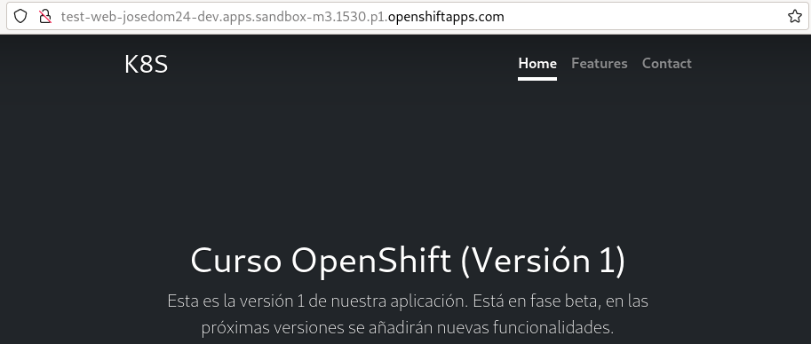

# Creación de un DeployConfig al crear una aplicación

Como hemos indicado anteriormente al crear una nueva aplicación con `oc new-app`, por defecto se va a desplegar usando un recurso de tipo **Deployment**. Si queremos crear un despliegue usando un recurso **DeploymentConfig**, tenemos que indicarlo explícitamente cuando creamos la aplicación.

Por ejemplo, si queremos crear un despliegue a partir de la imagen `josedom24/test_web:v1` y queremos hacerlo con un **DeploymentConfig**, ejecutaremos:

    oc new-app josedom24/test_web:v1 --name test-web --as-deployment-config=true

Si comprobamos nuestro despliegue:

    oc status
    In project josedom24-dev on server https://api.sandbox-m3.1530.p1.openshiftapps.com:6443

    svc/test-web - 10.217.4.221 ports 8080, 8443
      dc/test-web deploys istag/test-web:v1 
        deployment #1 running for 2 seconds - 0/1 pods

Y si vemos los recursos que se han creado:

    oc get all
    NAME                    READY   STATUS      RESTARTS   AGE
    pod/test-web-1-deploy   0/1     Completed   0          25s
    pod/test-web-1-rdnz9    1/1     Running     0          23s

    NAME                               DESIRED   CURRENT   READY   AGE
    replicationcontroller/test-web-1   1         1         1       25s

    NAME               TYPE        CLUSTER-IP     EXTERNAL-IP   PORT(S)             AGE
    service/test-web   ClusterIP   10.217.4.221   <none>        8080/TCP,8443/TCP   26s

    NAME                                          REVISION   DESIRED   CURRENT   TRIGGERED BY
    deploymentconfig.apps.openshift.io/test-web   1          1         1         config,image(test-web:v1)

    NAME                                      IMAGE REPOSITORY                                                            TAGS   UPDATED
    imagestream.image.openshift.io/test-web   default-route-openshift-image-registry.apps.sandbox-m3.1530.p1.openshiftapps.com/josedom24-dev/test-web   v1     25 seconds ago

Podemos observar como se ha ejecutado el Pod `pod/test-web-1-deploy` responsable de crear los Pods del primer despliegue que hemos realizado con el recursos **ReplicationController**, controlado por el **DeploymentConfig**.

Podemos ver la descripción de los recursos creados:

    oc describe dc/test-web
    oc describe rc/test-web-1

Por último creamos el recurso **Route** y comprobamos el acceso a la aplicación:

    oc expose service/test-web

