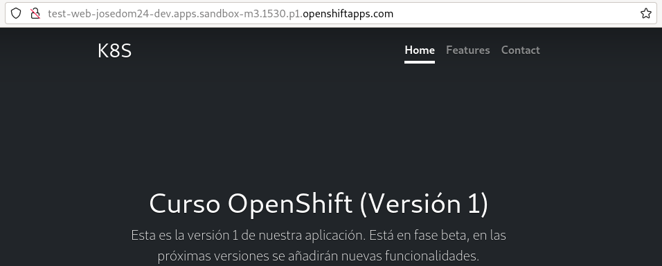
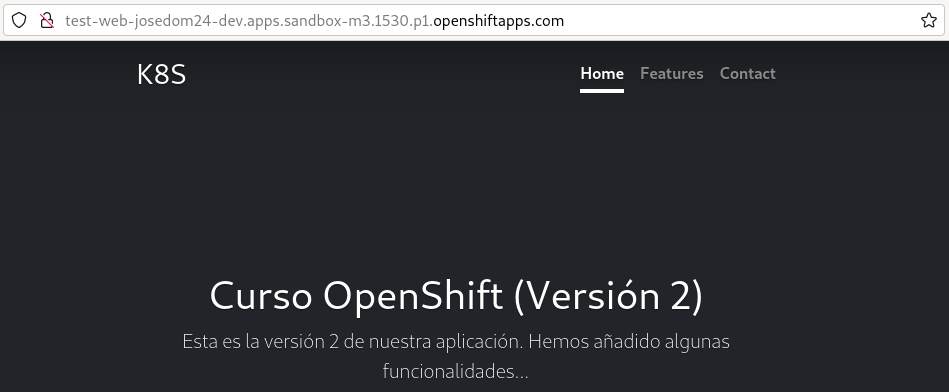
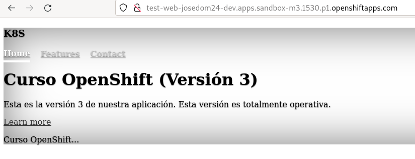

# Rollback de un DeploymentConfig

Tenemos la posibilidad de volver al estado del despliegue que teníamos en una revisión anterior (**Rollback**). Para realizar este ejercicio vamos a desplegar una nueva aplicación a partir de una imagen que tenemos en DockerHub. La imagen `josedom24/test_web` tiene tres versiones, identificadas por etiquetas.

En este ejercicio, vamos a crear un **ImageStream** antes de desplegar la aplicación, que nos permitirá ir cambiando de imagen con el uso de un tag, para ello:

    oc create is is_test_web
    oc import-image is_test_web:v1 --from=docker.io/josedom24/test_web:v1
    oc import-image is_test_web:v2 --from=docker.io/josedom24/test_web:v2
    oc import-image is_test_web:v3 --from=docker.io/josedom24/test_web:v3

Vamos a crear una nueva etiqueta `prod` que en primer lugar apuntará a la versión `v1` y que utilizaremos para el despliegue, posteriormente iremos referenciando con esta etiqueta otras versiones de la imagen, por lo que se producirá el trigger **ImageChange**:

    oc tag is_test_web:v1 is_test_web:prod

## Creación del DeploymentConfig

Creamos el **DeploymentConfig** con la siguiente instrucción:

    oc new-app is_test_web:prod --name test-web --as-deployment-config=true
    oc expose service test-web

    oc get dc,rc,pod
    NAME                                          REVISION   DESIRED   CURRENT   TRIGGERED BY
    deploymentconfig.apps.openshift.io/test-web   1          1         1         config,image(is_test_web:prod)

    NAME                               DESIRED   CURRENT   READY   AGE
    replicationcontroller/test-web-1   1         1         1       36s

    NAME                    READY   STATUS      RESTARTS   AGE
    pod/test-web-1-4c8gl    1/1     Running     0          34s
    pod/test-web-1-deploy   0/1     Completed   0          36s

    oc rollout history dc/test-web
    deploymentconfig.apps.openshift.io/test-web 
    REVISION	STATUS		CAUSE
    1		Complete	config change

## Actualización del despliegue a la versión 2

Para producir la actualización vamos a cambiar la imagen, para ello vamos a referenciar el tag `prod` a la segunda versión:

    oc tag is_test_web:prod -d
    oc tag is_test_web:v2 is_test_web:prod

Inmediatamente se produce la actualización del despliegue:

    oc get dc,rc,pod
    NAME                                          REVISION   DESIRED   CURRENT   TRIGGERED BY
    deploymentconfig.apps.openshift.io/test-web   2          1         1         config,image(is_test_web:prod)

    NAME                               DESIRED   CURRENT   READY   AGE
    replicationcontroller/test-web-1   0         0         0       3m35s
    replicationcontroller/test-web-2   1         1         1       8s

    NAME                    READY   STATUS      RESTARTS   AGE
    pod/test-web-1-deploy   0/1     Completed   0          3m36s
    pod/test-web-2-deploy   0/1     Completed   0          9s
    pod/test-web-2-fxghv    1/1     Running     0          7s

    oc rollout history dc/test-web
    deploymentconfig.apps.openshift.io/test-web 
    REVISION	STATUS		CAUSE
    1		Complete	config change
    2		Complete	image change

## Rollback del despliegue

Volvemos a realizar el cambio de imagen para desplegar la tercera versión:

    oc tag is_test_web:prod -d
    oc tag is_test_web:v3 is_test_web:prod

Se produce la actualización:

    oc get dc,rc,pod
    NAME                                          REVISION   DESIRED   CURRENT   TRIGGERED BY
    deploymentconfig.apps.openshift.io/test-web   3          1         1         config,image(is_test_web:prod)

    NAME                               DESIRED   CURRENT   READY   AGE
    replicationcontroller/test-web-1   0         0         0       7m17s
    replicationcontroller/test-web-2   0         0         0       3m50s
    replicationcontroller/test-web-3   1         1         1       7s

    NAME                    READY   STATUS      RESTARTS   AGE
    pod/test-web-1-deploy   0/1     Completed   0          7m18s
    pod/test-web-2-deploy   0/1     Completed   0          3m51s
    pod/test-web-3-4bjrv    1/1     Running     0          6s
    pod/test-web-3-deploy   1/1     Running     0          8s

    oc rollout history dc/test-web
    deploymentconfig.apps.openshift.io/test-web 
    REVISION	STATUS		CAUSE
    1		Complete	config change
    2		Complete	image change
    3		Complete	image change

Pero ahora, al acceder a la aplicación nos damos cuenta de que tiene un error:

Para volver a la versión anterior podemos ejecutar:

    oc rollout undo dc/test-web
    deploymentconfig.apps.openshift.io/test-web rolled back

    oc get dc,rc,pod
    NAME                                          REVISION   DESIRED   CURRENT   TRIGGERED BY
    deploymentconfig.apps.openshift.io/test-web   4          1         1         config

    NAME                               DESIRED   CURRENT   READY   AGE
    replicationcontroller/test-web-1   0         0         0       9m49s
    replicationcontroller/test-web-2   0         0         0       6m22s
    replicationcontroller/test-web-3   0         0         0       2m39s
    replicationcontroller/test-web-4   1         1         1       15s

    NAME                    READY   STATUS      RESTARTS   AGE
    pod/test-web-1-deploy   0/1     Completed   0          9m49s
    pod/test-web-2-deploy   0/1     Completed   0          6m22s
    pod/test-web-3-deploy   0/1     Completed   0          2m39s
    pod/test-web-4-8gfz2    1/1     Running     0          13s
    pod/test-web-4-deploy   0/1     Completed   0          15s
    
    oc rollout history dc/test-web
    deploymentconfig.apps.openshift.io/test-web 
    REVISION	STATUS		CAUSE
    1		Complete	config change
    2		Complete	image change
    3		Complete	image change
    4		Complete	image change

Y comprobamos que hemos vuelto a la versión anterior:

Realmente podemos volver a la revisión que queramos:

    oc rollout undo dc/test-web --to-revision=1

    oc rollout history dc/test-web
    deploymentconfig.apps.openshift.io/test-web 
    REVISION	STATUS		CAUSE
    1		Complete	config change
    2		Complete	image change
    3		Complete	image change
    4		Complete	image change
    5		Complete	image change

