# Trabajando con DeploymentConfig desde la consola web

Cuando creamos una nueva aplicación desde la consola web, y queremos utilizar como recurso de despliegue un **DeploymentConfig**, tenemos que seleccionar el recurso en el apartado **Resource type**:

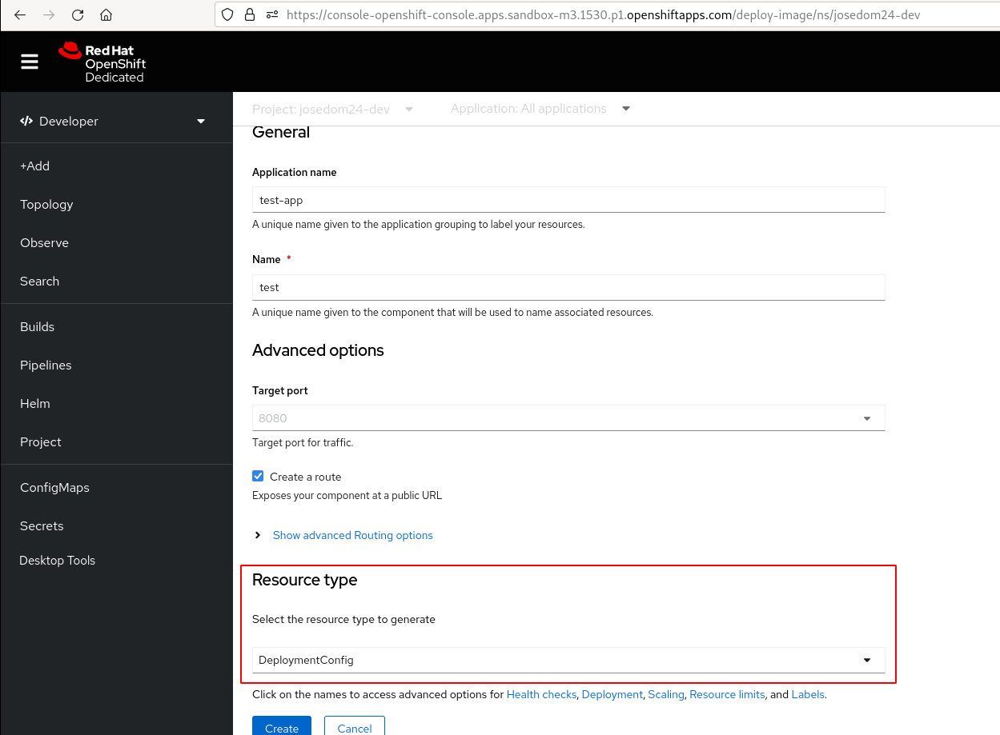

Una vez que se ha creado, podemos ver en la vista **Topology** que se ha creado un recurso de tipo **DeploymentConfig** (**DC**):

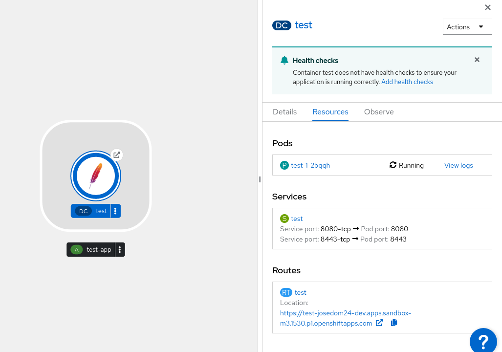

## Objeto DeploymentConfig

Si accedemos a la vista **Administrator**, la sección **Workloads -> DeploymentConfigs**, podemos ver la lista de objetos **DeploymentConfig** que tenemos en nuestro proyecto:

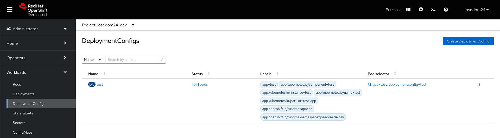

Con el botón **Create DeploymentConfig** podemos crear nuevos objetos **DeploymentConfig**, desde la vista formulario:

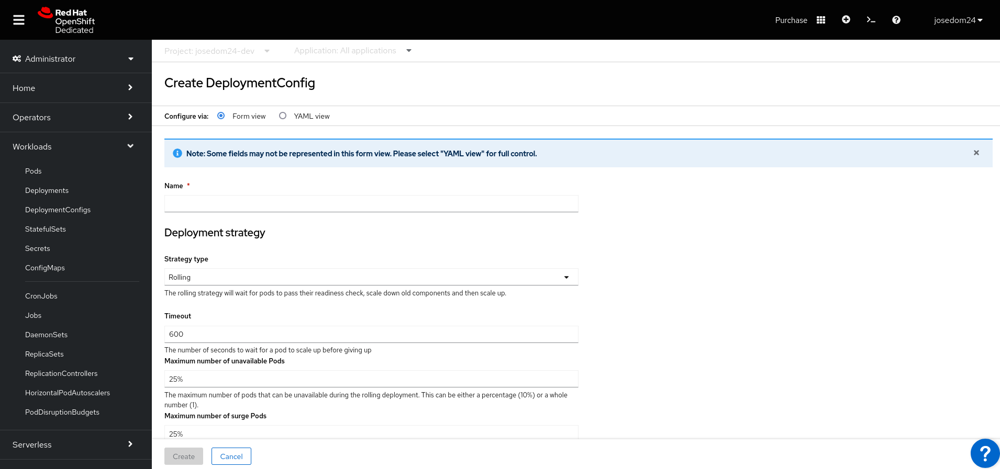

O desde la definición yaml del objeto:

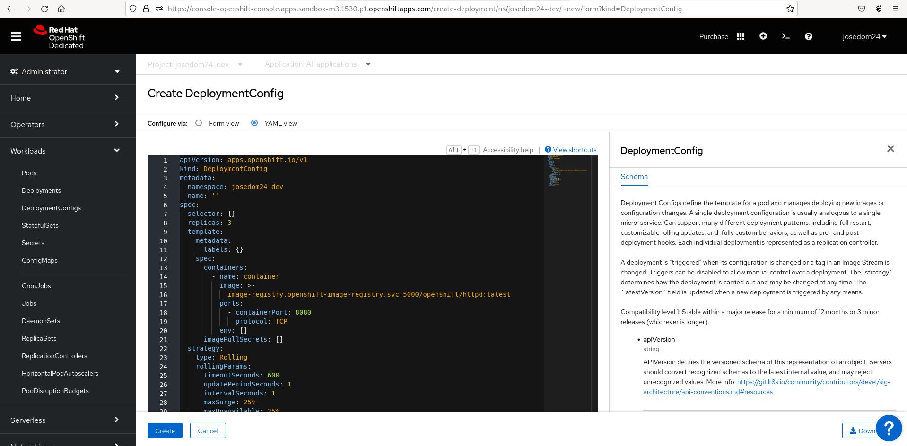

Si pulsamos en un objeto **DeploymentConfig** acedemos a una página donde nos dan los detalles del objeto y tenemos la posibilidad de gestionarlo con las acciones que encontramos en el desplegable **Actions**:

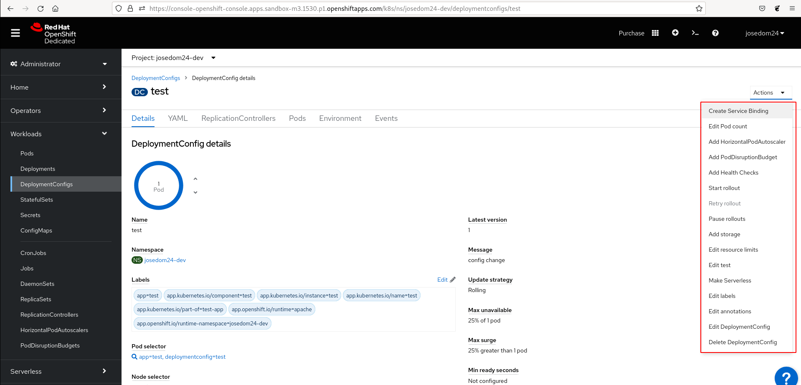

En esta pantalla encontramos varias pestañas:

* **Details**: La página donde estamos, que nos da información detallada del objeto.
* **YAML**: Donde accedemos a la definición yaml del objeto.
* **ReplicationControllers**: Accedemos a la ventana donde se nos muestran los objetos **ReplicationControllers** del objeto **DeploymentConfig** que estamos viendo.
* **Pods**: La lista de pods controlada por el **ReplicationController** activo.
* **Environment**: Donde podemos crear variables de entorno de tipo clave=valor que se crearan en los pods.
* **Events**: Donde nos indica los distintos eventos que han modificado el estado del objeto.

## Objetos ReplicationController

Como hemos indicados, podemos ver la lista de objetos **ReplicationControllers** de un **DeploymentConfig**, accediendo a la pestaña **ReplicationControllers**:

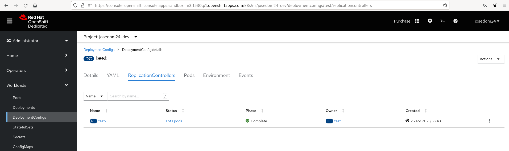

De la misma manera, si pulsamos sobre un objeto determinado, obtenemos la información detallada del mismo:

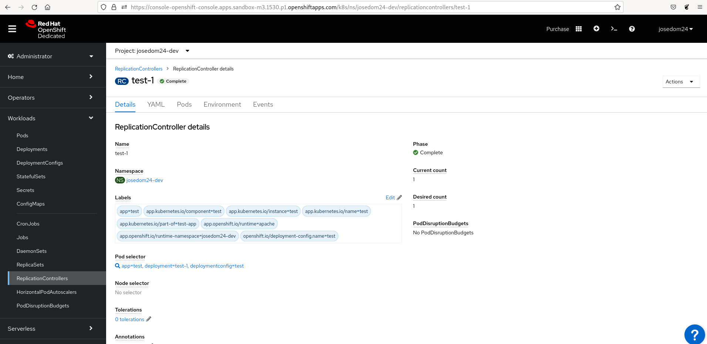

Donde tenemos varias pestañas con distintas informaciones:

* **Details**: La página donde estamos, que nos da información detallada del objeto.
* **YAML**: Donde accedemos a la definición yaml del objeto.
* **Pods**: La lista de pods controlada por el **ReplicationController** activo.
* **Environment**: Donde podemos crear variables de entorno de tipo clave=valor que se crearan en los pods.
* **Events**: Donde nos indica los distintos eventos que han modificado el estado del objeto.

## Rollout de un DeploymentConfig

Podemos actualizar el **DeploymentConfig** eligiendo la opción **Start rollout**:

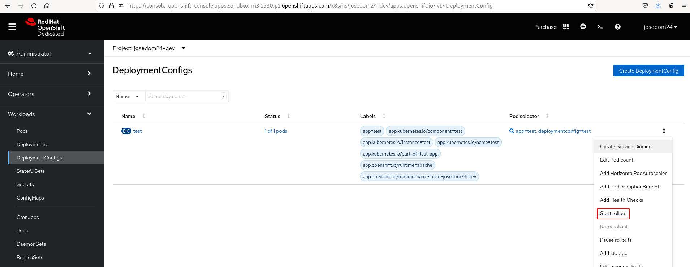

Podemos observar en la lista de **ReplicationController**  que se ha creado un nuevo objeto:

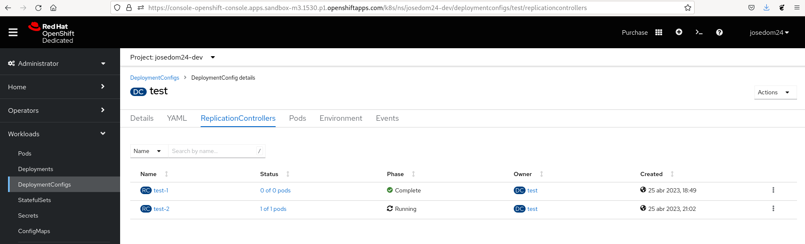

Efectivamente hemos tenido otro **deploy pod** que ha creado un nuevo pod:

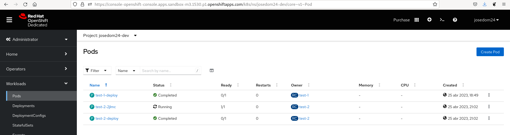

Si queremos hacer un Rollback a una revisión anterior para activar un **ReplicationController** anterior, lo elegimos en la lista y pulsamos sobre la opción **Rollback**:

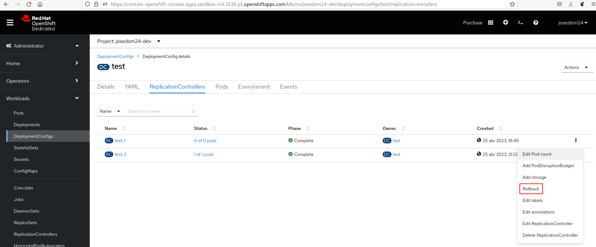

