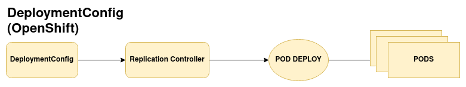
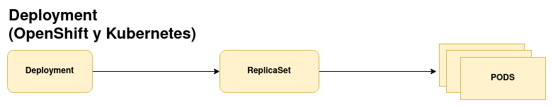

# Características del recurso DeploymentConfig

Los recursos **Deployment** y **DeploymentConfig** de OpenShift nos proporcionan la funcionalidad de desplegar una aplicación. Son dos métodos similares pero diferentes para la gestión detallada de aplicaciones.

* Estos recursos describen **el estado deseado de una aplicación** y lo usamos como plantillas de pod.
* Los objetos **DeploymentConfig**, son propios de la API de OpenShift y utilizan recursos **ReplicationController** para gestionar los pods de la aplicación. Para ello se utiliza un pod-deploy**, responsable de la creación de los pods.

    

* Los objetos **Deployment** utilizan recursos **ReplicSets** para el control de los pods.

    

## Características del recurso DeploymentConfig

1. Un objeto **DeploymentConfig** es una plantilla para ejecutar aplicaciones.
2. Podemos actualizar los despliegues con ul uso **triggers** (disparadores).
3. Además de las estrategias de despliegue que poseen los **Deployment** (Rolling Update y Recreate), podemos crear **estrategias personalizadas**.
4. Podemos usar *ganchos* (**lifecycle hooks**) para ejecutar comportamientos personalizados a lo largo del ciclo de vida del despliegue.
5. **Versionado de la aplicación** para permitir la reversión manual o automática en caso de fallo de despliegue.
6. **Escalado** manual de la replicación y autoescalado.

Cuando se crea un objeto **DeploymentConfig**, se crea un **ReplicationController** que representa la plantilla de pod. Un pod de despliegue (**pod deploy**) es el responsable de crear los nuevos pods.

Si se actualiza un despliegue, se creará otro **ReplicationController**, que por medio de otro pod de despliegue eliminará los pods antiguos y creará los nuevos. El objeto **ReplicationController** antiguo se conserva para permitir la vuelta a la versión anterior de la aplicación.

## Comparación de los objetos Deployment y DeploymentConfig

La recomendación es usar objetos **Deployment**, a menos que necesite una función o un comportamiento específicos proporcionados por los objetos **DeploymentConfig**.

Para ayudarnos a elegir que recurso usar, veamos algunas características de cada uno de ellos:

1. El **diseño** de los dos recursos es distintos: los objetos **DeploymentConfig** prefieren la **consistencia**, mientras que los objetos **Deployments** toman la **disponibilidad** por encima de la consistencia.
2. Los **DeploymentConfig** permiten volver automáticamente a la última versión operativa en caso de fallo.
3. Los objetos **Deployment** de forma implícita desencadenan un nuevo despliegue si hay un cambio en la configuración del recurso. Sin embargo, los objetos **DeploymentConfig**, pueden tener otras causas para desencadenar un despliegue de forma automática, por ejemplo, la modificación de la imagen.
4. Los **DeploymentConfig** tiene la posibilidad de ejecutar ciertos procesos en su ciclo de vida con los **lifecycle hooks**.
5. Los **DeploymentConfig** tiene la posibilidad de configurar estrategias personalizadas de despliegues.
6. Los recursos **Deployment** no utiliza un **pod de deploy**, por lo que pueden tener varios **ReplicaSet** activos, sin embargo los **DeploymentConfig**, pueden tener como máximo un **pod de deploy** en ejecución, por lo que sólo dos **ReplicationController** pueden estar activos al mismo tiempo. Esto se traduce que los **Deployment** pueden hacer despliegue más rápidos.
7. En los objetos **DeploymentConfig**, no se puede hacer un escalado parcial, es decir escalar un despliegue que se está ejecutando. Sin embargo, los **Deployment** si permiten esta característica.
8. Usando objetos **Deployment** podemos pausar el despliegue, sin embargo, en los **DeploymentConfig**, al no poder para el **pod de deploy**, no se pueden pausar los despliegues.