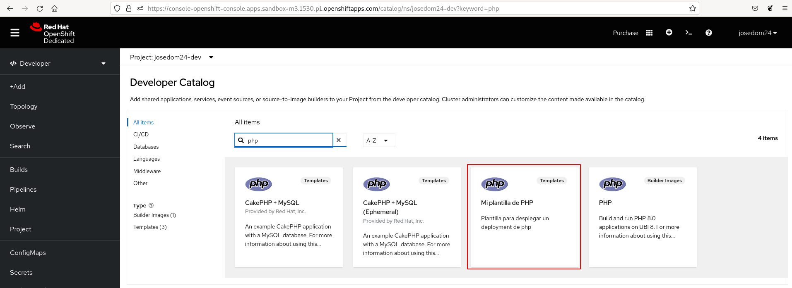

# Despliegue de una aplicación con plantillas

Continuamos creando nuestra nueva plantilla que nos va a permitir desplegar aplicaciones PHP guardadas en un repositorio GitHub. Partimos de un fichero `php-plantilla.yaml` con la lista de la definición de los objetos que habíamos creado en el punto anterior. Para convertir este fichero en la definición de un **Template** sigamos los siguientes pasos:

1. Vamos a limpiar la definición de los objetos que tenemos guardado. Eliminamos los parámetros que nos ofrecen valores por defecto, las anotaciones de los metadatos (`annotations`) y el estado de los objetos (`status`).
2. Escribimos la estructura de una definición de un **Template**:

    ```yaml
    apiVersion: template.openshift.io/v1
    kind: Template
    labels:
        app: php-plantilla
    metadata:
      name: php-plantilla
    ...
    objects:
    ...
    parameters:
    ...
    ```

    La sección `labels`: etiquetas que se asignarán a todos los objetos creados, `metadata`, información del objeto, `objects`, la lista de definición de los objetos que vamos a crear (el contenido que hemos generado en el punto anterior) y `parameters`, la lista de parámetros.

3. Determinamos los parámetros que vamos a crear, en nuestro caso:

    * `NOMBRE`: Nombre de la aplicación.
    * `PHP_VERSION`: Versión de PHP que vamos a usar para crear la imagen.
    * `REPOSITORIO_GIT`: URL del repositorio GitHub que se va a utilizar para el despliegue.
    * `GITHUB_WEBHOOK_SECRET`: Token para configurar el webhook en GitHub.

    Modificamos la definición de los objetos, para ir introduciendo los parámetros en los campos necesarios.
4. Alguna cosas a tener en cuenta:

    * El objeto **DeploymentConfig** tiene que desplegar la aplicación, una vez exista la **ImageStream** que apunta a la imagen que estamos generando. Para ello en la definición del contenedor del **DeploymentConfig** no se va a indicar ninguna imagen (`image: ' '`) y se le va a configurar un trigger de tipo `ImageChange` apuntando al **ImageStream**. De esta manera el **DeploymentConfig** no creará un **ReplicationController** hasta que la imagen no se haya creado.
    * Podemos indicar que no se ha terminado la creación completa de una plantilla hasta que no terminen de crearse algunos objetos. Por ejemplo, en nuestro caso se considera que se ha terminada de generar la plantilla cuando termine la construcción y el despliegue. Para ello en los objetos **BuildConfig** y **DeploymentConfig** hemos añadido la siguiente anotación:

            "template.alpha.openshift.io/wait-for-ready": "true"

Una vez concluido el fichero `php-plantilla.yaml`, nos ha quedado de esta forma:

```yaml
apiVersion: template.openshift.io/v1
kind: Template
labels:
  app: php-plantilla
metadata:
  name: php-plantilla
  annotations:
    openshift.io/display-name: Mi plantilla de PHP
    description: "Plantilla para desplegar un deployment de php"
    iconClass: "icon-php"
    tags: "php"
objects:
- apiVersion: apps.openshift.io/v1
  kind: DeploymentConfig
  metadata:
    annotations:
      template.alpha.openshift.io/wait-for-ready: "true"
    labels:
      app: ${NOMBRE}
    name: ${NOMBRE}
  spec:
    replicas: 1
    revisionHistoryLimit: 10
    selector:
      deploymentconfig: ${NOMBRE}
    strategy:
      type: Rolling
    template:
      metadata:
        labels:
          deploymentconfig: ${NOMBRE}
      spec:
        containers:
        - image: ' '
          name: ${NOMBRE}
          ports:
          - containerPort: 8080
            protocol: TCP
          - containerPort: 8443
            protocol: TCP
    triggers:
      - type: ConfigChange
      - imageChangeParams:
          automatic: true
          containerNames:
          - ${NOMBRE}
          from:
            kind: ImageStreamTag
            name: ${NOMBRE}:latest
        type: ImageChange
- apiVersion: v1
  kind: Service
  metadata:
    labels:
      app: ${NOMBRE}
    name: ${NOMBRE}
  spec:
    ports:
    - name: 8080-tcp
      port: 8080
      protocol: TCP
      targetPort: 8080
    selector:
      deploymentconfig: ${NOMBRE}
    type: ClusterIP
- apiVersion: image.openshift.io/v1
  kind: ImageStream
  metadata:
    labels:
      app: ${NOMBRE}
    name: ${NOMBRE}
- apiVersion: build.openshift.io/v1
  kind: BuildConfig
  metadata:
    annotations:
      template.alpha.openshift.io/wait-for-ready: "true"
    labels:
      app: ${NOMBRE}
    name: ${NOMBRE}
  spec:
    output:
      to:
        kind: ImageStreamTag
        name: ${NOMBRE}:latest
    source:
      git:
        uri: ${REPOSITORIO_GIT}
      type: Git
    strategy:
      sourceStrategy:
        from:
          kind: ImageStreamTag
          name: php:${PHP_VERSION}
          namespace: openshift
      type: Source
    triggers:
    - type: ConfigChange
    - type: ImageChange
    - github:
        secret: ${GITHUB_WEBHOOK_SECRET}
      type: GitHub
- apiVersion: route.openshift.io/v1
  kind: Route
  metadata:
    labels:
      app: ${NOMBRE}
    name: ${NOMBRE}
  spec:
    to:
      kind: Service
      name: ${NOMBRE}

parameters:
- description: El nombre asignado a la aplicación y a los recursos creados.
  displayName: Nombre
  name: NOMBRE
  required: true
  value: app-php
- description: Versión de PHP
  displayName: Versión de php
  name: PHP_VERSION
  required: true
  value: latest
- description: URL del repsositorio GItHub donde se encuentra la aplicación
  displayName: URL del repositorio Git
  name: REPOSITORIO_GIT
  required: true
  value: https://github.com/josedom24/osv4_php
- description: Token para webhook de GitHub   
  displayName: GitHub Webhook Token
  from: '[a-zA-Z0-9]{40}'
  generate: expression
  name: GITHUB_WEBHOOK_SECRET
  ```

Podemos crear la nueva plantilla ejecutando:

    oc apply -f php-plantilla.yaml

Y podemos crear un nuevo despliegue, ejecutando:

    oc process php-plantilla -p NOMBRE=php1 -o yaml | oc apply -f -

Además podemos ver en el **catálogo de aplicaciones** que se ha creado la nueva plantilla:



