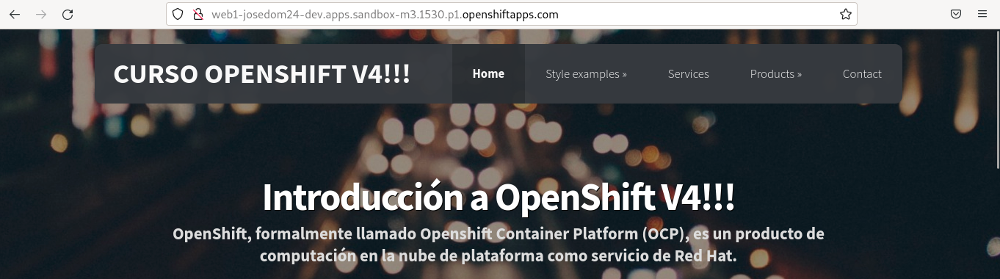
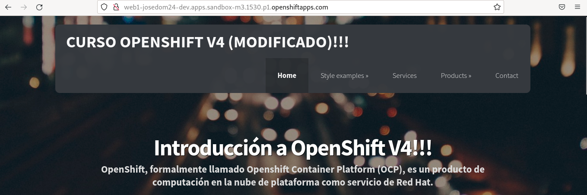

# Actualización de un DeploymentConfig (rollout)

En este apartado vamos a estudiar las distintas causas que provocan la actualización de un **DeploymentConfig**. Cuando se produce una actualización se creará un nuevo **ReplicationController** que creará un nuevo conjunto de Pods con la nueva versión del despliegue.

Tenemos tres posibles causas de actualización de un **DeploymentConfig**:

* **Manual**: El usuario ejecuta un comando que lleva a cabo la actualización.
* **Disparador ConfigChange**: Un cambio en la definición del objeto conlleva la actualización.
* **Disparador ImageChange**: Si cambia la imagen (realmente el objeto **ImageStream**) que hemos usado en la creación del despliegue, se producirá la actualización.

Para comprobar los distintos motivos de actualización, vamos a lanzar un nuevo despliegue con un **DeploymentConfig**, para ello ejecutamos:

    oc new-app httpd~https://github.com/josedom24/osv4_html --name=web1 --as-deployment-config=true

Se ha creado un nuevo **BuildConfig** que ha construido la nueva imagen usando Source-2-Image, y al finalizar se ha lanzado la aplicación, como veíamos en el apartado anterior:

    oc get dc
    NAME   REVISION   DESIRED   CURRENT   TRIGGERED BY
    web1   1          1         1         config,image(web1:latest)

Creamos el objeto **Route** y accedemos a la página:

    oc expose service web1

## Actualización manual del despliegue

La primera actualización la vamos a hacer de forma manual, y simplemente vamos a hacer que se actualice el despliegue a partir de la última revisión (no va a existir ningún cambio), para ello:

    oc rollout latest dc/web1
    deploymentconfig.apps.openshift.io/web1 rolled out

    oc get dc,rc,pod
    NAME                                      REVISION   DESIRED   CURRENT   TRIGGERED BY
    deploymentconfig.apps.openshift.io/web1   2          1         1         config,image(web1:latest)

    NAME                           DESIRED   CURRENT   READY   AGE
    replicationcontroller/web1-1   0         0         0       4m15s
    replicationcontroller/web1-2   1         1         1       21s

    NAME                READY   STATUS      RESTARTS   AGE
    pod/web1-1-build    0/1     Completed   0          4m53s
    pod/web1-1-deploy   0/1     Completed   0          4m15s
    pod/web1-2-deploy   0/1     Completed   0          20s
    pod/web1-2-lpss4    1/1     Running     0          19s

Vemos que ya tenemos dos revisiones (dos actualizaciones), por lo tanto, tenemos dos objetos **ReplicationController**, dos **pod deploy** y el Pod de la aplicación ha cambiado y tiene un `2` indicando que corresponde a la segunda revisión.

Para ver el estado y el historial de revisiones ejecutamos:

    oc rollout status dc/web1
    replication controller "web1-2" successfully rolled out

    oc rollout history dc/web1
    deploymentconfig.apps.openshift.io/web1 
    REVISION	STATUS		CAUSE
    1		Complete	config change
    2		Complete	manual change

Si queremos detalles de un revisión en concreto, ejecutamos:

    oc rollout history dc/web1 --revision=2

## Actualización por ConfigChange

En este apartado, vamos a realizar una actualización del despliegue, cambiando la configuración, por ejemplo:

    oc edit dc/web1

Y cambiamos el parámetro `terminationGracePeriodSeconds` (especifica el tiempo que se le dará a un contenedor para finalizar sus tareas y cerrar las conexiones abiertas). Una vez realizado el cambio, el despliegue se empieza a actualizar:

    oc get dc,rc,pod
    NAME                                      REVISION   DESIRED   CURRENT   TRIGGERED BY
    deploymentconfig.apps.openshift.io/web1   3          1         1         config,image(web1:latest)

    NAME                           DESIRED   CURRENT   READY   AGE
    replicationcontroller/web1-1   0         0         0       12m
    replicationcontroller/web1-2   0         0         0       8m12s
    replicationcontroller/web1-3   1         1         1       69s

    NAME                READY   STATUS      RESTARTS   AGE
    pod/web1-1-build    0/1     Completed   0          12m
    pod/web1-1-deploy   0/1     Completed   0          12m
    pod/web1-2-deploy   0/1     Completed   0          8m12s
    pod/web1-3-deploy   0/1     Completed   0          70s
    pod/web1-3-nbhsq    1/1     Running     0          68s

    oc rollout history dc/web1
    deploymentconfig.apps.openshift.io/web1 
    REVISION	STATUS		CAUSE
    1		Complete	config change
    2		Complete	manual change
    3		Complete	config change

## Actualización por ImageChange

Por último, vamos a hacer un cambio en la aplicación, voy a generar una nueva imagen, y el despliegue se actualizará por el cambio de imagen. Para ello, entro en repositorio y cambio el fichero `index.html`. Una vez realizado el cambio guardo los cambios en el repositorio y genero de nuevo la imagen:

    git commit -am "Cambio index.html"
    git push

    oc start-build web1

Una vez finalizada la construcción observamos que realmente se actualizado el despliegue:

    oc get dc,rc,pod
    NAME                                      REVISION   DESIRED   CURRENT   TRIGGERED BY
    deploymentconfig.apps.openshift.io/web1   4          1         1         config,image(web1:latest)

    NAME                           DESIRED   CURRENT   READY   AGE
    replicationcontroller/web1-1   0         0         0       19m
    replicationcontroller/web1-2   0         0         0       15m
    replicationcontroller/web1-3   0         0         0       8m37s
    replicationcontroller/web1-4   1         1         1       14s

    NAME                READY   STATUS      RESTARTS   AGE
    pod/web1-1-build    0/1     Completed   0          20m
    pod/web1-1-deploy   0/1     Completed   0          19m
    pod/web1-2-build    0/1     Completed   0          71s
    pod/web1-2-deploy   0/1     Completed   0          15m
    pod/web1-3-deploy   0/1     Completed   0          8m37s
    pod/web1-4-deploy   0/1     Completed   0          14s
    pod/web1-4-nwq55    1/1     Running     0          12s

    oc rollout history dc/web1
    deploymentconfig.apps.openshift.io/web1 
    REVISION	STATUS		CAUSE
    1		Complete	config change
    2		Complete	manual change
    3		Complete	config change
    4		Complete	image change

Podemos acceder a la página para comprobar que se ha modificado:

