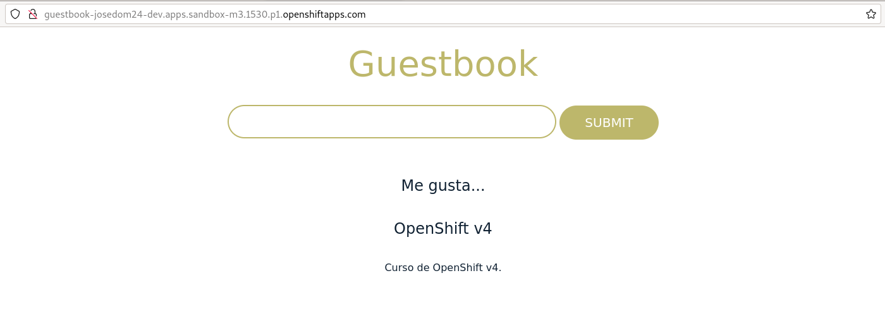

# Ejemplo 2: Gestión de almacenamiento desde la línea de comandos: GuestBook

En esta tarea vamos a desplegar una aplicación web que requiere de dos servicios para su ejecución. La aplicación se llama GuestBook y necesita los siguientes servicios:

* La aplicación GuestBook es una aplicación web desarrollada en python que tenemos guardada en el repositorio `https://github.com/josedom24/osv4_guestbook.git`.
* Esta aplicación guarda la información en una base de datos no relacional redis, que utiliza el puerto 6379/tcp para recibir las conexiones. Usaremos la imagen `bitnami/redis`.

Por lo tanto para desplegar las aplicaciones vamos a ejecutar los siguientes comandos:

    oc new-app https://github.com/josedom24/osv4_guestbook.git --name=guestbook
    oc new-app bitnami/redis  -e REDIS_PASSWORD=mypass --name=redis

**Nota**: No hay que indicar la contraseña de la base de datos en el despliegue de la aplicación GuestBook, porque por defecto coincide con la que hemos establecido en el despliegue de Redis.

A continuación, creamos la ruta para acceder a GuestBook y comprobamos que funciona:

    oc expose service/guestbook



## Persistencia de la información

La aplicación funciona de forma correcta, pero tenemos que tener en cuenta que **los Pods son efímeros**, es decir, cuando se eliminan pierden la información. En nuestro caso si eliminamos el Pod del despliegue redis (por alguna actualización, escalado, ...) se perderá la información de la base de datos.

Si estudiamos la documentación de la imagen `bitnami/redis` en [Docker Hub](https://hub.docker.com/r/bitnami/redis/), para que la información de la base de datos sea persistente, tenemos que asociar un volumen al directorio `/bitnami/redis/data`.

Además como vimos en el Ejercicio 1, tenemos que modificar la estrategia de despliegue a **Recreate**, para que no exista el Pod antiguo cuando se crea uno nuevo, y se pueda conectar sin problemas al volumen.

En primer lugar vamos a crear un objeto **PersistentVolumeClaim** que nos va permitir solicitar la creación de un **PersistentVolume**, para ello usamos la definición del objeto que tenemos en el fichero `pvc-redis.yaml`:

```yaml
apiVersion: v1
kind: PersistentVolumeClaim
metadata:
    name: my-pvc-redis
spec:
  accessModes:
    - ReadWriteOnce
  resources:
    requests:
      storage: 1Gi

```

Y creamos el objeto, ejecutando:

    oc apply -f pvc-redis.yaml

Podemos ver que se ha creado el objeto, pero que no se va asociar a un volumen hasta que no se utilice:

    oc get pvc
    NAME           STATUS    VOLUME   CAPACITY   ACCESS MODES   STORAGECLASS   AGE
    my-pvc-redis   Pending                                      gp3            4s

A continuación tenemos que modificar el despliegue de la aplicación GuestBook, para cambiar la estrategia de despliegue, asociar el volumen e indicar el directorio de montaje, para ello editamos el **Deployment** `redis` y lo dejamos con las siguientes modificaciones:

    oc edit deploy/redis

    spec:
    ...
      strategy:
        type: Recrete
    template:
    ...
      spec:
        containers:
        ...
          volumeMounts:
            - mountPath: /bitnami/redis/data
              name: my-volumen
          ...
        volumes:
          - name: my-volumen
            persistentVolumeClaim:
              claimName: my-pvc-redis

Cuando modificamos el **Deployment**, se produce una actualización: se creará un nuevo **ReplicaSet** que creará un nuevo Pod con la nueva configuración.

    oc get rs
    NAME                   DESIRED   CURRENT   READY   AGE
    ...
    redis-64b4c9d464       0         0         0       26m
    redis-7596cbd6d5       0         0         0       26m
    redis-7f59bf9479       1         1         1       6s

    oc get pod
    ...
    NAME                        READY   STATUS      RESTARTS      
    redis-7f59bf9479-mm76b      1/1     Running     0          10s

Puedes ver las características del Pod, ejecutando:

    oc describe pod/redis-7f59bf9479-mm76b

Accede de nuevo a la aplicación, introduce algunos mensajes, y vamos a simular la eliminación del Pod:

    oc delete pod/redis-7f59bf9479-mm76b

Inmediatamente se creará un nuevo Pod, volvemos acceder y comprobar que la información no se ha perdido:

