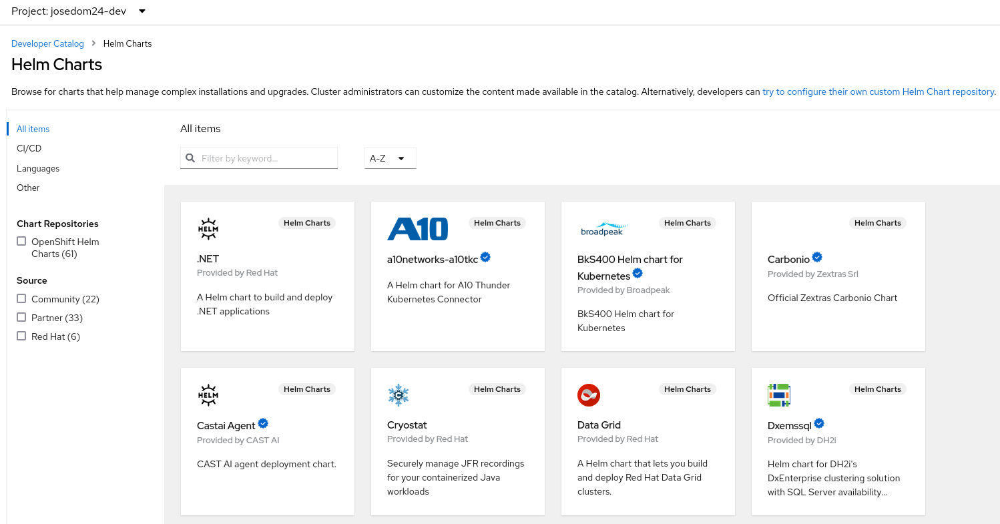
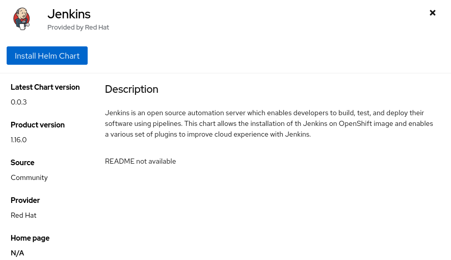
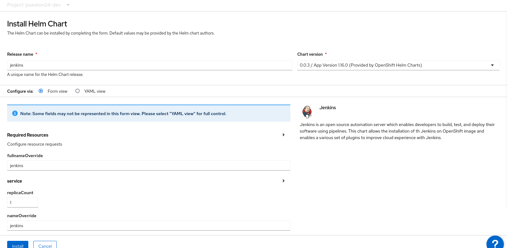
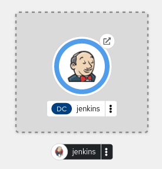
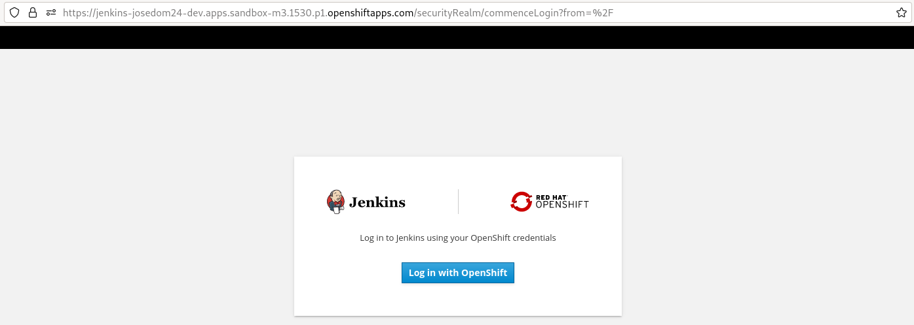
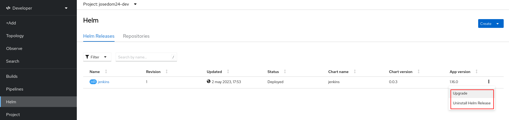
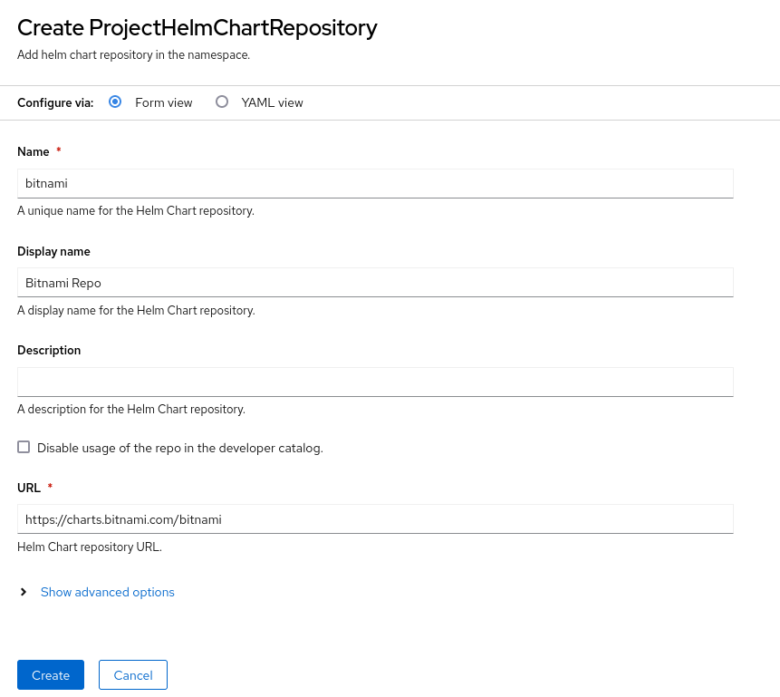
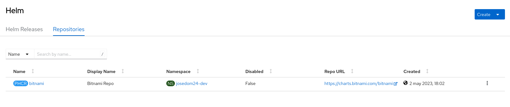
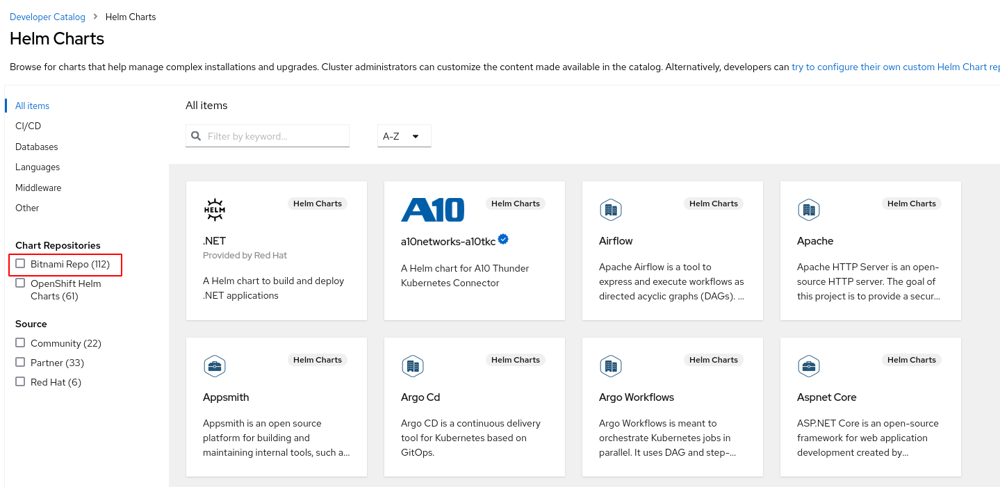

# Uso de Helm en OpenShift desde la consola web

[Helm](https://helm.sh/) es un software que nos permite empaquetar aplicaciones completas y gestionar el ciclo completo de despliegue de dicha aplicación. Helm usa un formato de empaquetado llamado **charts**. Un chart es una colección de archivos que describen un conjunto de recursos que nos permite desplegar una aplicación en Kubernetes o en OpenShift.

Tenemos diversos repositorios de Helm que nos permiten instalar un conjunto de charts. Por defecto en la consola web de OpenShift v4 tenemos instalado el repositorio de Helm de OpenShift: `https://charts.openshift.io/`. Para ver los charts que podemos instalar, tenemos que acceder al **catálogo de aplicaciones**:

## Instalación de un chart

Los chart de Helm son similares a los **Templates** de OpenShift, aunque tienen muchas más funcionalidades, por ejemplo que podemos gestionar el ciclo de vida completo de la aplicación: creación, actualización, eliminación...

Por ejemplo, vamos a instalar el chart de Jenkins, para ello pulsamos sobre el chart y el botón **Install Helm Chart**:

De la misma forma que las plantillas, los charts nos proporcionan una serie de parámetros que nos permiten la configuración concreta de una determinada instalación. En el caso de Jenkins tenemos varios parámetros que podríamos configurar:

Para este ejemplo vamos a dejar los datos de los parámetros por defecto. Al cabo de unos segundo hemos realizado la instalación:

Podemos acceder a la URL de la aplicación y comprobar que esta funcionando:

Como indicábamos anteriormente, lo interesante es que podemos controlar el ciclo de vida de la aplicación que hemos instalado, para ello desde la vista **Developer** escogemos la opción **Helm**. Accedemos a una ventana donde tenemos una pestaña **Helm Releases** donde tenemos la lista de las aplicaciones instaladas, así como las acciones que podemos hacer sobre ellas: actualización y borrado.

## Añadir nuevos repositorios

Podemos añadir nuevos repositorios. Para buscar repositorios y la documentación de los distintos charts es aconsejable estudiar el repositorio de charts [Artifacts Hub](https://artifacthub.io/).

Por ejemplo vamos a añadir el repositorio de charts de Bitnami: `https://charts.bitnami.com/bitnami`, para ello, en la ventana anterior pulsamos sobre el botón **Create -> Repository** y añadimos el nombre del repositorio y la URL:

Ahora, podemos comprobar que tenemos un nuevo repositorio configurado en la pestaña **Repoositories**:

Y en el **catálogo de aplicaciones** tenemos más charts disponibles:

