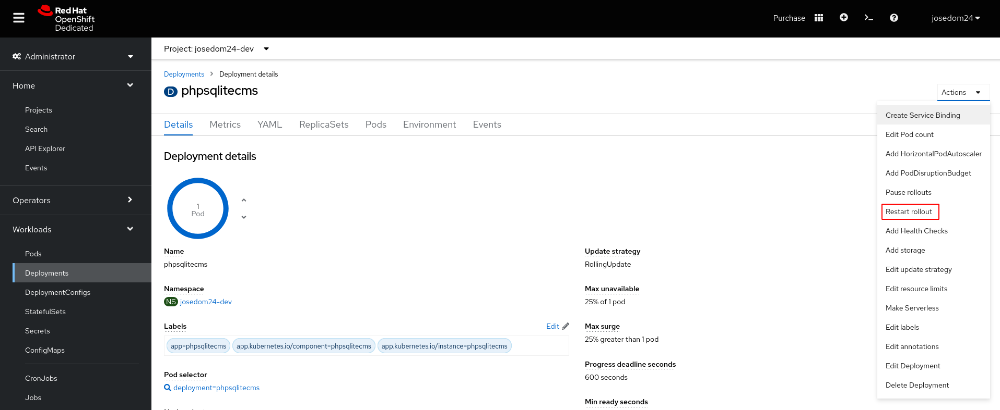
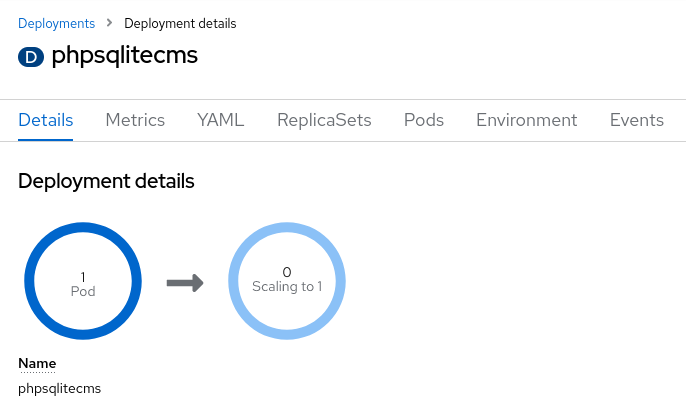
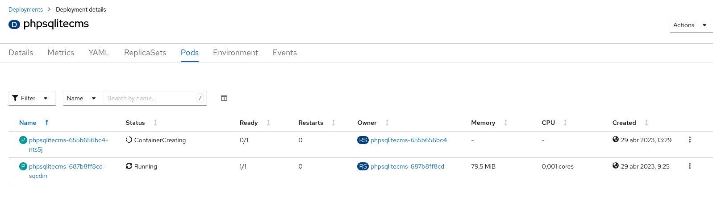
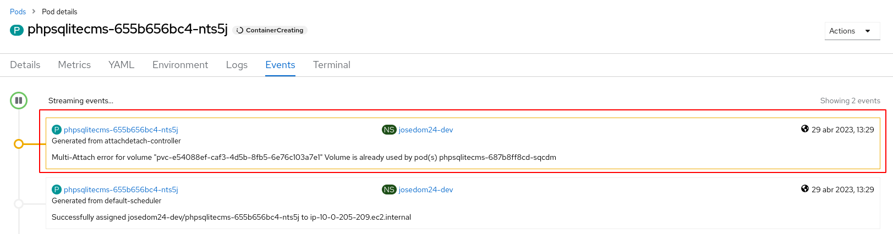

# Ejemplo 1: Gestión de almacenamiento desde la consola web: phpsqlitecms (2ª parte)

## Estrategias de despliegue y almacenamiento

¿Qué ocurrirá si volvemos actualizar el despliegue, creando un nuevo Pod? Lo vamos a realizar desde el entorno web seleccionando la acción **Restart rollout**:

Se crea un nuevo Pod, pero no termina de estar en estado de ejecución:

Si vemos los eventos del pod, nos aclara el problema que ha existido:

El problema es el siguiente:

* El volumen que se ha creado no permite que dos Pods estén conectados simultáneamente a él Esto es debido al tipo de volumen, en nuestro caso: **AWS Elastic Block Store (EBS)**.
* La estrategia de despliegue **RolligUpdate** crea el nuevo Pod, comprueba que funciona para posteriormente eliminar el viejo. Pero en este caso, no puede terminar de crear el nuevo Pod, porque no se puede conectar al volumen mientras el antiguo Pod este conectado a él.

La solución es configurar la estrategia de despliegue a **Recreate**, al eliminar el Pod antiguo, el Pod nuevo se puede conectar al volumen sin problemas. Para ello:

    oc edit deploy/phpsqlitecms
    ...
    spec:
    ...
      strategy:
        type: Recreate

Y volvemos realizar la actualización del despliegue:

    oc rollout restart deploy/phpsqlitecms

    oc get pod
    NAME                            READY   STATUS      RESTARTS   AGE
    phpsqlitecms-1-build            0/1     Completed   0          4h30m
    phpsqlitecms-6bc4dd8f58-ld6bf   1/1     Running     0          2s

Como vemos se ha creado un nuevo Pod sin problemas.

## Escalado y almacenamiento

Como hemos indicado el almacenamiento ofrecido por **Red Hat OpenShift Dedicated Developer Sandbox** no permite que varios Pods estén simultáneamente conectado a un mismo volumen, no proporciona almacenamiento compartido.

Esto tiene otra consecuencia, además de la estudiada en el punto anterior. Veamos como se comporta un escalado del despliegue:

    oc scale deploy/phpsqlitecms --replicas=2

    oc get pod
    NAME                            READY   STATUS              RESTARTS   AGE
    phpsqlitecms-1-build            0/1     Completed           0          4h34m
    phpsqlitecms-6bc4dd8f58-74h49   0/1     ContainerCreating   0          11s
    phpsqlitecms-6bc4dd8f58-ld6bf   1/1     Running             0          3m47s

De la misma manera, el nuevo Pod que se está creando no termina de crearse por que no se puede conectar al volumen, que ya está conectado al primer Pod.

Podríamos ver los detalles del Pod, para ver el problema que tiene:

    oc describe pod/phpsqlitecms-6bc4dd8f58-74h49
    ...
    Events:
      Type     Reason              Age   From                     Message
      ----     ------              ----  ----                     -------
      Normal   Scheduled           77s   default-scheduler        Successfully assigned josedom24-dev/phpsqlitecms-6bc4dd8f58-74h49 to ip-10-0-178-128.ec2.internal
      Warning  FailedAttachVolume  78s   attachdetach-controller  Multi-Attach error for volume "pvc-e54088ef-caf3-4d5b-8fb5-6e76c103a7e1" Volume is already used by pod(s) phpsqlitecms-6bc4dd8f58-ld6bf

Por lo tanto concluimos, que con este tipo de almacenamiento, no podemos escalar los despliegues.
