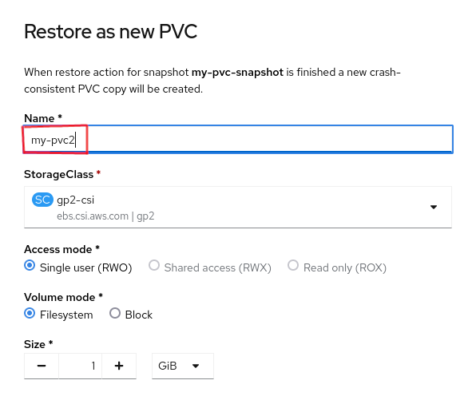
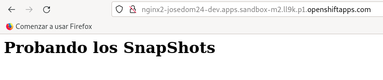

# Instantáneas de volúmenes

Un recurso **VolumeSnapshot** representa una instantánea de un volumen en un sistema de almacenamiento. Las instantáneas de volumen nos proporciona una forma estandarizada de copiar el contenido de un volumen en un momento determinado sin crear un volumen completamente nuevo.

Realmente un recurso **VolumeSnapshot** es una solicitud de instantánea de un volumen por parte de un usuario. Será necesario tener configurado un recurso **VolumeSnapshotClass**, donde el administrador del clúster habrá configurado diferentes características sobre al almacenamiento que está utilizando para que se realicen las instantáneas.

En la consola web, en la vista de **Administrator**, en el apartado **Storage -> VolumeSnapshotClasses**, podemos ver los recursos **VolumeSnapshotClasses** que están definidos en este clúster:


Para realizar el ejercicio, vamos a desplegar un servidor web *nginx* asociado a un volumen.
La definción de la solicutd del volumen la encontramos en el fichero `pvc.yaml` con el siguiente contenido:

```yaml
apiVersion: v1
kind: PersistentVolumeClaim
metadata:
    name: my-pvc
spec:
  storageClassName: gp3-csi
  accessModes:
    - ReadWriteOnce
  resources:
    requests:
      storage: 1Gi
```

Nos aseguramos con el parámetro `storageClassName` que se utilicen volúmenes del tipo `gp3-sci` para que el **VolumeSnapshotClasses** pueda realizar de manera adecuada los snpashots. Ahora, ejecutamos las siguientes instrucciones:

    oc apply -f pvc.yaml
    oc new-app bitnami/nginx --name nginx
    oc expose service/nginx
    oc set volumes deploy/nginx --add -m /app --name=my-vol -t pvc --claim-name=my-pvc --overwrite
    oc exec deploy/nginx -- bash -c "echo '<h1>Probando los SnapShots</h1>' > /app/index.html"

A continuación, vamos a crear una instantánea de ese volumen, para ello entramos en la sección **Storage -> VolumeSnapshots** y pulsamos sobre el botón **Create VolumeSnapshot**:


Indicamos el recurso **PersistentVolumeClaim** al que queremos crear la instantánea y el nombre de la misma:


Y transcurridos unos segundos, podremos ver la lista de las instantáneas de volúmenes que hemos creado:


Podemos eliminar el despliegue del servidor web y el volumen que hemos creado:

oc delete deploy/nginx
oc delete service/nginx
oc delete is/nginx
oc deplete pvc/my-pvc


A partir de la instantánea podemos crear un nuevo volumen con la misma información, para ello escogemos la opción:


Indicando las propiedades del recurso **PersistentVolumeClaim**:



Volvemos a crear el **Deployment**, y comprobamos que podemos acceder al fichero `index.html`, que en esta ocasión no hemos tenido que crear porque se ha restaurado desde la instantánea de volumen.


