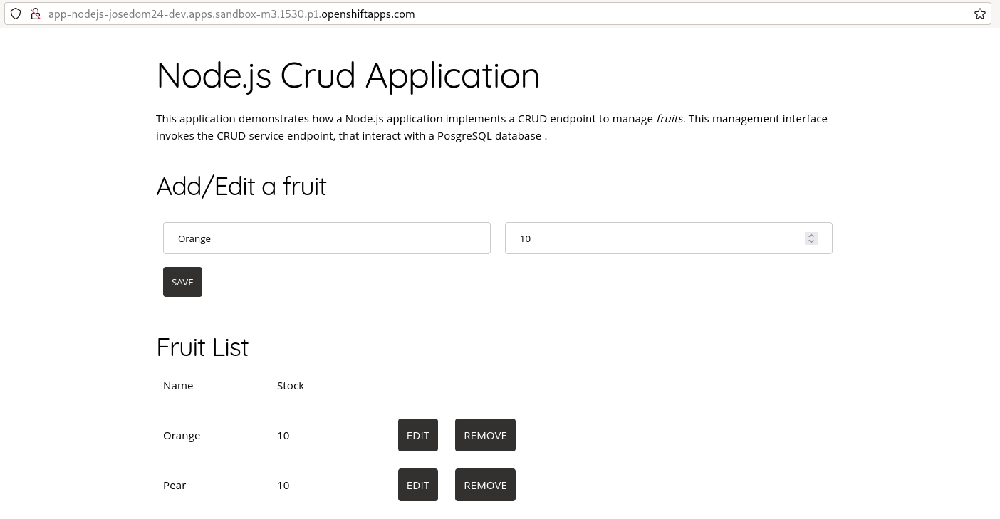

# Introducción a los Templates

Un **template** o plantilla describe un conjunto de objetos que pueden ser parametrizados y procesados para producir una lista de recursos para su creación en OpenShift.

Tenemos un conjunto de **Templates** ya definidos que podemos ver en el **catálogo de aplicaciones**:

También podemos obtener la lista de templates que se encuentran en el proyecto `openshift`, ejecutando la siguiente instrucción:

    oc get templates -n openshift

Si queremos desplegar la aplicación ejemplo nodejs podemos usar la plantilla `nodejs-postgresql-example`. Para ver los parámetros que podemos configurar, ejecutamos:

    oc process --parameters nodejs-postgresql-example -n openshift

Sólo vamos a definir el parámetro `NAME` para indicar el nombre de la aplicación durante la creación. Para ello, ejecutamos

    oc new-app nodejs-postgresql-example -p NAME=app-nodejs

Comprobamos los recursos que ha creado la plantilla:

    oc get all -o name
    pod/app-nodejs-1-build
    pod/app-nodejs-1-deploy
    pod/app-nodejs-1-lsdhb
    pod/postgresql-1-deploy
    pod/postgresql-1-x8kn6
    replicationcontroller/app-nodejs-1
    replicationcontroller/postgresql-1
    service/app-nodejs
    service/modelmesh-serving
    service/postgresql
    deploymentconfig.apps.openshift.io/app-nodejs
    deploymentconfig.apps.openshift.io/postgresql
    buildconfig.build.openshift.io/app-nodejs
    build.build.openshift.io/app-nodejs-1
    imagestream.image.openshift.io/app-nodejs
    route.route.openshift.io/app-nodejs

Esperamos a que la imagen se construya, y accedemos a la aplicación:

En este módulo, vamos a introducir la metodología para crear nuestras propios **Templates** y como gestionar su ciclo de vida para la creación de recursos en OpenShift.