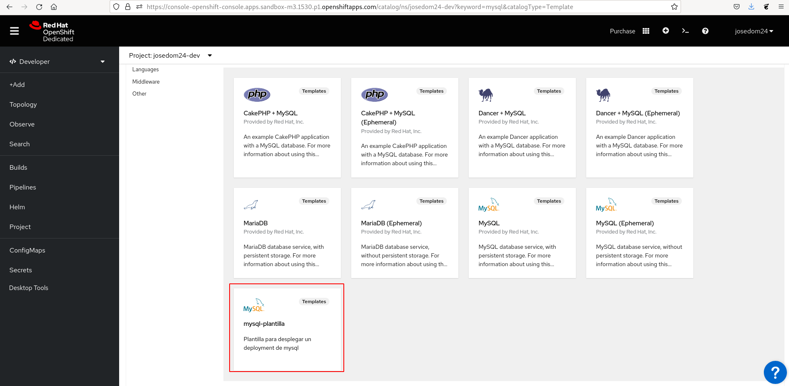
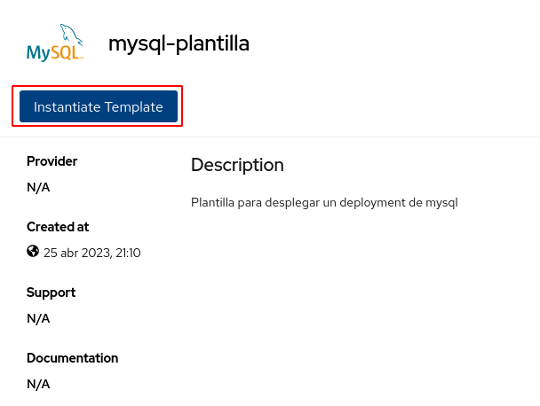
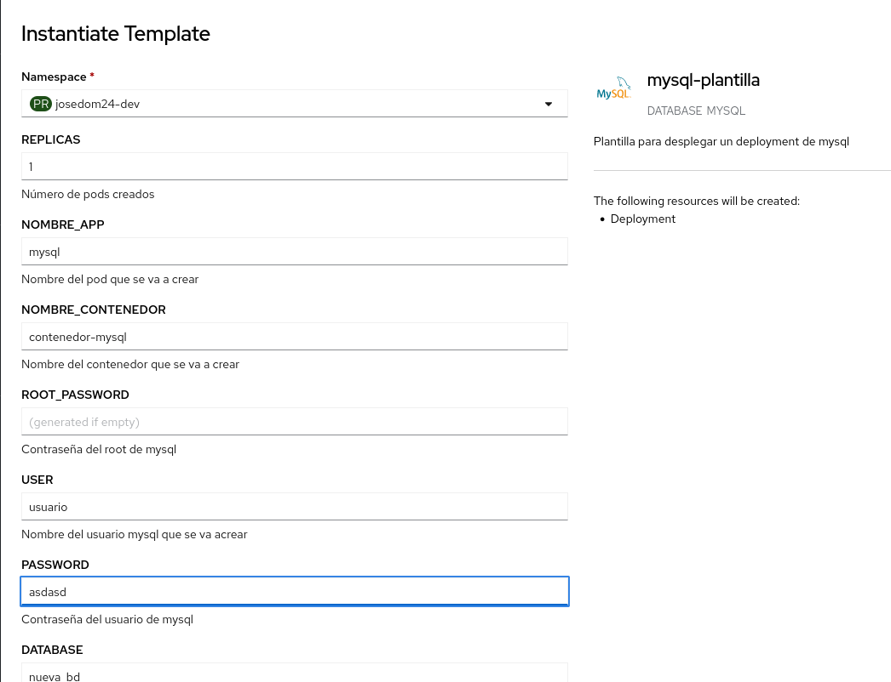
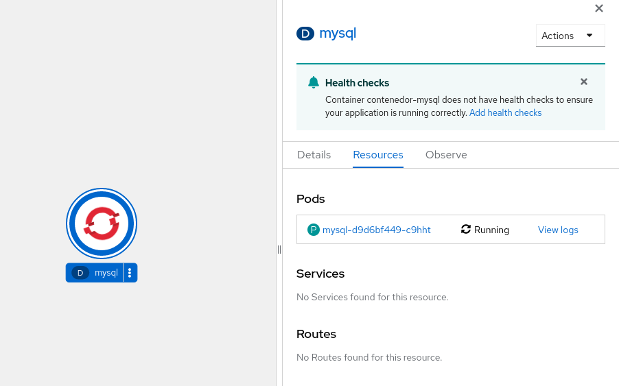
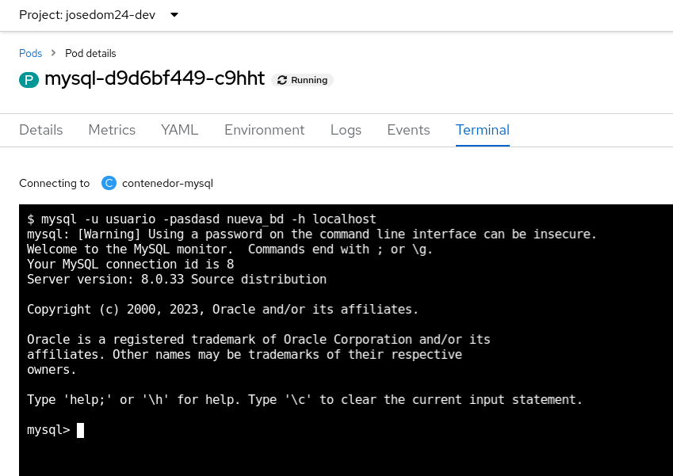

# Crear objetos desde un Template desde la consola web

Cuando hemos creado nuestra plantilla hemos comprado que ha aparecido en el **catálogo de aplicaciones**:

Para crear una nueva aplicación desde esta plantilla, pulsamos en el botón **Instantiate Template**:

Ahora podemos comprobar que nos aparece un formulario con los parámetros que hemos configurado en la plantilla, vamos a poner los mimos datos que en el apartado anterior:

Creamos el despliegue, y comprobamos los recursos que se han creado:

Finalmente, accedemos a la **Terminal** del pod que se ha creado y probamos a realizar la conexión:

