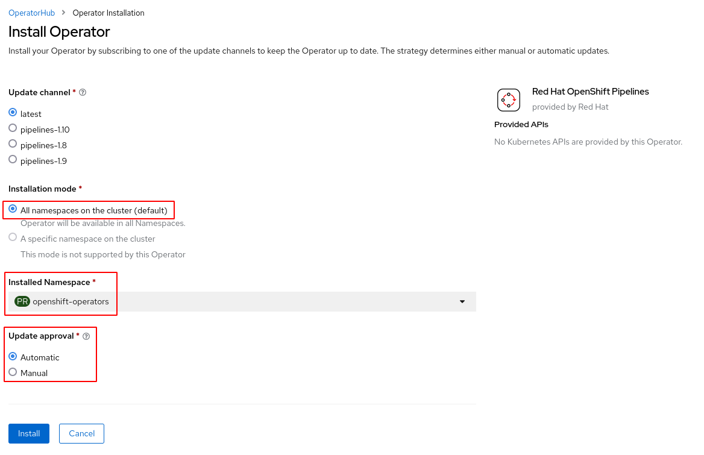

# Instalación de OpenShift Pipeline en CRC

Por defecto la instalación de OpenShift en local no tiene ningún Operador instalado. Los Operadores nos permiten instalar componentes internos de OpenShift que añaden funcionalidades extras a nuestro clúster.

## Instalación del operador OpenShift Pipelines desde la consola web

En la vista **Administrator**, escogemos la opción **Operators->OperatorHub** y filtramos con el nombre del operador "OpenShift Pipelines".

Nos aparece una ventana con información del operador y pulsamos sobre el botón **Install** para comenzar la instalación:

* Instalamos la última versión del operador etiquetada con `latest`.
* Al escoger la opción `All namespaces on the cluster (default)` hacemos que el operador se pueda usar en todos los proyectos.
* Se va a crear un namespace llamado `openshift-operators` donde se crearán los recursos que va a instalar el operador.
* Se activa la opción de actualizaciones automáticas.

Una vez instalado podemos comprobar que lo tenemos instalado en la opción **Operators->Installed Operators**:

Puedes ver los recursos que se han creado ejecutando:

    oc get all -n openshift-operators

Y puedes comprobar que ya aparecen la opciones de **Pipelines**:

