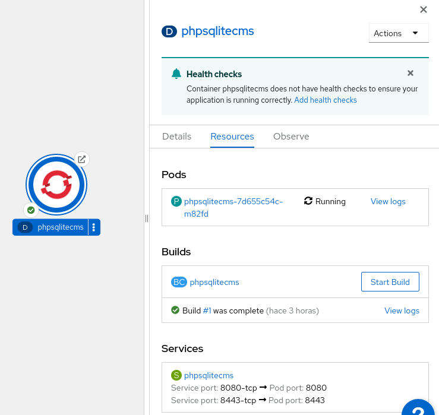
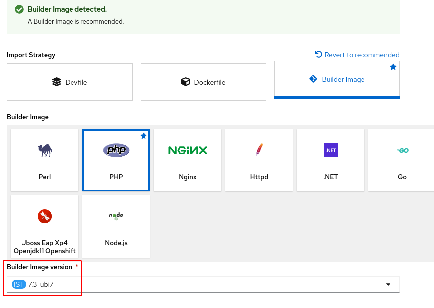
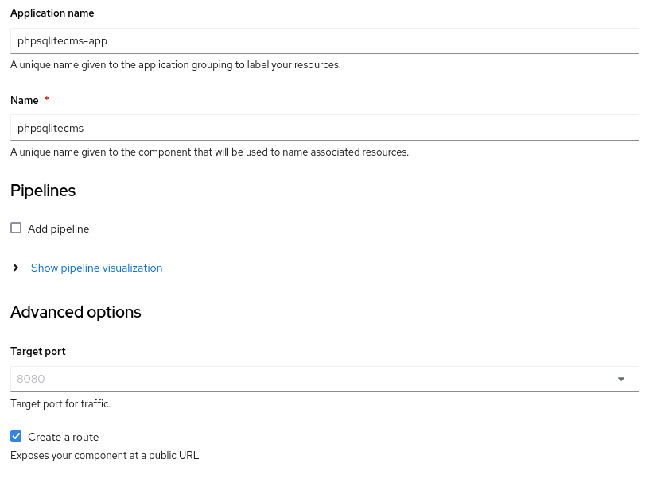

# Ejemplo 1: Gestión de almacenamiento desde la consola web: phpsqlitecms

En este ejemplo, vamos a instalar un CMS PHP llamado **phpSQLiteCMS** que utiliza una base de datos SQLite. Para ello vamos a utilizar el código de la aplicación que se encuentra en el repositorio: `https://github.com/ilosuna/phpsqlitecms`.

Vamos a realizar el despliegue desde la línea de comandos:

    oc new-app php:7.3-ubi7~https://github.com/ilosuna/phpsqlitecms --name=phpsqlitecms
    oc expose service/phpsqlitecms

Se han creado los recursos:

Y podemos acceder a la aplicación:

## Modificación de la aplicación

A continuación vamos a entrar en la zona de administración,en la URL `/cms`, y con el usuario y contraseña: `admin` - `admin` vamos a realizar un cambio (por ejemplo el nombre de la página) que se guardará en la base de datos SQLite.

