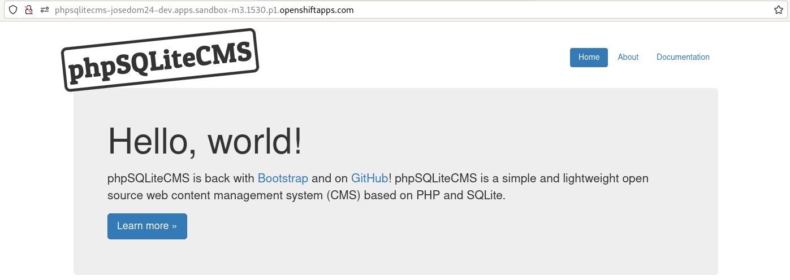

# Ejemplo 1: Gestión de almacenamiento desde la consola web: phpsqlitecms

En este ejemplo, vamos a instalar un CMS PHP llamado **phpSQLiteCMS** que utiliza una base de datos SQLite. Para ello vamos a utilizar el código de la aplicación que se encuentra en el repositorio: `https://github.com/ilosuna/phpsqlitecms`.

Vamos a realizar el despliegue desde la consola web:

Añadimos una aplicación desde un repositorio Git, indicamos la URL del repositorio:

Vamos a crear la nueva imagen usando la versión de PHP `7.3-ubi7`:

Indicamos el nombre de la aplicación, del despliegue, el puerto y creamos una ruta:

Y finalmente elegimos como tipo de recurso de despliegue el **Deployment**:

