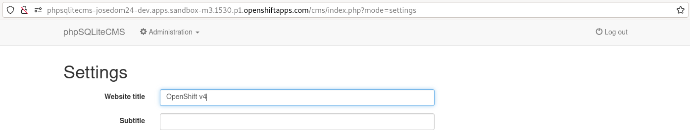
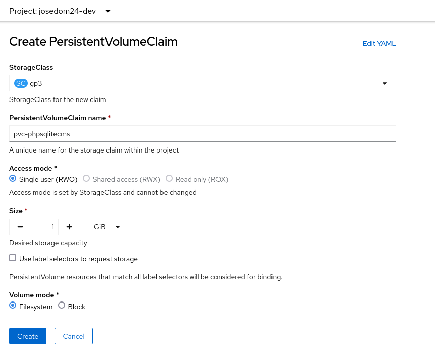
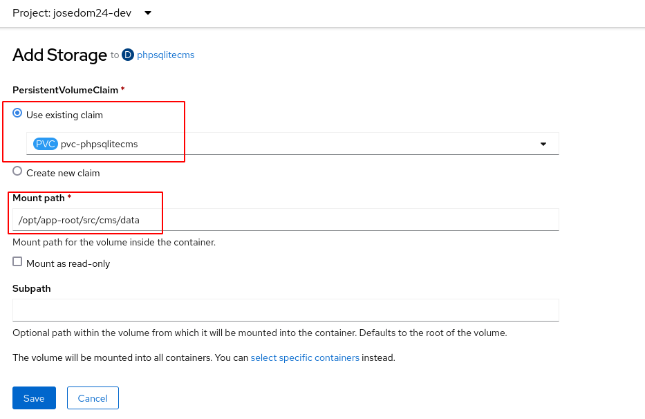

# Ejemplo 1: Gestión de almacenamiento desde la consola web: phpsqlitecms

En este ejemplo, vamos a instalar un CMS PHP llamado **phpSQLiteCMS** que utiliza una base de datos SQLite. Para ello vamos a utilizar el código de la aplicación que se encuentra en el repositorio: `https://github.com/ilosuna/phpsqlitecms`.

Vamos a realizar el despliegue desde la línea de comandos:

    oc new-app php:7.3-ubi7~https://github.com/ilosuna/phpsqlitecms --name=phpsqlitecms
    oc expose service/phpsqlitecms

Se han creado los recursos:

Y podemos acceder a la aplicación:

## Modificación de la aplicación

A continuación vamos a entrar en la zona de administración,en la URL `/cms`, y con el usuario y contraseña: `admin` - `admin` vamos a realizar un cambio (por ejemplo el nombre de la página) que se guardará en la base de datos SQLite.

## Los contenedores son efímeros

Los contenedores son efímeros. La información que se guarda en ellos se pierde al eliminar el contenedor, además si tenemos varias replicas de una misma aplicación (varios pods) la información que se guarda en cada una de ellas es independiente. Vamos a comprobarlo:

1. Cuando escalemos nuestra aplicación se va a crear otro pod con la base de datos inicial, en este nuevo pod no tenemos el mismo contenido que el original.
2. Si realizamos un nuevo despliegue después de una actualización, los nuevos pods perderán los datos de la base de datos.

## Volúmenes persistentes

Necesitamos un volumen para guardar los datos de la base de datos. Vamos a crear un volumen y lo vamos a montar en le directorio `/opt/app-root/src/cms/data` que es donde se encuentra la base de datos. Para ello vamos a crear un objeto **PersistentVolumenClaim** que nos permitirá crear un **PersistentVolumen** que asociaremos al **Deployment**. Lo vamos a hacer desde la consola web, desde la vista **Administrator**, es cogemos la opción **Storage -> PersistentVolumenClaims** y creamos un nuevo objeto:

A continuación añadimos almacenamiento al despliegue:

Indicando el objeto **PersistentVolumenClaim** que hemos creado, y directorio donde vamos a montar el parámetro.

