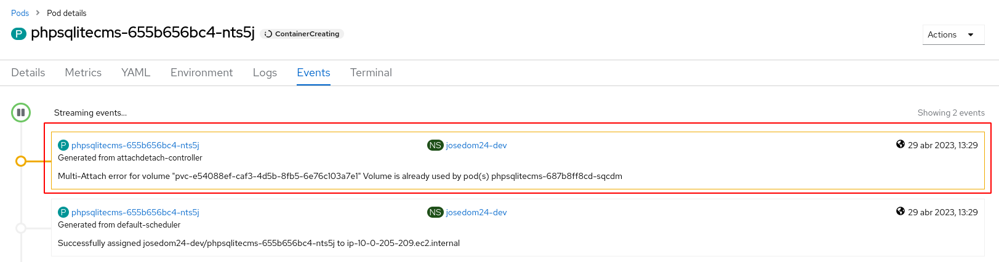

# Ejemplo 1: Gestión de almacenamiento desde la consola web: phpsqlitecms

En este ejemplo, vamos a instalar un CMS PHP llamado **phpSQLiteCMS** que utiliza una base de datos SQLite. Para ello vamos a utilizar el código de la aplicación que se encuentra en el repositorio: `https://github.com/ilosuna/phpsqlitecms`.

Vamos a realizar el despliegue desde la línea de comandos:

    oc new-app php:7.3-ubi7~https://github.com/ilosuna/phpsqlitecms --name=phpsqlitecms
    oc expose service/phpsqlitecms

Se han creado los recursos:

Y podemos acceder a la aplicación:

## Modificación de la aplicación

A continuación vamos a entrar en la zona de administración,en la URL `/cms`, y con el usuario y contraseña: `admin` - `admin` vamos a realizar un cambio (por ejemplo el nombre de la página) que se guardará en la base de datos SQLite.

## Los contenedores son efímeros

Los contenedores son efímeros. La información que se guarda en ellos se pierde al eliminar el contenedor, además si tenemos varias replicas de una misma aplicación (varios Pods) la información que se guarda en cada una de ellas es independiente. Vamos a comprobarlo:

1. Cuando escalemos nuestra aplicación se va a crear otro Pod con la base de datos inicial, en este nuevo Pod no tenemos el mismo contenido que el original.
2. Si realizamos un nuevo despliegue después de una actualización, los nuevos Pods perderán los datos de la base de datos.

## Volúmenes persistentes

Necesitamos un volumen para guardar los datos de la base de datos. Vamos a crear un volumen y lo vamos a montar en le directorio `/opt/app-root/src/cms/data` que es donde se encuentra la base de datos. Para ello vamos a crear un objeto **PersistentVolumenClaim** que nos permitirá crear un **PersistentVolumen** que asociaremos al **Deployment**. Lo vamos a hacer desde la consola web, desde la vista **Administrator**, es cogemos la opción **Storage -> PersistentVolumenClaims** y creamos un nuevo objeto:

A continuación añadimos almacenamiento al despliegue:

Indicando el objeto **PersistentVolumenClaim** que hemos creado, y directorio donde vamos a montar el parámetro.

Se ha actualizado el despliegue, se ha creado un nuevo Pod con la nueva versión (el volumen montado en el directorio) y podemos comprobar que el **PersistentVolumenClaim** se ha asociado con un **PersistentVolumen**:

Accedemos a la aplicación para comprobar si funciona:

La aplicación no está funcionando bien. ¿Qué ha pasado?. Al montar el volumen en el directorio `/opt/app-root/src/cms/data`, el contenido anterior, correspondiente a los ficheros de la base de datos se han perdido. Tenemos que copiar en este directorio, en realidad en el volumen, los ficheros necesario, para ello vamos a copiarlos desde el repositorio, para ello:

    git clone https://github.com/ilosuna/phpsqlitecms
    cd phpsqlitecms/cms

    oc get pod
    NAME                            READY   STATUS      RESTARTS   AGE
    phpsqlitecms-1-build            0/1     Completed   0          8m26s
    phpsqlitecms-687b8ff8cd-sqcdm   1/1     Running     0          6m17s

    oc cp data phpsqlitecms-687b8ff8cd-sqcdm:/opt/app-root/src/cms

Y volvemos a comprobar si está funcionando la aplicación:

## Estrategias de despliegue y almacenamiento

¿Qué ocurrirá si volvemos actualizar el despliegue, creando un nuevo pod? Lo vamos a realizar desde el entorno web seleccionando la acción **Restart rollout**:

Se crea un nuevo Pod, pero no termina en estar en estado de ejecución:

Si vemos los eventos del pod, nos aclara el problema que ha existido:

El problema es el siguiente:

* El volumen que se ha creado no permite que dos Pods estén conectados simultáneamente a él.
* La estrategia de despliegue **RolligUpdate** crea el nuevo pod, comprueba que funciona para posteriormente eliminar el viejo. Pero en este caso, no puede terminar de crear el nuevo pod, porque no se puede conectar al volumen mienstras el antiguo Pod este conectado a él.

La solución es configurar la estrategia de despliegue a **Recreate**, al eli,minar el Pod antiguo, el Pod nuevo se puede conectar al volumen sin problemas. Para ello:

    oc edit deploy/phpsqlitecms
    ...
    spec:
    ...
      strategy:
        type: Recreate

Y volvemos realizar la actualización del despliegue:

    oc rollout restart deploy/phpsqlitecms

    oc get pod
    NAME                            READY   STATUS      RESTARTS   AGE
    phpsqlitecms-1-build            0/1     Completed   0          4h30m
    phpsqlitecms-6bc4dd8f58-ld6bf   1/1     Running     0          2s

Como vemos se ha creado un nuevo Pod sin problemas.

## Escalado y almacenamiento

Como hemos indicado el almacenamiento ofrecido por RedHat OpenShift Dedicated Developer Sandbox no permite que varios Pods estén simultáneamente conectado a un mismo volumen, no proporciona almacenamiento compartido.

Esto tiene otra consecuencia, además de la estudiada en el punto anterior. Veamos como se comporta un escalado del despliegue:

    oc scale deploy/phpsqlitecms --replicas=2

    oc get pod
    NAME                            READY   STATUS              RESTARTS   AGE
    phpsqlitecms-1-build            0/1     Completed           0          4h34m
    phpsqlitecms-6bc4dd8f58-74h49   0/1     ContainerCreating   0          11s
    phpsqlitecms-6bc4dd8f58-ld6bf   1/1     Running             0          3m47s

De la misma manera, el nuevo Pod que se está creando no termina d crearse por que no se puede conectar al volumen, que ya está conectado al primer pod.

Podríamos ver los detalles del pod, para ver el problema que tiene:

    oc describe pod/phpsqlitecms-6bc4dd8f58-74h49
    ...
    Events:
      Type     Reason              Age   From                     Message
      ----     ------              ----  ----                     -------
      Normal   Scheduled           77s   default-scheduler        Successfully assigned josedom24-dev/phpsqlitecms-6bc4dd8f58-74h49 to ip-10-0-178-128.ec2.internal
      Warning  FailedAttachVolume  78s   attachdetach-controller  Multi-Attach error for volume "pvc-e54088ef-caf3-4d5b-8fb5-6e76c103a7e1" Volume is already used by pod(s) phpsqlitecms-6bc4dd8f58-ld6bf

Por lo tanto concluimos, que con este tipo de almacenamiento, no podemos escalar los despliegues.
