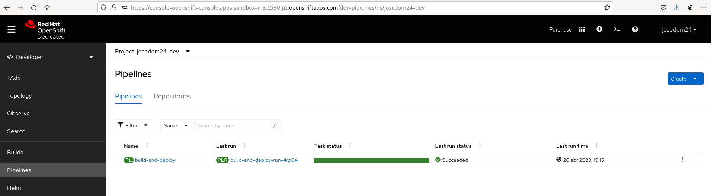
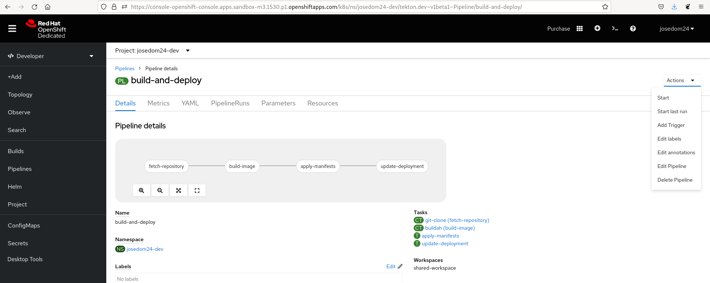
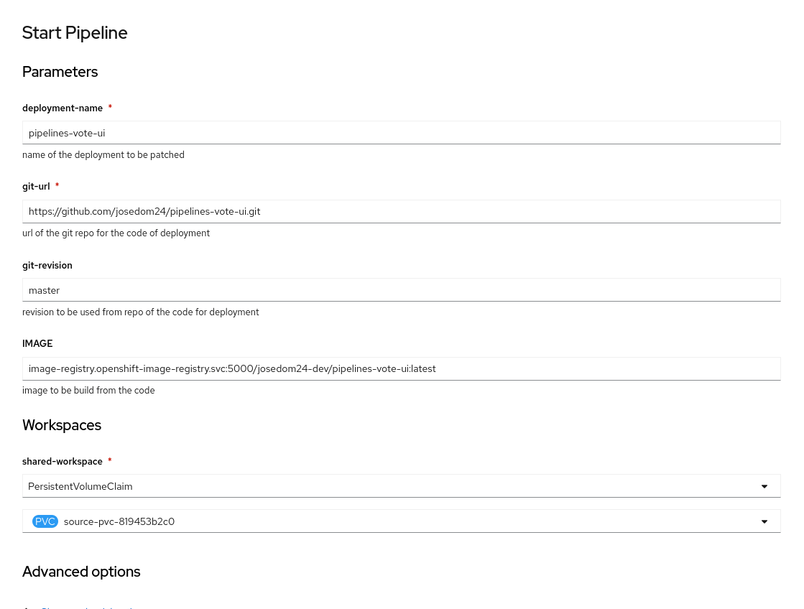
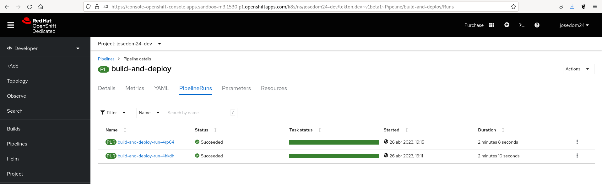
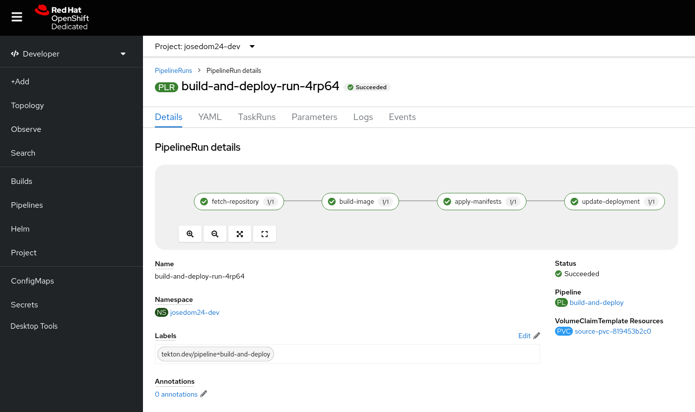
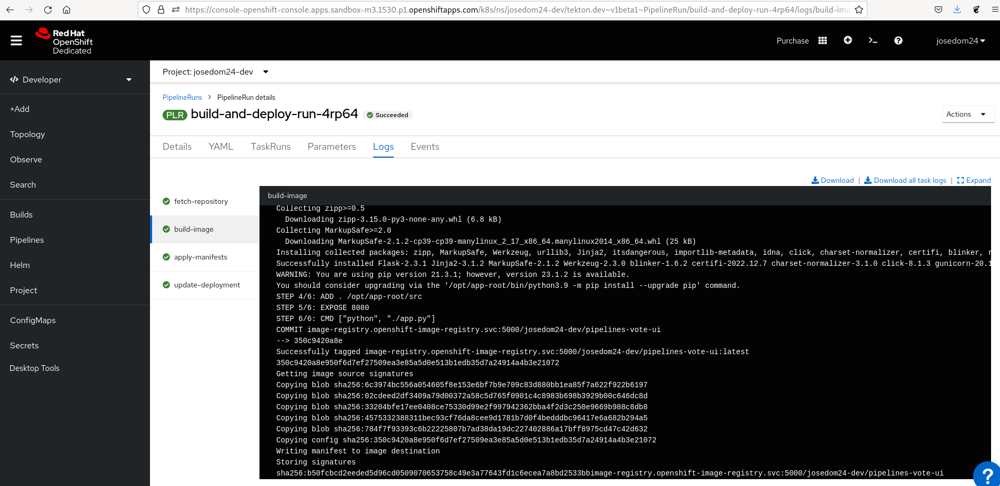
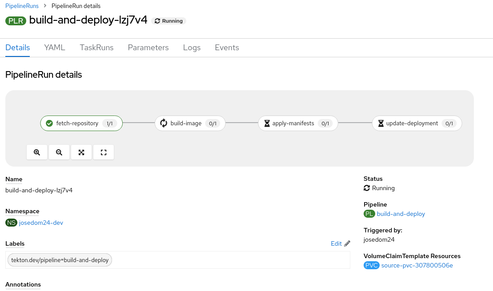
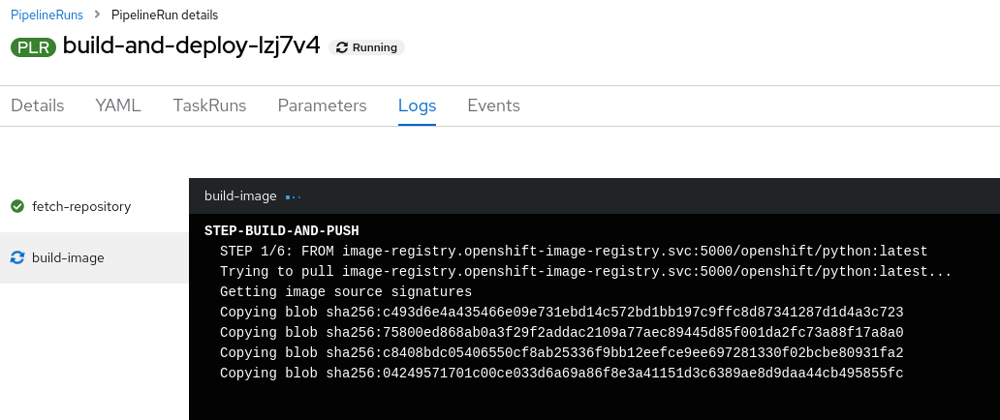
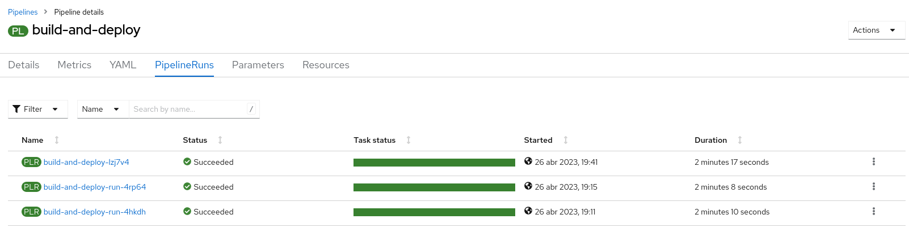

# Gestión de OpenShift Pipeline desde la consola web

Como hemos visto en el punto anterior, en el apartado **Pipelines** de la consola web podemos ver la lista de objetos **Pipleines** que tenemos definidos:

Si pulsamos en un **Pipeline** en particular, accedemos a  sus detalles:

Como vemos tenemos varias opciones, por ejemplo **Start last run**, ejecutaría un nuevo **PipelineRun** con la misma configuración que el último que se ha ejecutado. Si elegimos la opción **Start** para ejecutar un nuevo **PipelineRun** tendremos que indicar los parámetros igual que hicimos con la herramienta `tnk`:

En la pestaña **PipelineRun** obtenemos la lista de ejecuciones:

Podemos acceder a los detalles de cada una de ellas:

Si pulsamos sobre alguna de las tareas podemos acceder a los logs de la misma:

## Ejecución del Pipeline

Podríamos hacer un cambio en el repositorio `pipelines-vote-ui` y volver a ejecutar el **Pipeline** para desplegar el cambio. Para ello, nos vamos al detalle de nuestro **Pipeline** y escogemos la opción **Start last run** (ya que la última ejecución se había hecho sobre este repositorio, si quisiéramos estar seguro elegiríamos la opción **Start** e indicaríamos los parámetros de forma adecuada).

Vemos como la primera tarea ya se ha ejecutado, y se está ejecutando la segunda. Si pulsamos sobre alguna de las tareas podemos acceder a los logs:

Una vez finalizado, podemos comprobar que tenemos tres objetos **PipelineRun**:

