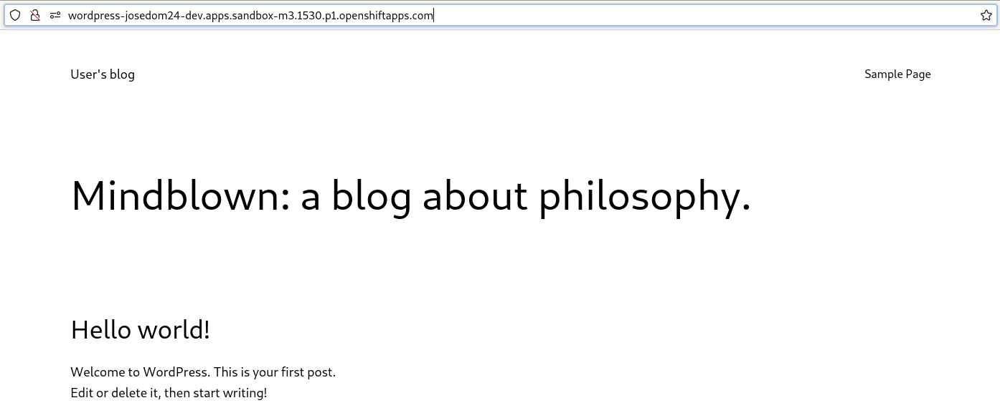
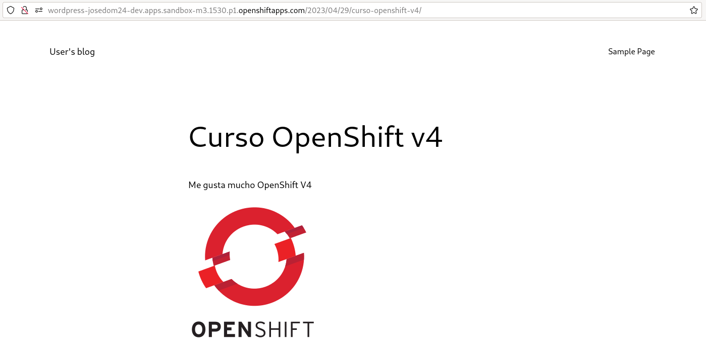

# Ejemplo 3: Haciendo persistente la aplicación Wordpress

## Base de datos persistente

Para obtener una base de datos persistente vamos a crear una aplicación de base de datos a partir de una plantilla que cree y configure un volumen. Por ejemplo, vamos a usar la plantilla `mariadb-persistent`:

    oc process --parameters mariadb-persistent -n openshift
    NAME                    DESCRIPTION                                                               GENERATOR           VALUE
    MEMORY_LIMIT            Maximum amount of memory the container can use.                                               512Mi
    NAMESPACE               The OpenShift Namespace where the ImageStream resides.                                        openshift
    DATABASE_SERVICE_NAME   The name of the OpenShift Service exposed for the database.                                   mariadb
    MYSQL_USER              Username for MariaDB user that will be used for accessing the database.   expression          user[A-Z0-9]{3}
    MYSQL_PASSWORD          Password for the MariaDB connection user.                                 expression          [a-zA-Z0-9]{16}
    MYSQL_ROOT_PASSWORD     Password for the MariaDB root user.                                       expression          [a-zA-Z0-9]{16}
    MYSQL_DATABASE          Name of the MariaDB database accessed.                                                        sampledb
    MARIADB_VERSION         Version of MariaDB image to be used (10.3-el7, 10.3-el8, or latest).                          10.3-el8
    VOLUME_CAPACITY         Volume space available for data, e.g. 512Mi, 2Gi.                                             1Gi

Y creamos el despliegue, ejecutando:

    oc new-app mariadb-persistent -p MYSQL_USER=usuario \ 
                                  -p MYSQL_PASSWORD=asdasd \
                                  -p MYSQL_DATABASE=wordpress \
                                  -p MYSQL_ROOT_PASSWORD=asdasd \
                                  -p VOLUME_CAPACITY=5Gi

Podemos comprobar que se ha creado un objeto **PersistentVolumeClaim** asociado a un **PersistentVolume**:

    oc get pvc
    NAME      STATUS   VOLUME                                     CAPACITY   ACCESS MODES   STORAGECLASS   AGE
    mariadb   Bound    pvc-b36f04d5-c067-4aea-b7e2-1ca499a7ff6e   5Gi        RWO            gp3            6s

Y que efectivamente está montado en un directorio de los Pods:

    oc describe dc/mariadb
    ...
    Containers:
     mariadb:
     ...
      Mounts:
        /var/lib/mysql/data from mariadb-data (rw)
    Volumes:
     mariadb-data:
      Type:	PersistentVolumeClaim (a reference to a PersistentVolumeClaim in the same namespace)
      ClaimName:	mariadb
      ReadOnly:	false

## WordPress persistente

Vamos a desplegar WordPress y posteriormente, crearemos un nuevo volumen para guardar los datos del blog. Este volumen habrá que montarlo en el directorio `/bitnami/wordpress`.

Para desplegar el WordPress usando un **DeploymentConfig**:

    oc new-app bitnami/wordpress -e WORDPRESS_DATABASE_NAME=wordpress -e  WORDPRESS_DATABASE_HOST=mariadb -e WORDPRESS_DATABASE_USER=usuario -e WORDPRESS_DATABASE_PASSWORD=asdasd --name wordpress --as-deployment-config=true

En primer lugar cambiamos la estrategia de despliegue, para evitar el problema que hemos visto en ejemplos anteriores:

    oc patch dc/wordpress --patch '{"spec":{"strategy":{"type":"Recreate"}}}'

A continuación, creamos un **PersistentVolumeClaim** usando la definición que tenemos en el fichero `pvc-wordpress.yaml`:

```yam
apiVersion: v1
kind: PersistentVolumeClaim
metadata:
    name: my-pvc-wordpress
spec:
  accessModes:
    - ReadWriteOnce
  resources:
    requests:
      storage: 5Gi
```

Creamos el **PersistentVolumeClaim** y añadimos el almacenamiento al despliegue:

    oc apply -f pvc-wordpress.yaml

    oc set volumes dc/wordpress --add -m /bitnami/wordpress --name=vol-wordpress -t pvc --claim-name=my-pvc-wordpress --overwrite

Comprobamos los dos volúmenes que hemos creado:

    oc get pvc
    NAME               STATUS   VOLUME                                     CAPACITY   ACCESS MODES   STORAGECLASS   AGE
    mariadb            Bound    pvc-b36f04d5-c067-4aea-b7e2-1ca499a7ff6e   5Gi        RWO            gp3            24m
    my-pvc-wordpress   Bound    pvc-c06048d4-8388-48b5-8052-d77f42195992   5Gi        RWO            gp3            5m


Y que efectivamente hemos asociado un volumen al **DeploymentConfig** montado en el directorio `/bitnami/wordpress`:

    oc describe dc/wordpress
    ...
      Containers:
       wordpress:
      ...
      Volumes:
       vol-wordpress:
        Type:	PersistentVolumeClaim (a reference to a PersistentVolumeClaim in the same namespace)
        ClaimName:	my-pvc-wordpress
        ReadOnly:	false

Finalmente creamos la ruta y accedemos a la aplicación:

    oc expose service/wordpress



Ahora podemos entrar en la zona de administración (en la URL `/wp-admin`) y usando las credenciales por defecto, usuario y contraseña: `user` - `bitnami`, podemos crear una nueva entrada con una imagen:



Finalmente podemos actualizar los dos despliegues:

    oc rollout latest dc/mariadb
    oc rollout latest dc/wordpress

Y volvemos acceder a la aplicación para comprobar que no hemos perdido la información.