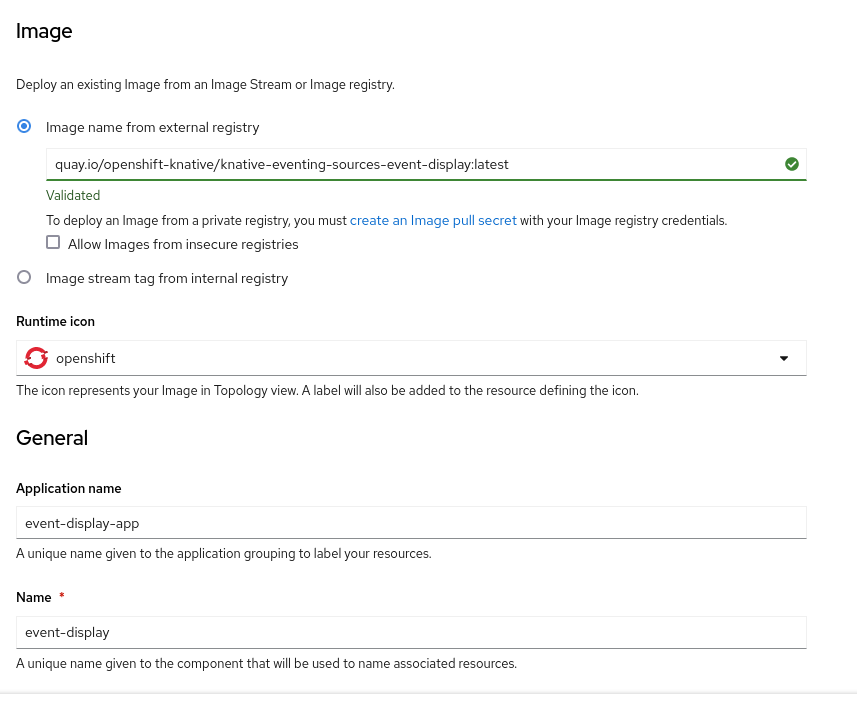
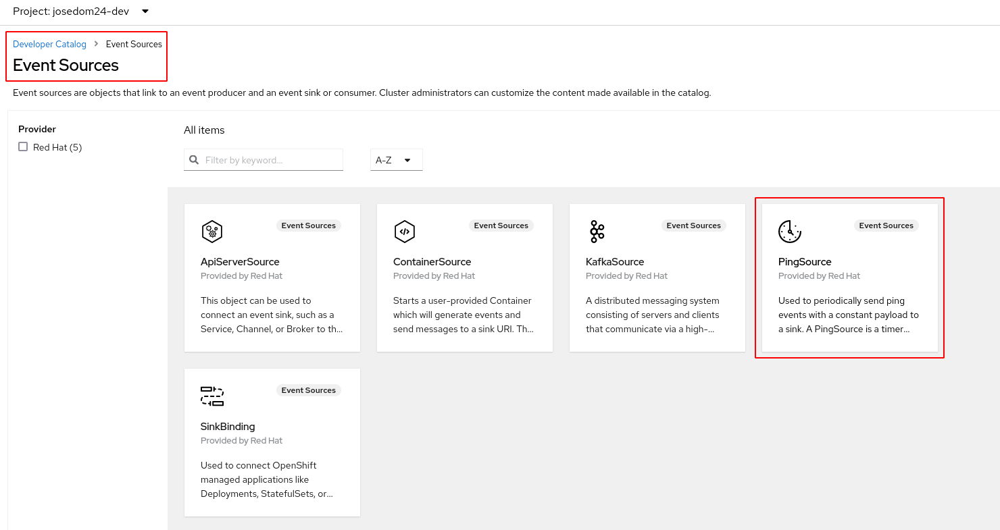
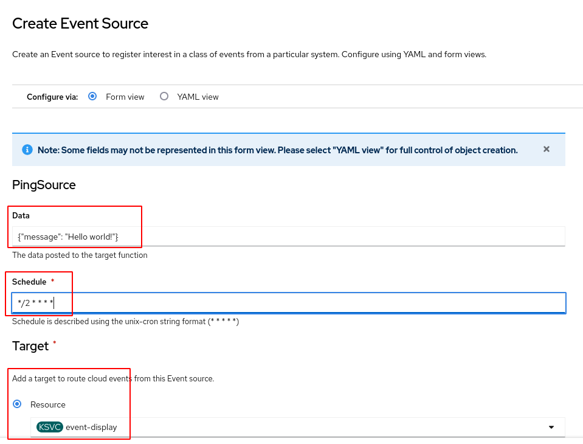
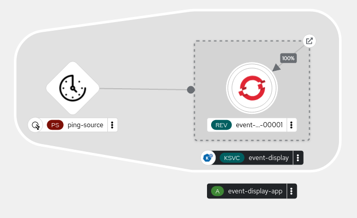

# Ejemplo de Serverless Eventing

En este ejemplo vamos a crear una aplicación Serverless muy sencilla, que responde a un evento periódico que vamos a producir con un componente (**Event sources**) llamado **PingSource**.

## Creación de la aplicación Serverless desde la consola web

Para crear la aplicación Serverless vamos a crear una nueva aplicación usando la imagen `quay.io/openshift-knative/knative-eventing-sources-event-display:latest`, para ello:

Recuerda que el parámetro **Resource type** debe estar definido con la opción **serverless Aplicattion**.

A continuación vamos a crear el generador de eventos de tipo **PingSource**, para ello desde el catálogo de aplicaciones lo vamos a instalar:

Y realizamos la configuración:

En cada evento se va a enviar una información, en este caso hemos indicado un json, hemos definido un cron para que se envíen eventos cada 2 minutos u por último, hemos indicado la fuente de eventos nuestra aplicación Serverless. Desde la topología obtenemos el siguientes esquema:

## Creación de la aplicación Serverless con la herramienta kn

Para crear la aplicación Serverless ejecutamos:

    kn service create event-display --image quay.io/openshift-knative/knative-eventing-sources-event-display:latest

Y para crear el generador de eventos de tipo **PingSource**, ejecutamos:

     kn source ping create test-ping-source \
    --schedule "*/2 * * * *" \
    --data '{"message": "Hello world!"}' \
    --sink ksvc:event-display

## Comprobación del funcionamiento

Podemos ejecutar en un terminal la siguiente instrucción:

    watch oc get pod

Para comprobar que cada 2 minutos se crea un pod trás recibir el evento, pasado unos segundo el pod se elimina.
Cuando tenemos un pod en ejecución podemos ver sus logs para comprobar que efectivamente ha recibido la información del evento:

    oc logs $(oc get pod -o name | grep event-display) -c event-display
    
    ☁️  cloudevents.Event
    Validation: valid
    Context Attributes,
      specversion: 1.0
      type: dev.knative.sources.ping
      source: /apis/v1/namespaces/josedom24-dev/pingsources/ping-source
      id: b49e0e3d-1cfc-4e07-98a3-db6882cc3d25
      time: 2023-04-27T17:14:00.041380151Z
    Data,
      {"message": "Hello world!"}
