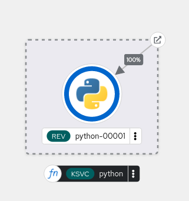

# Ejemplo de Serverless Function

Serverless Functions nos permite crear e implementar funciones Serverless basadas en eventos como un servicio Knative.
Una función Serverless, también conocida como función sin servidor, es un modelo de programación en la nube en el que nos centramos en escribir funciones que se ejecutan en una infraestructura que no tenemos que mantener, en nuestro caso OpenShift la ejecuta como aplicación Serverless.

Podemos crear funciones Serverless en distintos lenguajes y framework: Qurakus, Go, Node.js, TypeScript, Python,...

## Ejemplo de función Serverless escrita en Python

Lo primero que vamos a hacer es crear una aplicación en nuestro entorno de desarrollo basada en python, para ello ejecutamos:

    cd python
    kn func create -l python

Nos ha creado un esqueleto de aplicación python. Los ficheros que se han creado son los siguientes:

    ls
    app.sh  func.py  func.yaml  Procfile  README.md  requirements.txt  test_func.py

Nuestra aplicación debe estar en el fichero `func.py` por lo que vamos a modificar este fichero para escribir una función principal muy sencilla, que devolverá un json:

```python
def main(context: Context):
    body = { "mensaje": "Funcion Serverless" }
    headers = { "content-type": "application/json" }
    return body, 200, headers
```

A continuación, debemos crear una imagen con el código que hemos desarrollado, está imagen se guardará en el registro interno de OpenShift, para ello ejecutamos:

    kn func build

Si queremos comprobar el funcionamiento de nuestra función en nuestro entorno de desarrollo, ejecutamos:

    kn func run
    ...
    Function started on port 8080

Si accedemos a `localhost` al puerto `8080` podemos ver la aplicación funcionando antes de desplegarla:


Por último, para desplegar nuestra función en una aplicación Serverless en OpenShift, ejecutamos:

    kn func deploy

Una vez desplegada, podemos ver el esquema de recursos creados en la topología:



Y comprobamos que hemos creado un servicio Knative:

    kn service ls
    NAME     URL                                                                      LATEST         AGE   CONDITIONS   READY   REASON
    python   https://python-josedom24-dev.apps.sandbox-m3.1530.p1.openshiftapps.com   python-00001   74s   3 OK / 3     True    

Finalmente, si accedemos a la aplicación, comprobamos que funciona de manera adecuada:

    curl https://python-josedom24-dev.apps.sandbox-m3.1530.p1.openshiftapps.com
    {"mensaje":"Funcion Serverless"}

