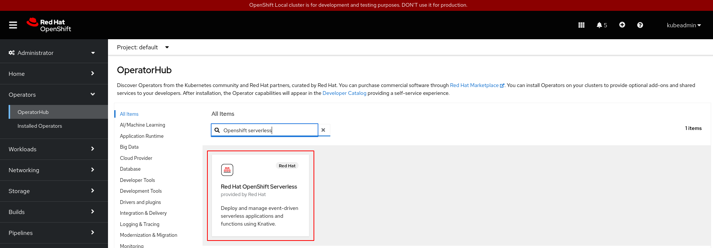
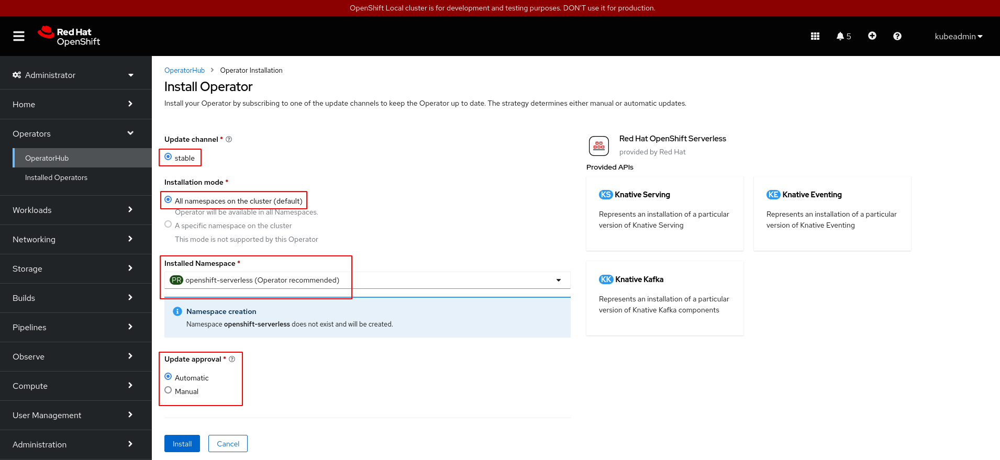
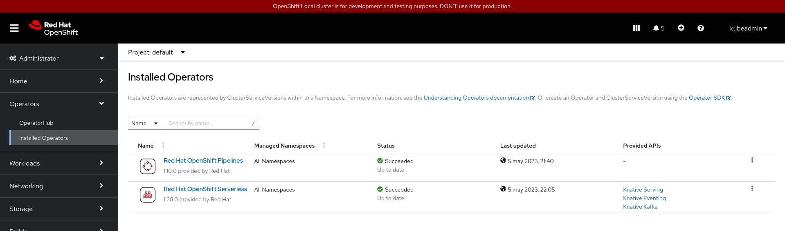
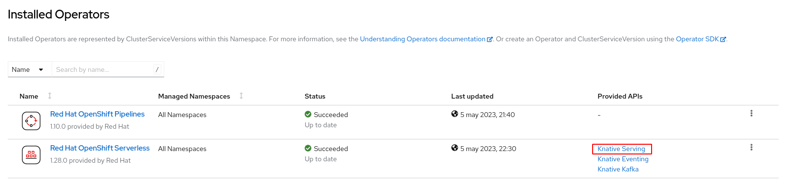
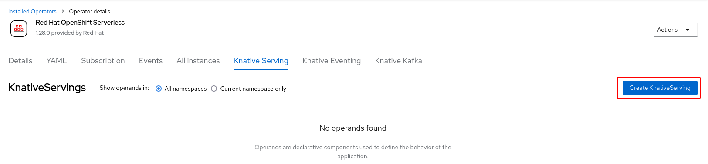
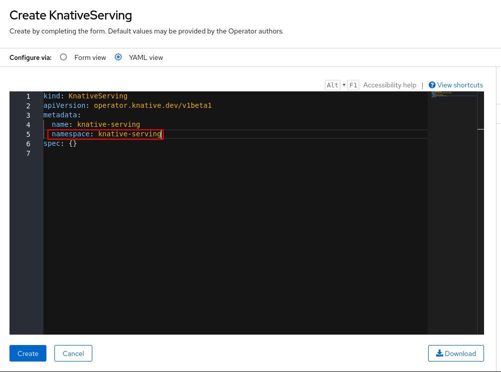
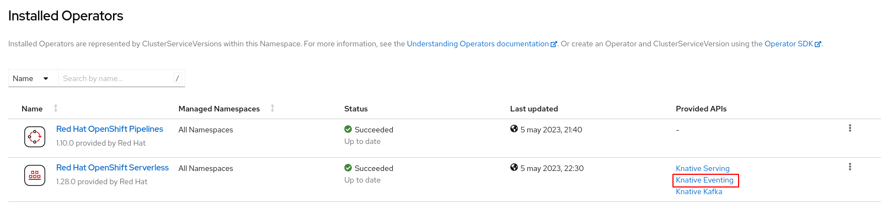
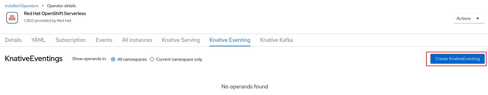
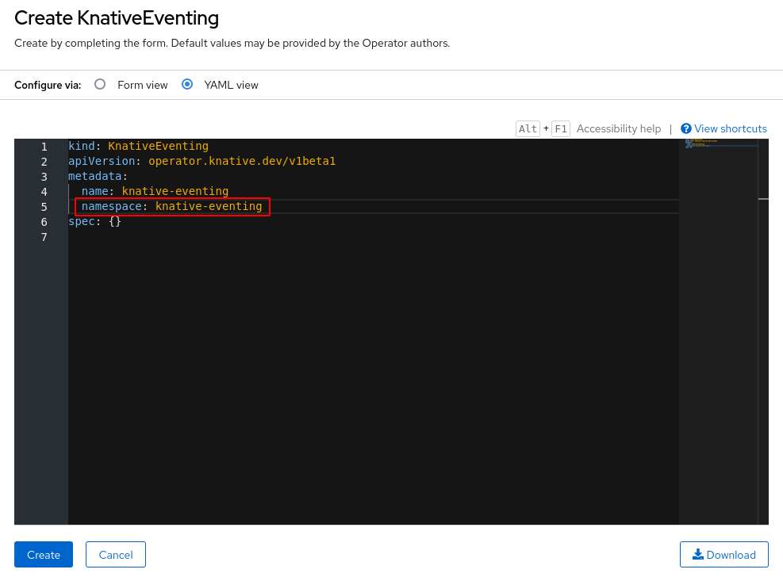
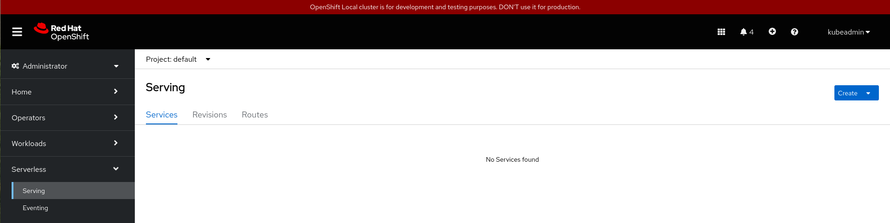

# Instalación de OpenShift Serverless en CRC

## Instalación del operador OpenShift Pipelines desde la consola web

En la vista **Administrator**, escogemos la opción **Operators->OperatorHub** y filtramos con el nombre del operador "OpenShift Serverless".

Nos aparece una ventana con información del operador y pulsamos sobre el botón **Install** para comenzar la instalación:

* Instalamos la última versión del operador etiquetada con `latest`.
* Al escoger la opción `All namespaces on the cluster (default)` hacemos que el operador se pueda usar en todos los proyectos.
* Se va a crear un **namespace** llamado `openshift-serverless` donde se crearán los recursos que va a instalar el operador.
* Se activa la opción de actualizaciones automáticas.

Una vez instalado podemos comprobar que lo tenemos instalado en la opción **Operators->Installed Operators**:

## Instalar Knative Serving

Instalar Knative Serving le permite crear servicios y funciones Knative en su clúster. Para realizar la instalación pulsamos sobre la opción **Knative Serving** del operador OpenShift Serverless que hemos instalado:

Y pulsamos sobre el botón **Create KnativeServing**:

Y dejamos todas las opciones por defecto, pero en la vista YAML nos aseguramos de configurar el **namespace** con el valor `knative-serving`, que es el valor esperado y es el proyecto donde se crearan los recurso del operador.

## Instalar Knative Eventing

De manera similar, vamos a instalar Knative Eventing, que nos permite el uso de la arquitectura basada en eventos. Para realizar la instalación pulsamos sobre la opción **Knative Eventing** del operador OpenShift Serverless que hemos instalado:

Y pulsamos sobre el botón **Create KnativeEventing**:

Y dejamos todas las opciones por defecto, pero en la vista YAML nos aseguramos de configurar el **namespace** con el valor `knative-eventing`, que es el valor esperado y es el proyecto donde se crearan los recurso del operador.

Y puedes comprobar que ya aparecen la opciones de **Serverless**:

