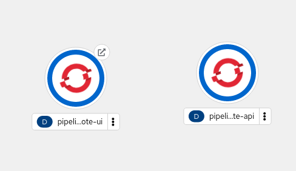
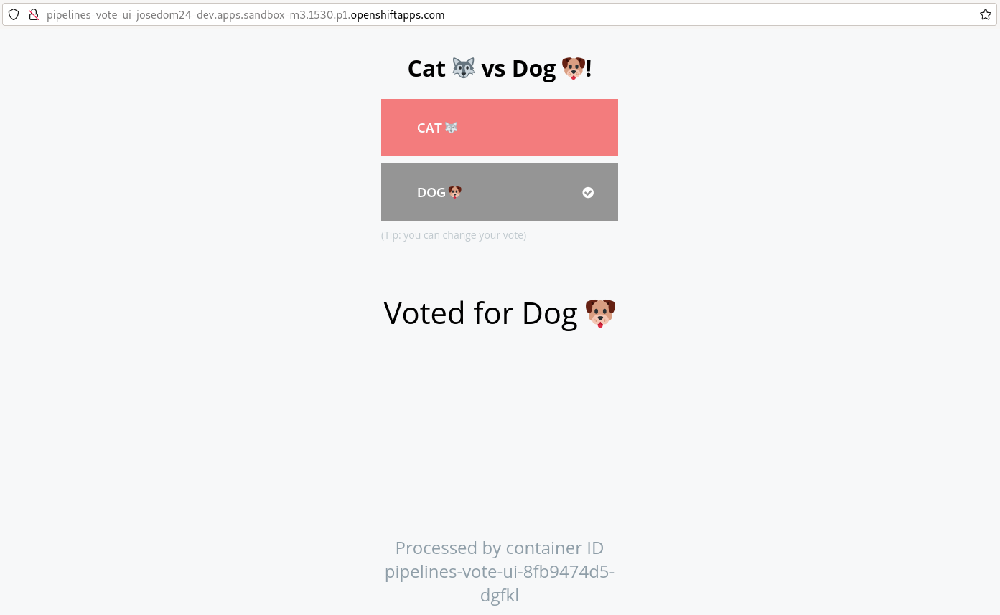

# Despliegue de una aplicación con OpenShift Pipeline

## Tekton CLI 

Vamos a usar una herramienta de línea de comandos llamada `tkn`, puedes seguir las siguientes [instrucciones](https://github.com/tektoncd/cli#installing-tkn) para su instalación. En Linux Debian:

    curl -LO https://github.com/tektoncd/cli/releases/download/v0.30.1/tektoncd-cli-0.30.1_Linux-64bit.deb
    sudo dpkg -i tektoncd-cli-0.30.1_Linux-64bit.deb

## Aplicación de ejemplo

Vamos a desplegar una aplicación muy sencilla de votaciones:

* [frontend](https://github.com/josedom24/pipelines-vote-ui): Aplicación construida con Python Flask que nos permite votar.
* [backend](https://github.com/josedom24/pipelines-vote-api): Aplicación escrita en Go que nos permite guardar las votaciones.

En el directorio `k8s` del repositorio se encuentran los ficheros yaml que posibilitan el despliegue de la aplicación.

## Instalación de Tasks

Las **Tasks** consisten en una serie de pasos que se ejecutan de forma secuencial. Las tareas se ejecutan mediante la creación de **TaskRuns**. Un **TaskRun** creará un Pod y cada paso se ejecuta en un contenedor independiente dentro del mismo pod. Podemos definir entradas y salidas para interactuar con otras tareas en el pipeline.

Vamos a instalar dos tareas:

1. `apply-manifests`: responsable de ejecutar los ficheros yaml que se encuentran en el directorio`k8s` y por lo tanto aplicar los posibles cambios en los recurso que estamos creando.
2. `update-deployment`: responsable de actualizar el objeto **Deployment**, en concreto cambiar el nombre y la imagen.

Para ello tenemos el fichero `01_apply_manifest_task.yaml` con el siguiente [contenido](https://raw.githubusercontent.com/josedom24/pipelines-tutorial/master/01_pipeline/01_apply_manifest_task.yaml) y el fichero `02_update_deployment_task.yaml` con este [contenido](https://raw.githubusercontent.com/josedom24/pipelines-tutorial/master/01_pipeline/02_update_deployment_task.yaml).

Creamos las tareas ejecutando:

    oc create -f https://raw.githubusercontent.com/josedom24/pipelines-tutorial/master/01_pipeline/01_apply_manifest_task.yaml
    oc create -f https://raw.githubusercontent.com/josedom24/pipelines-tutorial/master/01_pipeline/02_update_deployment_task.yaml

Puedes ver la lista de tareas creadas, ejecutando una de estas dos instrucciones:

    oc get tasks
    tkn task ls

Hay tareas predefinidas en el clúster de OpenShift, para obtener la lista podemos ejecutar una de estas dos instrucciones:

    oc get clustertasks
    tkn clustertasks ls

## Creando el pipeline

En este ejemplo, vamos a crear un pipeline que toma el código fuente de la aplicación de GitHub y luego lo construye y despliega en OpenShift.


El fichero `04_pipeline.yaml` tiene la definición yaml del pipeline:

```yaml
apiVersion: tekton.dev/v1beta1
kind: Pipeline
metadata:
  name: build-and-deploy
spec:
  workspaces:
  - name: shared-workspace
  params:
  - name: deployment-name
    type: string
    description: name of the deployment to be patched
  - name: git-url
    type: string
    description: url of the git repo for the code of deployment
  - name: git-revision
    type: string
    description: revision to be used from repo of the code for deployment
    default: master
  - name: IMAGE
    type: string
    description: image to be build from the code
  tasks:
  - name: fetch-repository
    taskRef:
      name: git-clone
      kind: ClusterTask
    workspaces:
    - name: output
      workspace: shared-workspace
    params:
    - name: url
      value: $(params.git-url)
    - name: subdirectory
      value: ""
    - name: deleteExisting
      value: "true"
    - name: revision
      value: $(params.git-revision)
  - name: build-image
    taskRef:
      name: buildah
      kind: ClusterTask
    params:
    - name: IMAGE
      value: $(params.IMAGE)
    workspaces:
    - name: source
      workspace: shared-workspace
    runAfter:
    - fetch-repository
  - name: apply-manifests
    taskRef:
      name: apply-manifests
    workspaces:
    - name: source
      workspace: shared-workspace
    runAfter:
    - build-image
  - name: update-deployment
    taskRef:
      name: update-deployment
    params:
    - name: deployment
      value: $(paGestión de OpenShift Pipeline desde la consola web
rams.deployment-name)
    - name: IMAGE
      value: $(params.IMAGE)
    runAfter:
    - apply-manifests
```

Veamos las diferentes tareas que se ejecutan en el pipeline:

* Clona el código fuente de la aplicación desde un repositorio git (`git-url` y `git-revision param`) usando el **ClusterTask** `git-clone`.
* Construye la imagen del contenedor de la aplicación utilizando la **ClusterTask** `buildah` que utiliza Buildah para construir la imagen.
* La imagen de la aplicación se envía a un registro de imágenes (parámetro `image`).
* La nueva imagen de la aplicación se despliega en OpenShift utilizando las tareas `apply-manifests` y `update-deployment`.

Es posible que haya notado que no hay referencias al repositorio git o el registro de imágenes que se utiliza en el pipeline. Esto se debe a que los pipelines en Tekton están diseñados para ser genéricos y reutilizables. Al activar un pipeline, puedes proporcionar diferentes repositorios git y registros de imágenes para ser utilizados durante la ejecución del pipeline. 

En concreto los parámetros que hay que proporcionar son:

* `deployment-name`: Nombre del despliegue que tiene que coincidir con el que se ha indicado como nombre del **Deployment** en el fichero yaml correspondiente en el repositorio `k8s`.
* `git-url`: URL del repositorio GitHub que queremos desplegar.
* `git-revision`: Rama del repositorio GitHub, por defecto es `master`.
* `IMAGE`: Nombre de la imagen que vamos a construir. En nuestro caso indicaremos el registro interno de OpenShift. Recuerda que el registro interno tiene la siguiente URL, donde hay que indicar el nombre del proyecto, en mi caso: 

        `image-registry.openshift-image-registry.svc:5000/josedom24-dev`

El orden de ejecución de las tareas está determinado por las dependencias que se definen entre las tareas a través de las entradas y salidas, así como las órdenes explícitas que se definen a través de `runAfter`.

El campo `Workspaces` permite especificar uno o más volúmenes que cada **Task** en el **Pipeline** requiere durante la ejecución para intercambiar información. 

Para crear el pipeline, ejecutamos:

    oc create -f https://raw.githubusercontent.com/josedom24/pipelines-tutorial/master/01_pipeline/04_pipeline.yaml

Y puedes ver los objetos **Pipelines** que has creado, ejecutando una de estas dos instrucciones:

    oc get pipelines
    tkn pipelines ls

Si accedemos a la sección **Pipeline** de la consola web podemos ver la lista de  **Pipelines**:


Y si pulsamos sobre el **Pipeline** obtenemos información detallada del mismo:


## Disparar el pipeline

Como hemos indicado anteriormente, para que las distintas tareas del pipeline compartan información en el **Workspaces**, necesitamos asociar un volumen para que se guarde la información de manera compartida entre los distintos Pods que ejecutan las tareas. Para crear el volumen vamos a usar un objeto **PersistentVolumeClaim** que esta definido en el fichero `03_persistent_volume_claim.yaml` y que tiene este [contenido](https://raw.githubusercontent.com/josedom24/pipelines-tutorial/master/01_pipeline/03_persistent_volume_claim.yaml).

Para disparar la primera ejecución del **Pipeline** que creará el primer **PipelineRun** vamos a usar la herramienta `tk`, ejecutando la siguiente instrucción para la aplicación `backend`:

    tkn pipeline start build-and-deploy \
        -w name=shared-workspace,volumeClaimTemplateFile=https://raw.githubusercontent.com/josedom24/pipelines-tutorial/master/01_pipeline/03_persistent_volume_claim.yaml \
        -p deployment-name=pipelines-vote-api \
        -p git-url=https://github.com/josedom24/pipelines-vote-api.git \
        -p IMAGE=image-registry.openshift-image-registry.svc:5000/josedom24-dev/pipelines-vote-api \
        --use-param-defaults

Y ejecutando la siguiente instrucción indicando el nombre del **PipelineRun** podemos ver los logs de las distintas tareas:

    tkn pipelinerun logs build-and-deploy-run-85whr -f -n josedom24-dev

De forma similar, para desplegar el `frontend`:

    tkn pipeline start build-and-deploy \
        -w name=shared-workspace,volumeClaimTemplateFile=https://raw.githubusercontent.com/josedom24/pipelines-tutorial/master/01_pipeline/03_persistent_volume_claim.yaml \
        -p deployment-name=pipelines-vote-ui \
        -p git-url=https://github.com/josedom24/pipelines-vote-ui.git \
        -p IMAGE=image-registry.openshift-image-registry.svc:5000/josedom24-dev/pipelines-vote-ui \
        --use-param-defaults

Vemos el **Pipeline** que hemos creado:

    tkn pipeline list
    NAME               AGE           LAST RUN                     STARTED        DURATION   STATUS
    build-and-deploy   2 hours ago   build-and-deploy-run-4hkdh   1 minute ago   ---        Running


Si queremos ver las ejecuciones que se han realizado, es decir los objetos **PipelineRun**:

    tkn pipelinerun list
    NAME                            STARTED          DURATION   STATUS
    build-and-deploy-run-4rp64      27 seconds ago   ---        Running
    build-and-deploy-run-4hkdh      3 minutes ago    2m10s      Succeeded

Y sus logs, lo podemos ver:

    tkn pipeline logs -f
    ? Select pipelinerun:  [Use arrows to move, type to filter]
    > build-and-deploy-run-4rp64 started 1 minute ago
      build-and-deploy-run-4hkdh started 4 minutes ago

Podemos ver los recursos que hemos creado:



Y si accedemos a la aplicación, vemos que está funcionando:



Si haces algún cambio en las aplicaciones y quieres volver a lanzar el despliegue, tendrías que ejecutar:

    tkn pipeline start build-and-deploy --last
