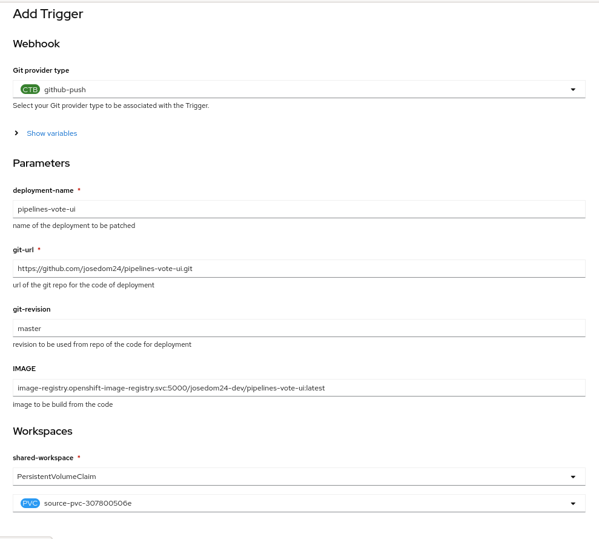
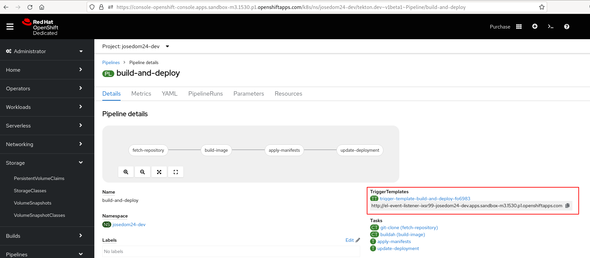
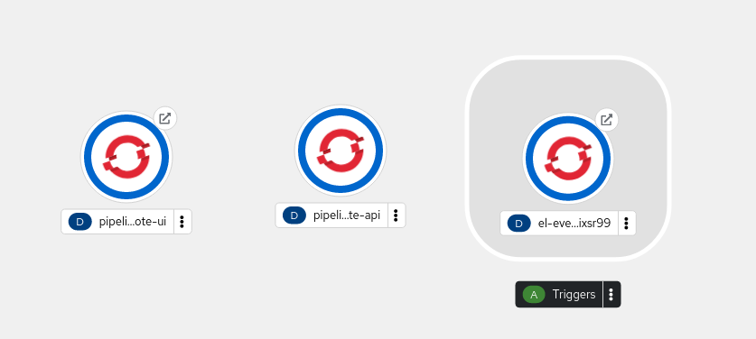
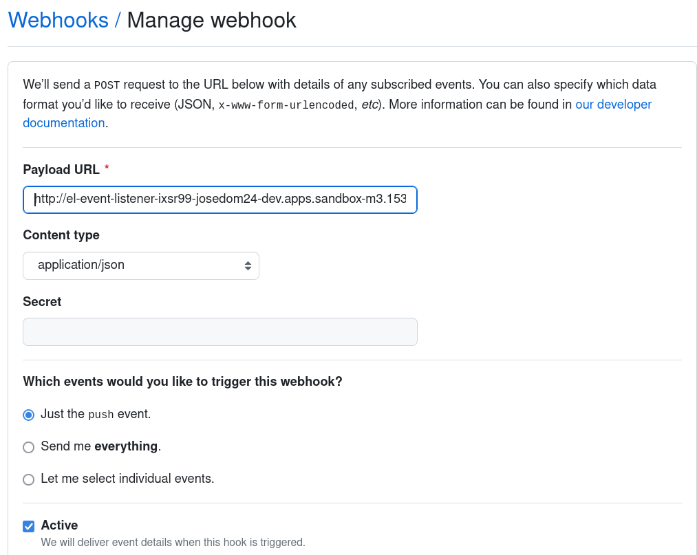
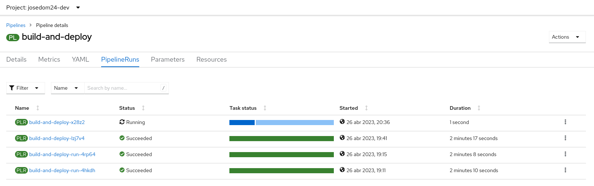

# Despliegues automáticos con trigger webhook en OpenShift Pipeline

Podemos configurar el disparo de nuestro pipeline, configurando un webhook en un servicio externo, para que cuando ocurra un evento se ejecute el pipeline.

En nuestro ejemplo, vamos a configurar eun webhook en el repositorio GitHub de la aplicación `pipelines-vote-ui` para que cuando se realice un `push` se dispare la ejecución.

La forma más sencilla de hacerlo es desde la consola web, posteriormente examinaremos los objetos que se han creado. Para ello escogemos la acción **Add Trigger** en el pipeline con el que estamos trabajando:

Como vemos indicamos el evento que producirá la ejecución (**github-push**) y los parámetros necesarios. En los detalles del pipeline, encontramos la URL del webhook:

Se ha creado un objeto **TriggerTemplate** que guarda la información del trigger y que crea un objeto **EventListener**, responsable de crear un **Deployment** y un **Route**, que corresponde a la URL del webhook y recibe los eventos que hemos configurado:

A continuación, configuramos el webhook, en nuestro repositorio:

Hacemos una modificación en la aplicación, y realizamos un `push` para guardar los cambios, y automática saltará la ejecución del pipeline:

